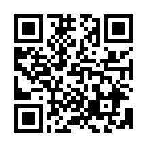

## 今日の目次

1. はじめに
1. 授業概要
1. 諸注意と評価
1. アイスブレイク
1. まとめ

# はじめに

## 授業資料と最新版シラバス
{.r-stretch}

## 本日の目的と到達目標
#### 目的
本科目の目的・計画・評価方法・諸注意を紹介し、受講の可否の判断材料を提供する。仲間と受講の動機を共有し、今後学んでいくための環境を整える。

::: {.fragment .fade-in}
#### 到達目標
1. 本科目「政治過程論」の目的、進め方、評価方法を他人に説明できる。
1. 自分の興味関心を言語化し、本科目で学びたいことを他人に説明できる。
1. 学ぶ仲間の名前を2人以上言うことができる。
:::

## 担当者の自己紹介
::: {.columns}
::: {.column width=25%}

 - [[email]{.button}](mailto:jsuzuki@iss.u-tokyo.ac.jp)
 - [[webpage]{.button}](https://junpei-suzuki.github.io)
 - [[researchmap]{.button}](https://researchmap.jp/junpeisuzuki-ps)
 - [[Podcast]{.button}](https://open.spotify.com/episode/5EmfMuzgwuTSLuMblepmTp?si=_d_BnbJ-QSOIBMeldISyVg)
 
:::

::: {.column width=5%}
:::

::: {.column width=70%}
::: {.fragment .fade-in}
**鈴木淳平**（すずき・じゅんぺい）

駒澤大学法学部政治学科講師
:::

::: {.incremental}
 - 学位：早稲田大学博士（政治学）（2024年）
 - 職歴：早稲田大学助手→東京大学特任研究員→駒澤大学講師
 - 専門：先進諸国の比較政治経済学
 - 居室：第二研究館8階2825室

:::

:::

:::

## アンケート①

今日の調子はいかがですか？

1. 良い
1. まあまあ
1. 悪い

## アンケート②

今、何年生ですか？

1. 1年生
1. 2年生
1. 3年生
1. 4年生

## アンケート③

教室の中を見渡してみましょう。何人名前を知っている人がいますか？

1. 0人
1. 1人
1. 2人
1. 3人以上

# 授業概要
## 授業概要
::: {.incremental}
 - 政治＝**市民や政治家、政党、利益団体、官僚**といった**アクター**が相互に影響しながら織りなすダイナミックな社会現象
 - 現実政治の動きを**理論**と**実証**に基づいて考察できる能力を身につける
 - 政治学の関連する**概念・理論・モデル**を学ぶ
 - **講義方式**によるが、**アクティブラーニング**を用いたワークを積極的に活用

:::

## 到達目標
::: {.incremental}

1.  **政治過程や政策過程の全体像**を描写できる。
2.  **市民の政治参加や投票参加**に関する理論の内容を説明できる。
3.  **政党の目的や機能**、**政党間関係システム**を理論的実証的に説明できる。
4.  **利益団体の定義や機能、政治過程で果たす役割**を説明できる。
5.  **官僚制の機能や問題点、政策過程で果たす役割**を説明できる。
6.  **議会制度や執政制度、地方自治制度**の働きを説明できる。
7.  **経済学や国際関係論など、一部の隣接分野に関係する政治過程**を理論的実証的に説明できる。
8.  政治現象をめぐる**一般的な主張や先行研究の妥当性を検証**することができる。
9.  グループワークを通じて、**相互に学びの深化に貢献**できる。

:::

## 進行計画

# 諸注意と評価

## 授業の進め方
::: {.incremental}

 - 基本的は対面の講義方式で、スライドを使用
    - ただし 14 回までオンライン振替の可能性
 - 授業資料等はWebClassで共有
    - スライドのハードコピーは配布はしない予定なので、各自でダウンロードすること
    - ただしワークシートなどを配布することがある
 - 随時アクティブラーニングも取り入れ、「聞くだけ」の授業にはしない
    - 事前・事後学習、問いかけ、アンケート、ディスカッション⋯
 - 特に各期末の試験直前1回ずつはグループワークによる復習セッションに充てる

:::

## 事前・事後学習
::: {.fragment .fade-in}
#### 事前学習
::: {.incremental}
 - 指定された教科書等の該当部分を読む→授業開始までにWebClass上のチェックフォームに記入
 - **【教科書・購入必須】**松田憲忠・岡田浩（編著）（2018）『よくわかる政治過程論』ミネルヴァ書房．
     - これ以外の文献も事前学習課題として指定されることがある（WebClassで共有）

:::

:::

::: {.fragment .fade-in}
#### 事後学習
::: {.incremental}
 - 授業の**3日後（日曜日）**を締切として、オンラインのフォーム上でリアクションペーパー記入（合計100字程度）
     - 次回授業でなるべくフィードバック予定

:::

:::

## 連絡方法とオフィスアワー
::: {.incremental}
 - コンタクトは~~必ず~~なるべく担当者の[メールアドレス](mailto:jsuzuki@komazawa-u.ac.jp)に行うこと
    - ~~WebClassのメッセージ機能では気づかない可能性大~~
 - メールを送付する際は「[メールの書き方](http://www2.ipcku.kansai-u.ac.jp/~iwamoto/email.pdf)」を必ず参照し、形式やマナーを守ること
 - オフィスアワー（OH）：**木曜日4限　2研2825室** 
    - **OH中はアポなしで来室可能**
    - これ以外でもアポにより対応可能

:::
## その他注意
::: {.incremental}
 - オンラインのツールを用いることがあるので、できるだけ電子機器持参
 - 授業計画は若干の変更の可能性あり
 - やむを得ない事情（病気、就活、忌引き等）で欠席する際にはWebClass上からアクセスできるフォームから登録
 - 同じ担当者による「現代政治分析入門1・2」の履修も合わせて推奨 

:::

## 評価
::: {.fragment .fade-in}
**平常点**（30%）⋯事前学習と事後学習に対する取り組み（WebClass上）

 - 事前学習（教科書）のチェックフォーム（授業開始まで；10%）
 - 100字程度のリアクションペーパー（日曜日まで；20%）

:::

::: {.fragment .fade-in}
**復習セッション**（20%）⋯授業内容のふりかえり（各期末）

 - 5〜6人程度の班を作り、割り当てられた回の授業内容をまとめる
 - 作業への貢献度（相互評価；10%）、ミニテスト（10％）

:::

::: {.fragment .fade-in}
**試験**（50%）⋯前期と後期の合計2回実施（25×2）

 - 選択式問題＋記述式問題
 - 各回授業の目標到達度を測定

:::

# アイスブレイク
## はじめに
::: {.fragment .fade-in}
#### 目的
 - 共に学ぶ仲間のことを知る
 - それぞれの受講動機を明確にする
 - グループワークに慣れる

:::

::: {.fragment .fade-in}
#### 到達目標
 1. 2名以上の受講者の名前を言える
 1. 自分の受講動機を明確に他者に説明できる
 1. このクラスを安心な場となるような振る舞いができる

:::

## グラウンドルール

学び合う環境づくりのために…

::: {.incremental}
 - 「さん」づけで呼びましょう
 - どんなことからでも学べるつもりで
 - 相手の話を関心をもってよく聴く
 - **3K**⋯敬意を持って、忌憚なく、建設的に

:::

## アイスブレイクの手順
::: {style="font-size: 0.9em;"}
 1. 受講動機を整理する（個人：1分）
    - どこかにメモをする
 1. お互いを知る①（ペア：1人1分）
    - 左右で隣の人とペアになる
    - 誕生日が早い方から自己紹介（年は考えない）
    - 相手の名前・出身高校・受講動機を聴き、メモする
 1. お互いを知る②（グループ：1人1分）
    - 前後のペア2組を合併して、グループを作る
    - ペアの相手の名前・出身高校・受講動機を、新たなグループメンバーに紹介する
    - 順番は、誕生日が一番遅い人のいるペアから、遅い方から順番に紹介
    
:::

::: {.notes}

1分でもいっぱいいっぱいかもしれない→要点をかいつまんで話すように心がける

ペア作りの時「隣の人と2人ペアになってください。右でも左でも構いません。はい、どうぞ」→10秒待つ

ペア合体「では、前か後ろのペアと一緒になってグループを作ってください。4人がいいですが5人6人でもいいです。さっき1人になってしまった人はここでどこかに合流してください。移動はせず、その場で振り向くだけでOKです」

「ではペア相手を紹介してください。先ほどペアがいなかった人は自己紹介で結構です」
:::

# まとめ

## 本日の目的と到達目標
#### 目的
本科目の目的・計画・評価方法・諸注意を紹介し、受講の可否の判断材料を提供する。仲間と受講の動機を共有し、今後学んでいくための環境を整える。

::: {.fragment .fade-in}
#### 到達目標
1. 本科目「政治過程論」の目的、進め方、評価方法を他人に説明できる。
1. 自分の興味関心を言語化し、本科目で学びたいことを他人に説明できる。
1. 学ぶ仲間の名前を2人以上言うことができる。

:::

## 次回までに

::: {.fragment .fade-in}
#### 事後学習

 - 授業資料を見直し、目標到達をセルフチェック
 - WebClass上でのリアクションペーパー入力（日曜日まで）
    - 今回は動作確認も兼ねているので成績には含まない
:::

::: {.fragment .fade-in}
#### 事前学習

 - 教科書（序-1、序-2）を読み、WebClass上でのチェックフォーム記入

:::