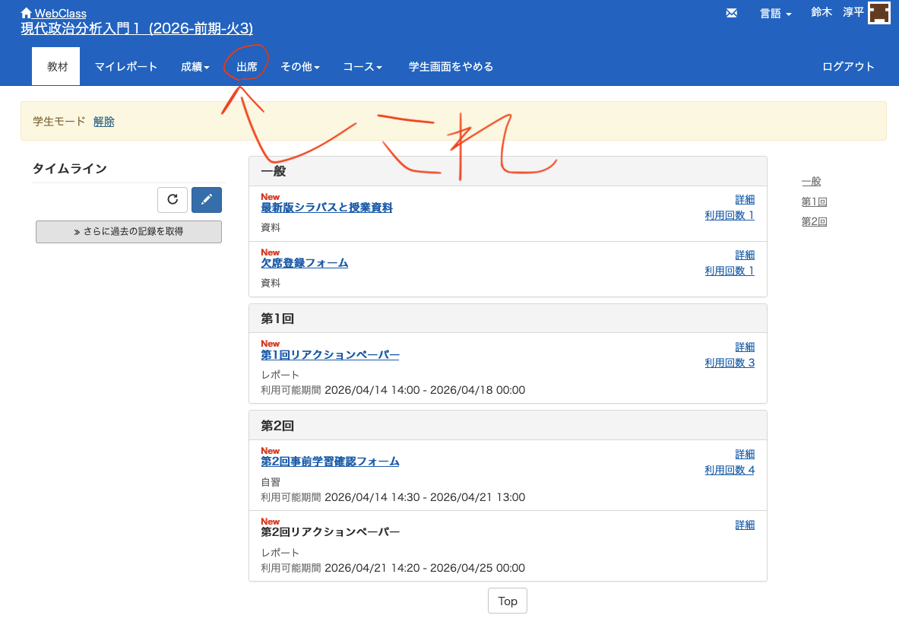
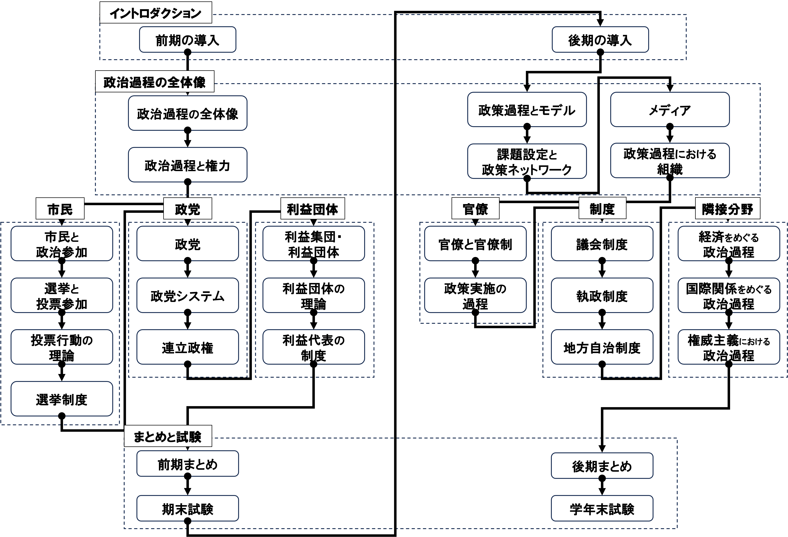
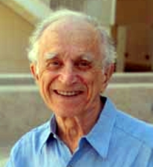

## 出席登録をお願いします

## 今日の目次

1. はじめに
1. 政治過程の視点
1. 政治システム論
1. 政治過程論のアプローチ
1. まとめ

# はじめに
::: {.notes}
目標10分
:::

## アンケート
::: {.fragment .fade-in}
今日の調子はいかがですか？

1. 良い
1. まあまあ
1. 悪い

:::

::: {.fragment .fade-in}
教科書の指定部分を読んできましたか？

1. はい
1. いいえ

:::

## 先週のRPより①
::: {style="font-size: 0.9em;"}
提出者数96/141

::: {.fragment .fade-in}
> スライドも説明もわかりやすくてこれからの授業が楽しみになりました。今日行ったようにアイスブレイクなどのアクションできる授業形態はいいと思いました。

> 授業の進行計画が細かく書かれていたり、次の授業でやるところの教科書のページが提示されていたりして、予習がしやすいなと思いました。

:::

::: {.fragment .fade-in}
> 一部の学生が友人同士で受講しているため、交流の際に少し入りにくさを感じました。毎回座席をランダムに入れ替えてほしいです。

:::

::: {.fragment .fade-in}
> 先生のマイクの音が少し小さくて始まるタイミングがつかめなかったところがありました。

:::

:::

::: {.notes}
- 授業設計特にアクティブラーニングに高い評価をいただき感謝
   - 積極的に参加して、学習に役立ててほしい
   - 授業計画を詳細にしているのもまさに自学自習に役立ててほしいからなので、シラバスや資料を繰り返し確認して学んでほしい
- 他のグループの輪に入りにくいのは申し訳ない。ものすごく気持ちはわかる。ただ、100人超の授業で毎回座席をランダマイズするのは現実的に難しいのでご理解いただきたい。ペアを組む時もなるべく新しい人を入れてあげるとかの協力をしてほしい。
- 声が聞き取りにくいのも申し訳ない。なるべく声を張る予定だが、ワーク前後の指示の聞き逃しがないように皆さんにも注意して話を聞いてほしい

:::

## 先週のRPより②
> スライドのPDF化やDLに苦戦しているが、開示期限があるためしっかり対応したい。

::: {.notes}
- 別に開示期限は設けていない（学期中はずっと公開しているつもり）が、ダウンロード方法がわかりにくくて申し訳ない。左下の「三」のアイコンから、PDFとして印刷ができるので試してほしい。ただ少しコツがいる（4枚だと横向きになってしまって切れるので、6枚印刷が推奨）。
:::

## 本日の目的と到達目標
#### 目的
イーストンの「政治システム」概念を手がかりに、政治過程の全体像を描写する。政治過程の各段階において重要な役割を果たすアクター（登場人物）を列挙し概観するとともに、政治過程論の全体を概観する。

::: {.fragment .fade-in}
#### 到達目標
1. 政治過程の動態に着目する考え方がいつ、どこで、どのような問題意識により生まれたのかを説明できる。
1. イーストンの「政治システム論」の内容を説明できる。
1. 政治システムの各段階においてどのようなアクターがいるか挙げることができる。
1. 政治過程論の主要なアプローチ（アクター、制度、アイデア）の内容をそれぞれ説明できる。

:::

## 本日の授業の位置付け

# 政治過程の視点
::: {.notes}
ここまで10分

目標15分
:::
## 政治過程という視点
::: {.fragment .fade-in}
#### 本授業における政治
有権者や政治家、政党、利益団体、官僚などのアクターが織りなす動態的（ダイナミック）な現象
:::

::: {.fragment .fade-in}
政治を「**過程**（process）」として捉える
:::

::: {.fragment .fade-in}
→政治学が紀元前からあるにもかかわらず新しい視点
:::

::: {.notes}
問いかけ（冒頭）

- 質問「シラバスの授業概要を見返してください。ここでは政治をどのように捉えているでしょうか」
- 進行：30秒作業→1-2人に当てる
:::

## 古典政治学vs現代政治学
::: {.fragment .fade-in}
**古典政治学**…古代から19世紀までの政治学

::: {.incremental}
 - **静態的**（static）→制度・憲法・法律の記述と理想の探究
 - 例：アリストテレス、モンテスキュー

:::

:::

::: {.fragment .fade-in}
**現代政治学**⋯20 世紀以降の政治学

::: {.incremental}
 - **動態的**（dynamic）→「実際に行われていること」の分析
 - ベントレーの「死んだ政治学批判」
    - アメリカの利益団体の研究（経済団体、禁酒団体…）

:::

:::

::: {.notes}
アリストテレスの6分類

- 支配者の数と統治の質（いいor悪い）
- 王政／僭主政、貴族政／寡頭政、ポリテイア／民主制

モンテスキュー『法の精神』…イギリス流の権力分立が正義に近い
:::

# 政治システム論
::: {.notes}
ここまで25分

目標15分
:::
## デイヴィッド・イーストン
::: {.columns}

::: {.column width=70%}
::: {.incremental}
- 「政治とは社会の価値の権威的配分」
- **政治システム論**
    - **環境**と相互作用する**政治システム** (political system)
    - 相互作用の過程⋯入力→変換→出力→フィードバック

:::
:::

::: {.column width=5%}
:::

::: {.column width=25%}

**David Easton** (1917--2014)

<!-- - [Source](https://upload.wikimedia.org/wikipedia/commons/0/0f/DavidEaston.JPG) -->
:::

:::

::: {.notes}
問いかけ（イーストンの紹介）

- 質問「イーストンの名前を聞いたことはありますか？」→はいorいいえ
- 進行：挙手→（挙げた人がいれば）当てる
   -（はいの人に）「イーストンの名前はどういう流れ／文脈で聞きましたか？」
      - 「価値の権威的配分」が出てくればそれで良い
      - 出てこなければ「まあいいです」と解説

政治システム論

- 政治システムは政府だと考えれば良い
- 環境は社会全体だと考えれば良い
:::

## 政治システム

# 政治のアクター
::: {.notes}
ここまで40分→予定通りに来ていれば5分休憩

目標20分
:::
## 政治のアクター
::: {.incremental}
- 投票などの形で政治に参加する**市民**
- 選挙で選ばれて立法府や執政府する活動する政治家とその集まりである**政党**
- 医師会や農協といった、共通の利益を代表する**利益団体**
- 官庁で政策の立案や執行に携わる**官僚**
- 政治の動きを監視し問題があれば報道する**メディア**
:::

## Think-pair-share (10分)
#### 目的
政治システムにおいてそれぞれのアクターがどのような役割を果たしているかを理解する

::: {.columns}

::: {.column width=70%}

::: {.fragment .fade-in}
1. **Think** (3分)
   - ワークシートを見ながら、①入力過程、②変換過程、③出力／フィードバック過程がどのアクターが現れて、何をしているか考える
1. **Pair** (3分)⋯ペアで共有、一致する／しない部分を整理
1. **Share** (1-2分)⋯全体に共有（[WebClassチャット](https://webclass.komazawa-u.ac.jp/webclass/login.php?id=7bbf6edc984a411e0805900411528072)）

:::

:::

::: {.column width=30%}

::: {.fragment .fade-in}
{width=100%}
:::

:::

:::

# 政治過程論のアプローチ
::: {.notes}
ここまで65分（1:25）

目標15分
:::
## 政治過程論のアプローチ
::: {.fragment .fade-in}
政治過程の原動力としてどのような要素に着目するか
:::

::: {.incremental}
1. **アクター**中心アプローチ
1. **制度**中心アプローチ
1. **アイディア**中心アプローチ⋯言説・信念・規範などに注目
:::

::: {.fragment .fade-in}
→本授業ではアクターおよび制度に重点
:::

## アクター中心アプローチ
::: {.fragment .fade-in}
**アクター（登場人物）**に注目
:::

::: {.fragment .fade-in}
→「アクターは何を考えて行動しているのか」
:::

::: {.fragment .fade-in}
#### **合理的選択論**（Rational Choice Theory）
::: {.incremental}
- 経済学における基本的な考え
- アクターは効用を最大化するべく行動と仮定
- 例：**政治的景気循環**（political business cycle）
    - 現職の政府は再選を目指す
    - 選挙前に財政支出増→選挙サイクルと景気循環の一致

:::
:::

## 制度中心アプローチ
::: {.fragment .fade-in}
**古典的制度論**⋯今ある制度（法律や慣習など）の記述に力点

:::

::: {.fragment .fade-in}
**新制度論**（New Institutionalism）⋯制度を「アクターの行動を決めるルール」としてとらえる考え方

:::

::: {.incremental}
- **歴史的制度論**⋯経路依存性への着目
    - 例：福祉国家の経路依存性
- **合理的選択制度論**⋯制度が利益・コストを規定
    - 例：民主主義と経済成長
- **社会学的制度論**⋯慣習や信念などの非公式な制度
    - 例：アフリカ新興国における科学省

:::

# まとめ
::: {.notes}
ここまで80分（1:20）

目標10分
:::
## 本日の目的と到達目標
#### 目的
イーストンの「政治システム」概念を手がかりに、政治過程の全体像を描写する。政治過程の各段階において重要な役割を果たすアクター（登場人物）を列挙し概観するとともに、政治過程論の全体を概観する。

::: {.fragment .fade-in}
#### 到達目標
1. 政治過程の動態に着目する考え方がいつ、どこで、どのような問題意識により生まれたのかを説明できる。
1. イーストンの「政治システム論」の内容を説明できる。
1. 政治システムの各段階においてどのようなアクターがいるか挙げることができる。
1. 政治過程論の主要なアプローチ（アクター、制度、アイデア）の内容をそれぞれ説明できる。

:::

## 次回までに
::: {.fragment .fade-in}
#### 事後学習

 - 授業資料を見直し、目標到達をセルフチェック
 - WebClass 上でのリアクションペーパー入力（日曜日まで）

:::

::: {.fragment .fade-in}
#### 事前学習

 - 教科書（序-3）を読み、WebClass 上でのチェックフォーム記入
 - **【反転授業】**WebClass上で「反証可能性」についての事前学習ビデオ視聴

:::