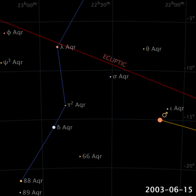
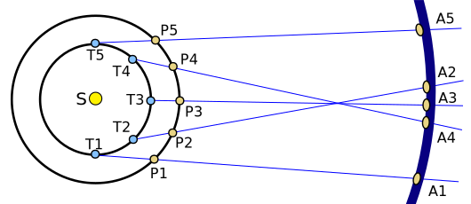

## 実証政治学の二つの目的と因果
#### 記述（description）
「**どうなっているのか**」を明らかにすること

 - 内閣支持率、女性議員比率、汚職の程度

#### 説明（explanation）
「**なぜ**」を明らかにすること

 - 高市政権の人気はなぜ？、日本で女性議員比率が低いのはなぜ？、汚職が少ないのはなぜ？→**因果関係**をめぐる問いに答える
 
<!-- #### 因果関係の3条件 -->
<!-- 1. 独立／従属変数の共変関係 -->
<!-- 1. 原因の時間的先行 -->
<!-- 1. 他の変数の統制 -->
 
## 科学の条件
#### 再現可能性 (replicability)
同じ手順を踏めば、他人でも同様の結果や結論を得られること

 - 自身の記述／説明の検証方法を記録・公開する必要
 - 実験ノート、レプリケーションファイル…
 
#### 反証可能性 (falsifiability)
ある仮説や理論が実験やデータによって「誤りである」と言える可能性を持つこと

::: {.notes}
再現可能性は検証を行う段階あるいは行った後の段階で問題

反証可能性は検証を行う前の段階（＝仮説構築の段階）で問題

:::

## 火星の動きの例
::: {.columns}
::: {.column width=50%}
{width=100%}
:::

::: {.column width=50%}
{width=100%}
:::

:::

::: {.notes}
火星を天球上で見ると、順行→逆行→順行

地動説「地球が火星を追い越した時にこの動きをする」

代替仮説「火星は自分の意思でふらふら動いている」
…なんでも説明できそうではある

地動説の方は、模型などを作るなどにして、「誤っている」と言える構造になる
代替仮説は、どんな証拠を突きつけても「誤っている」とは言えない構造になっている

:::

## 反証を可能にする
例：「あの人が不幸なのは信仰心が足りないからだ」

- 変数である不幸／信仰心という概念が抽象的
- 抽象性ゆえに測定も比較も不能

概念を具体化することで反証可能にできる

例：「教会に週1回以上通っている人はそうでない人と比べて離婚率が低い」

 - 独立変数：信仰心→教会に行く頻度
 - 従属変数：不幸→離婚

::: {.notes}
具体化の過程で抽象概念にはあったさまざまな側面が捨てられ単純化されていることに注意

離婚が必ずしも不幸かという批判は可能

:::
