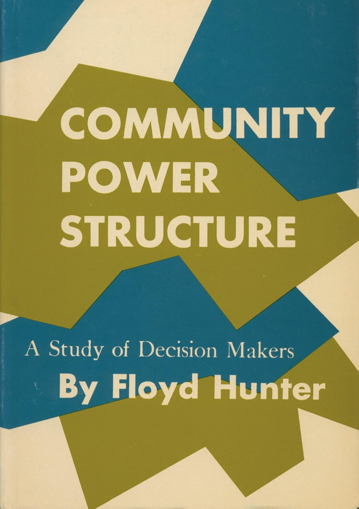
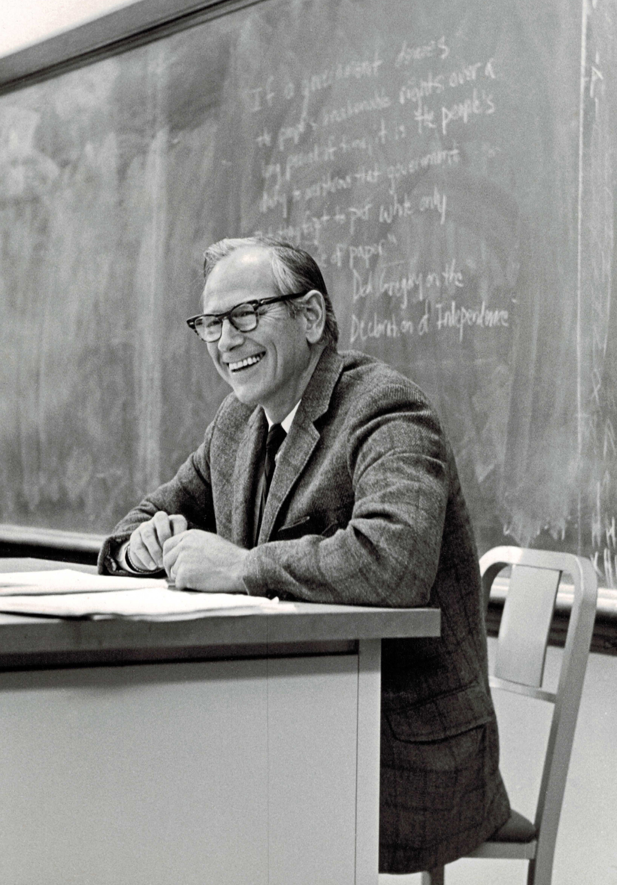
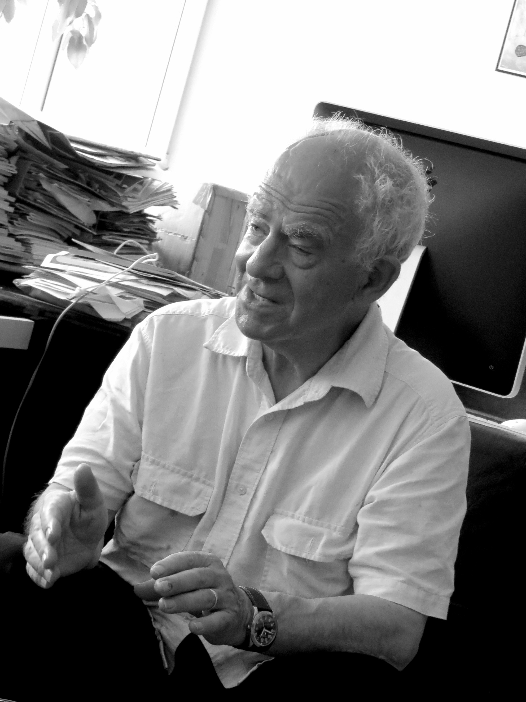

## 今日の目次

1. はじめに
1. 反証可能性
1. コミュニティ権力論争
1. 非決定権力論
1. 三次元的権力論
1. まとめ

# はじめに
## アンケート
::: {.fragment .fade-in}
教科書の指定部分を読んできましたか？

1. はい
1. いいえ

:::

::: {.fragment .fade-in}
反証可能性に関する講義動画を視聴してきましたか？

1. はい
1. いいえ
:::

## 先週のRPより
TBD

## 本日の目的と到達目標
#### 目的
コミュニティ権力論争を手がかりに、政治学が「権力」概念をどのように定義してきたか学ぶ。政治学が科学であるためにはどうすれば良いかを考えるとともに、抽象的な概念を定義し測定する際の難しさを体感する。

::: {.fragment .fade-in}
#### 到達目標
1. 科学の条件としての反証可能性を説明できる。
1. ハンターとダールの間で繰り広げられたコミュニティ権力論争の内容を説明できる。
1. ダールによる権力の定義を説明できる。
1. バクラックとバラッツによる非決定権力論の内容を説明できる。
1. ルークスによる三次元的権力論の内容を説明できる。
:::

## 本日の授業の位置付け

# 反証可能性
## 反証可能性
::: {.fragment .fade-in}
#### 反証可能性 (falsifiability)
ある仮説や理論が実験やデータによって「誤りである」と言える可能性を持つこと
:::

::: {.fragment .fade-in}
例：「火星は自分の意思で動いている」仮説
:::

::: {.fragment .fade-in}
→どのような証拠を出しても反証できない！
:::

::: {.notes}
（冒頭）「事前に配布したビデオで反証可能性の概念について講義しました。この反証可能性とはどういう意味なのか、説明できる人はいますか？」
:::

## クイズ
次の主張それぞれは反証可能かどうか考えてください。

1. 朝食を毎日食べると学校の成績が良くなる。
1. 成功するためには誰よりも努力することが必要だ。
1. 民主主義国家は戦争しない。
1. SNSにハマると頭が悪くなる。
1. 政治家はみな最終的には自分の利益しか考えていない。
1. 射手座の人は金持ちになりやすい。

::: {.notes}
1. 反証可能
2. 反証不能→成功しなかったら努力不足と後付けて言える
3. 反証可能→SNSの利用時間とGPAのデータ
4. 反証不能→政治家の動機は観察できない
5. 反証可能→射手座とそれ以外の年収を比べれば良い
（反証可能性だけでは科学かどうかを完全には決めきれない）
:::

# コミュニティ権力論争
## コミュニティ権力論争
::: {.fragment .fade-in}
コミュニティ（地域社会や都市）を牛耳るエリートは存在するか？
:::

::: {.fragment .fade-in}
1950〜60年代にかけてアメリカの政治学で流行
:::

::: {.incremental}
- 戦後経済復興と冷戦による軍拡
- アイゼンハワー大統領退任演説（1961年）…**軍産複合体**に言及

:::

::: {.columns}
::: {.column width=50%}
::: {.fragment .fade-in}
**エリート論**「存在する」

 - フロイド・ハンター
 - ライト・ミルズ…

:::
:::

::: {.column width=50%}
::: {.fragment .fade-in}
**多元主義論**「存在しない」

 - ロバート・ダール
 - ネルソン・ポルスビー…

:::
:::
:::

## エリート論
::: {.columns}
::: {.column width=65%}
ハンター『コミュニティの権力構造』[^hunter1953]

::: {.incremental}
- ジョージア州アトランタ[^atlanta]での調査
- **評判法**による検証
   - 「この街で影響力があるのは誰ですか」と尋ねる
   - 名前が上がった人に同じ質問を尋ねる
   - これを繰り返して最終的に到達した人がエリート

:::

::: {.fragment .fade-in}
→「アトランタは一握りの経済エリートが支配」と結論
:::

:::

::: {.column width=5%}

:::

::: {.column width=30%}
{width=100%}
:::

:::

[^hunter1953]: Hunter, F. (1953). Community Power Structure: A Study of Decision Makers. UNC Press.

[^atlanta]: 本文中では仮名（リージョナル市）

## 多元主義論
::: {.columns}
::: {.column width=65%}
ダール『統治するのはだれか』[^dahl1963]

::: {.incremental}
- コネチカット州ニューヘイブンでの調査
- **争点法**による検証
   - 市政で重要な争点を選ぶ
   - それぞれの争点で権力を行使した人を特定
   - 争点ごとに権力行使者は異なることを発見

:::

::: {.fragment .fade-in}
→「すべてを支配するエリートはいない」と結論
:::

:::

::: {.column width=5%}

:::

::: {.column width=30%}
{width=100%}
:::

:::

[^dahl1963]: Dahl, Robert A. (1961). Who Governs?: Democracy and Power in an American City.

## ダールによるエリート論批判
::: {.incremental}
- 権力の定義／測定の問題
    - 「誰が本当に権力者なのか」ではなく、「誰が権力者だと思われているか」→権力の定義が明確ではない
    - 権力の定義「**Aの働きかけがなければBは行わないであろうことを、AがBに行わせるかぎりにおいて、AはBに対して権力を持つ**」
       - 他者の利害に反してでも自分の利害に適う決定を成し遂げられた人が権力者→測定可能

- 反証可能性の問題
   - 権力者の利害に反する決定がされたとの観察
      - 例：犬神家が支配している村
   - 「本当の権力者がいるはず」→**無限後退問題**
   - cf. 陰謀論

:::

::: {.notes}
例えば犬神家が支配しているある村で、犬神家に反する条例が可決されたとする

エリート論は、「犬神家は本当のエリートではなく、別の場所にエリートがいるのかもしれない」と考える→反証を認めない

あるいはより露骨な陰謀論であれば、「その条例は犬神家の権力構造を隠すためのカモフラージュであり、そのことこそが犬神家の権力性を浮き彫りにしている」と主張する
:::

# 非決定権力論
## 『権力の二つの顔』
::: {style="font-size: 0.9em;"}
バクラックとバラッツによる批判[^bachrach1962]

::: {.incremental}
- **明示的権力**（ダール）…何かを**させる**形で行使される権力
- **非決定権力**（B&B）…何かを**させない**形で行使される権力

:::

::: {.fragment .fade-in}
研究例：
:::

::: {.incremental}
- 大気汚染問題（クレンソン）[^crenson1971]…企業城下町の自治体では大気汚染問題が議題にならない
- 欠陥車問題（大嶽秀夫）[^ohtake1996]…自動車メーカーがスポンサーの新聞社が欠陥車問題を報道せず、したがって国会でも取り上げられない

:::

[^bachrach1962]: Bachrach, P., & Baratz, M. S. (1962). Two Faces of Power. *The American Political Science Review, 56*(4), 947–952. https://doi.org/10.2307/1952796

[^crenson1971]: Crenson, M. A. (1971). *The Un-Politics of Air Pollution: A Study of Non-Decisionmaking in the Cities.* Johns Hopkins University Press

[^ohtake1996]: 大嶽秀夫（1996）『現代日本の政治権力経済権力: 政治における企業・業界・財界』三一書房．

:::

## Think-pair-share (10分)
目的：明示的権力との対比から、非決定権力とはなんであるかを理解する。

::: {.fragment .fade-in}
1. **Think**（2分）
   - ワークシートを見ながら、日常生活における明示的権力および非決定権力行使の例を1つずつ書き出す
1. **Pair**（5分）…ペアで共有
1. **Share** (3分)…全体で共有

:::

# 三次元的権力論
## 『現代権力論批判』
::: {.columns}
::: {.column width=65%}
**スティーブン・ルークス**[^lukes1974]はダールとB&Bを共に批判

::: {.incremental}
- **一次元的権力観**（ダール）…観察可能な行動が前提
- **二次元的権力観**（B&B）…観察可能な紛争が前提
- **三次元的権力観**（ルークス）…紛争を意識させない形で、かつ良級そのものを操作する形で行使される権力
   - 男女性別役割分業、自己責任論、ナショナリズム…

:::

:::

::: {.column width=5%}

:::

::: {.column width=25%}

:::

:::

[^lukes1974]: Lukes, S. (1974). *Power: A Radical View.* MacMillan.

## 質問（時間があれば）
Q. 三つの権力観それぞれの反証可能性はどのように評価できるでしょうか？

::: {.notes}
一次元的権力観…反証可能

二次元的権力観…一次元よりは程度は落ちるが、反証可能
 - 非決定は反証が困難
 - 利害対立は反証可能

三次元的権力観…反証困難
 - 「女性が家にいることを望んでいる」ことを強いられていることはどう反証できるか？

:::

# まとめ
## 本日の目的と到達目標
#### 目的
コミュニティ権力論争を手がかりに、政治学が「権力」概念をどのように定義してきたか学ぶ。政治学が科学であるためにはどうすれば良いかを考えるとともに、抽象的な概念を定義し測定する際の難しさを体感する。

::: {.fragment .fade-in}
#### 到達目標
1. 科学の条件としての反証可能性を説明できる。
1. ハンターとダールの間で繰り広げられたコミュニティ権力論争の内容を説明できる。
1. ダールによる権力の定義を説明できる。
1. バクラックとバラッツによる非決定権力論の内容を説明できる。
1. ルークスによる三次元的権力論の内容を説明できる。

:::

## 次回までに
::: {.fragment .fade-in}
#### 事後学習

 - 授業資料を見直し、目標到達をセルフチェック
 - WebClass 上でのリアクションペーパー入力（土曜日まで）

:::

::: {.fragment .fade-in}
#### 事前学習

 - 教科書（V-1〜2、V-10〜11）を読み、WebClass 上でのチェックフォーム記入

:::