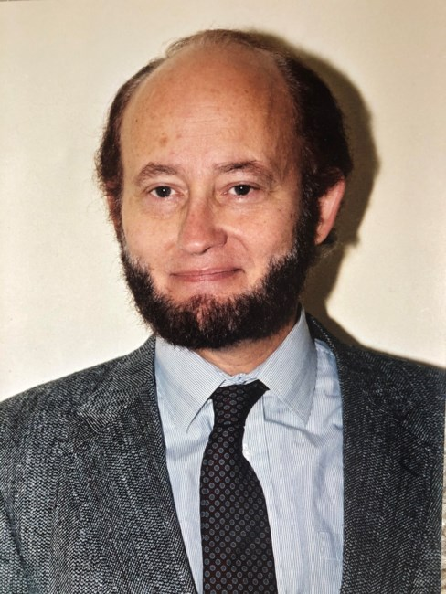

## 出席登録をお願いします

## 今日の目次

1. はじめに
1. 政治参加の形態
1. 政治文化論
1. 『静かなる革命』
1. 社会関係資本
1. まとめ

# はじめに
::: {.notes}
目標10分
:::
## アンケート
::: {.fragment .fade-in}
ゴールデンウィークを楽しみましたか

1. はい
1. いいえ
:::

::: {.fragment .fade-in}
教科書の指定部分を読んできましたか？

1. はい
1. いいえ
:::

## 先週のRPより
::: {.fragment .fade-in}
> 反証不可能と、不能とでは意味が異なるのでしょうか。

:::

::: {.fragment .fade-in}
> 明示的権力は、例えばバイトのシフトを勝手に決められてしまうということも入るのでしょうか？

:::

::: {.fragment .fade-in}
> 私は日本には総理という支配のトップがいるので、エリート論が存在しないとは思えないと考える。

:::

::: {.notes}
反証不可能と反証不能は同じ

グラデーションがある

- 「シフトに入れなかったらクビ」まで言われれば明示的権力、「嫌だと言いたいけど言えないなあ」であれば非決定権力に近い

総理でもなんでも思い通りに決められるわけではない

- 令和8年度予算、ホルムズ海峡自衛隊派遣
:::

## 先週のRPより（続）
::: {.fragment .fade-in}
> 学んだことは、「非決定権力」の概念です。店選びで相手との衝突を避け、自分の意見を言わずに諦めてしまう状況も権力作用の一つだと知り、日常生活における権力の身近さに驚きました。

:::

::: {.fragment .fade-in}
> 別の授業で権力論、特に非決定権力に関してミシェル・フーコーが示したパノプティコンの概念が紹介されていた記憶がある。その関連について詳しく知りたいと思った。

:::

::: {.notes}
権力の日常性

- 政府などの公共領域だけでなく、私的領域
- フェミニズムとの関係

フーコーの「パノプティコン」論（規律権力論）との関係

- 密接に関係
   - フーコー「近代資本主義の生産性向上に向けた規律権力」
- 違い
   - 三次元的権力観は行使者が割と明確
   - フーコーは行使者が不明確（社会全体？）

:::

## 本日の目的と到達目標
#### 目的
選挙参加をはじめとした、政治参加のさまざまなあり方を学ぶ。政治文化論の見地から国間の違いを概観したうえで、イングルハートやパットナムの議論を踏まえて政治文化の要因を考察する。

::: {.fragment .fade-in}
#### 到達目標
1. 政治参加の2つの形態を列挙できる。
1. アーモンドとヴァーバによる政治文化論を説明できる。
1. 政治文化論に照らし合わせて、日本の政治参加の特徴を説明できる。
1. イングルハートによる脱物質主義論を説明できる。
1. パットナムによる社会関係資本の議論を説明できる。

:::

## 本日の授業の位置付け

# 政治参加の形態
::: {.notes}
ここまで10分

目標15分
:::

## 復習：政治システム

::: {.notes}
政治参加はより直接的には入力に位置付けられる。

ただ入力内容は出力内容に対するフィードバックも含まれるので、出力も関係する

:::

## 政治参加の形態
::: {.fragment .fade-in}
#### 選挙政治参加
::: {.incremental}
- 選挙という公式的なチャネルを通じた参加
- 投票参加、特定の候補者・政党の応援、政治家への陳情
- 包括的直接的な利害の反映

:::

:::

::: {.fragment .fade-in}
#### 統治政治参加
::: {.incremental}
- 選挙とは別の機会を通じた参加
- デモ、署名、住民運動、自治会への参加
- 少数派の意見反映や新たな世論醸成

:::
:::

## アンケート
::: {}
以下の政治活動のうちどれに参加したことがありますか？（複数回答可）→[WebClassアンケート](https://webclass.komazawa-u.ac.jp/webclass/login.php?id=c369daefe1bce281cc99f0da24eaa30d&page=1)
:::

::: {.columns}
::: {.column width=50%}
1. 選挙で投票
1. 政治家や官僚と接触
1. 議会や役所に請願・陳情
1. 選挙や政治の集会に出席
1. 選挙運動手伝い
1. 市民・住民運動に参加
1. 請願書に署名
1. 献金・カンパ
1. デモ参加
1. インターネットを通じて意見
:::

::: {.column width=50%}
{width=50%}
:::

:::

::: {.notes}
多分1が多いはず
:::

# 政治文化論
::: {.notes}
ここまで25分

目標20分
:::
## 比較政治文化研究
::: {.fragment .fade-in}
政治参加のパターンには国ごとに違いがあるのか？
:::

::: {.fragment .fade-in}
→**ガブリエル・アーモンド**と**シドニー・ヴァーバ**による比較政治文化研究[^almond1963]
:::

::: {.incremental}
- 政治文化＝さまざまな政治的な対象に対する人々の志向のパターン
- アメリカ、イギリス、ドイツ、イタリア、メキシコでの世論調査
- 政治システム、入力機構（投票など）、出力機構（政府）、自己への態度
- 三つの政治文化＝参加型、臣民型、未文化型

:::

[^almond1963]: Almond, G. A., & Verba, S. (1963). *The Civic Culture: Political Attitudes and Democracy in Five Nations.*

## 三つの政治文化
::: {.incremental}
1. **参加型**
   - 政治システム、入力、出力、自己全てに対して肯定的
   - アメリカ、ついでイギリス→最も民主主義が進んだ国
1. **臣民型**
   - 政治システムや出力には肯定的だが、入力と自己には信頼が低い
   - ドイツとイタリア→かつてのナチス／ファシスト体制
1. **未文化型**
   - 政治システム、入力、出力、自己いずれにも明確な態度がない
   - メキシコ→政治経済的に後発の国

:::

## Think-pair-share (10分)
目的：日本の政治文化の位置付けを理解する

::: {.fragment .fade-in}
1. **Think**（1分）
   - 日本は三つの類型のうちどれに近いか、理由も考える
1. **Pair**（2-3分）…ペアで共有、納得するかしないか
1. **Share** (2-3分)…全体で共有（[WebClassチャット](https://webclass.komazawa-u.ac.jp/webclass/login.php?id=6aa14924a3ec82b7ec8d89530206db12)）

{width=35%}

:::

::: {.notes}
アンケートとはURLが違うので注意
:::

## 日本の政治文化
臣民型の特徴？

::: {.incremental}
- 投票参加は高いが、投票外参加は低調
- 政治参加に対する忌避意識
- 国会や政府、政治家に対する不信
- 官僚機構（裁判所・警察・自衛隊）と自治体への信頼

:::

::: {.fragment .fade-in}
[Link1](https://www.nira.or.jp/paper/research-report/2025/122507.html)；[Link2](https://x.com/TANAKAKAKUEI512/status/2010730604363727127?s=20)
:::

# 『静かなる革命』
::: {.notes}
ここまで45分

目標20分
:::
## 質問
社会にとってより重要なのはどちらだと思いますか？

1. 経済成長や雇用の確保
1. 表現の自由や政治参加の拡大

## 『静かなる革命』
::: {.columns}
::: {.column width=65%}
**ロナルド・イングルハート**の研究[^inglehart1977]

::: {.incremental}
- 戦後の価値観の変化
   - **物質主義**…生存や財産、社会的地位を求める価値観
   - **脱物質主義**…精神的な満足や生活の質、良好な環境を求める価値観

- 「**静かなる革命**」…緩慢だが大規模な社会変化
   - 経済成長、産業構造変化、高学歴化…
   - cf. **マズローの欲求段階説**
       - 生理→安全→社会→承認→自己実現

:::
:::

::: {.column width=5%}
:::

::: {.column width=25%}

**Ronald Inglehart**

(1934-2021)
:::

:::

[^inglehart1977]: Inglehart, R. (1977). *The Silent Revolution: Changing Values and Political Styles Among Western Publics.* Princeton University Press.

::: {.notes}
欲求段階

- 生理…生きるための根源的な本能（食欲、睡眠欲、排泄欲など）
- 安全…安心・安全な環境、経済的安定、健康維持
- 社会…集団への所属、信頼できる人間関係、愛されたいという欲求
- 承認…他者から認められたい（尊厳、評価、名声）という欲求
- 自己実現…自分の持つ能力を最大限に発揮し、理想の自分になりたいという欲求
:::

## イングルハートの手法、発見、示唆
アメリカと欧州の国際世論調査

::: {.incremental}
- 「次のうちどれが優先されるべきですか？」
   - 治安、政治参加、物価高、表現の自由

:::

::: {.fragment .fade-in}
調査からの発見

::: {.incremental}
- 若者の脱物質主義的傾向
   - 戦争経験の欠如と経済成長下での社会化
- エリート挑戦的な政治態度の増加
   - 政府・エリートへの不信、投票外参加への期待

:::
:::

::: {.fragment .fade-in}
**ニューポリティクス**…学生運動の活発化、環境保護・フェミニズム運動、新興政党の登場
:::

::: {.fragment .fade-in}
→社会構造変化による新たな形の政治文化？
:::

::: {.notes}
新興政党

- 当初は緑の党のような左派・リベラル政党が想定
- しかし、反移民の極右政党も延長線上にあるとの指摘→「静かなる反革命」（Ignazi）
:::

# 社会関係資本
::: {.notes}
ここまで65分（1:05）

目標15分
:::
## 質問
次のうち当てはまるものはありますか？

1. 近所の人の名前を知っている
1. 地域のイベントに参加したことがある
1. サークルや地域活動に参加している
1. 家族以外で困ったとき頼れる人がいる

::: {.notes}
挙手
:::

## 社会関係資本
::: {.columns}
::: {.column width=65%}
::: {style="font-size: 0.9em;"}

#### 社会関係資本 (social capital)
各個人が置かれた身近な地域社会に置いて共有されている規範やネットワーク、信頼関係

::: {.fragment .fade-in}
**ロバート・パットナム**のイタリア研究[^putnam1993]

::: {.incremental}
- 州政府のパフォーマンスは北部＞南部
   - 改革立法、保育所、住宅・都市開発
- 北部での豊富な社会関係資本
   - スポーツクラブ、新聞購読、国民投票参加…
- 歴史的経緯…北部の都市国家と南部の専制支配

:::
:::

::: {.fragment .fade-in}
→長期的な人間関係と政治文化の関わり？
:::

:::

:::

::: {.column width=5%}
:::

::: {.column width=25%}

**Robert Putnam**

(b. 1941)
:::

:::

[^putnam1993]: Putnam, R. (1993). Makind Democracy Work: Civic Traditions in Modern Italy. Princeton University Press.

::: {.notes}

政府のパフォーマンスでは役所の問い合わせに対する返事のスピードも

イタリアの歴史…統一されたのが遅かった

- 北部…ヴェネツィア、フィレンツェ、ピサ、ジェノヴァ…
- 南部…イスラム、ビザンツ帝国、ノルマン人、ハプスブルク、ブルボン…
:::

# まとめ
::: {.notes}
ここまで80分（1:20）

目標10分
:::

## 本日の目的と到達目標
#### 目的
選挙参加をはじめとした、政治参加のさまざまなあり方を学ぶ。政治文化論の見地から国間の違いを概観したうえで、イングルハートやパットナムの議論を踏まえて政治文化の要因を考察する。

::: {.fragment .fade-in}
#### 到達目標
1. 政治参加の2つの形態を列挙できる。
1. アーモンドとヴァーバによる政治文化論を説明できる。
1. 政治文化論に照らし合わせて、日本の政治参加の特徴を説明できる。
1. イングルハートによる脱物質主義論を説明できる。
1. パットナムによる社会関係資本の議論を説明できる。

:::

## 次回までに
::: {.fragment .fade-in}
#### 事後学習

 - 授業資料を見直し、目標到達をセルフチェック
 - WebClass 上でのリアクションペーパー入力（日曜日まで）

:::

::: {.fragment .fade-in}
#### 事前学習

 - 教科書（V-3、V-9）を読み、WebClass 上でのチェックフォーム記入

:::