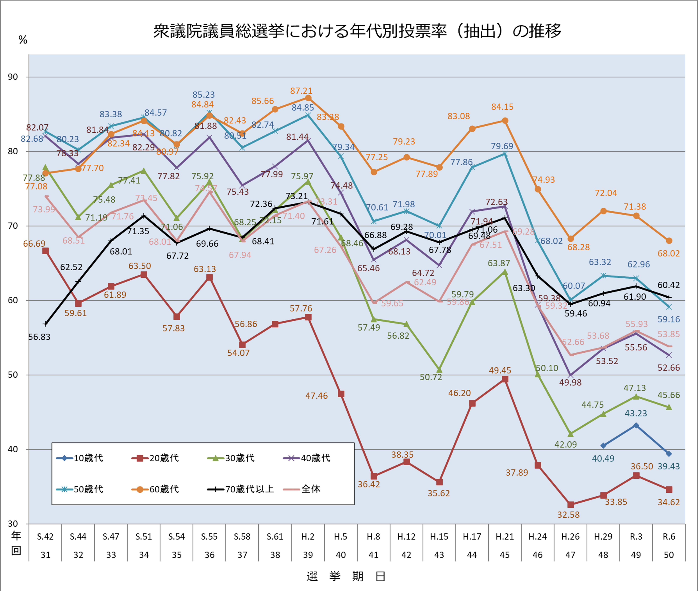
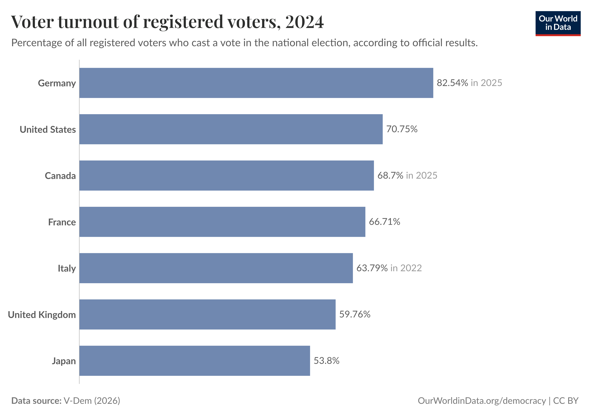
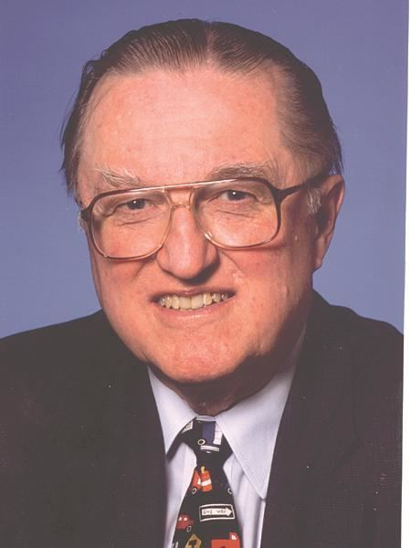

## 今日の目次

1. はじめに
1. 投票参加とその実態
1. 合理的選択論
1. 投票のパラドックスとROモデル
1. 投票参加の要因
1. まとめ

# はじめに
## 先週のRPより
TBD

## 本日の目的と到達目標
::: {style="font-size: 0.9em;"}
#### 目的
政治参加の中でも特に重要である、選挙と投票参加を考察する。人間の行動に関する合理的選択理論を学び、人はなぜ投票に行くのかを理論的に検討する。

::: {.fragment .fade-in}
#### 到達目標
1. 日本の投票参加の特徴を3つ列挙できる。
1. 社会的望ましさバイアスとは何かを説明できる。
1. 投票参加に関するダウンズら合理的選択論の主張とその問題点を説明できる。
1. 投票のパラドックスとは何かを説明できる
1. ライカー＝オーデシュックモデルの主張とその問題点を説明できる。
1. 投票参加に影響する具体的な要因を3つ以上挙げることができる。
:::

:::

## 本日の授業の位置付け

# 投票参加とその実態
## 質問
今年2月に行われた衆議院議員総選挙で投票しましたか？

1. はい
1. いいえ

## 衆議院議員総選挙の投票率
{width=75%}

::: {.notes}
1. 長期的に下落傾向にある
1. 高齢層に比べて若年層の投票率が低い
:::

## G7の投票率

::: {.notes}
2024年における国政選挙の投票率

国際的に比較しても日本の投票率は低い
:::

## 社会的望ましさバイアス
#### Social Desirability Bias (SDB)
社会調査で回答者が望ましい行動を過大報告し、あるいは望ましくない行動を過小報告する傾向

例：

::: {.incremental}
 - 「投票に行く」ことは望ましい→行っていない人も「行った」回答→実際よりも高い数字
 - 「大麻を吸う」ことは望ましくない→吸っている人も「吸ったと回答→実際よりも低い数字

:::

## リスト実験 (list experiment)
SDBを解決するための社会調査上の方法

::: {.fragment .fade-in}
「あなたは，次に示したもののうち，いくつに当てはまりますか。当てはまるものの『個数』をお答えください。どれに当てはまるかをお答えになる必要はありません。」[^list_ex]
:::

::: {.incremental} 
 - 過去 1 か月間に 1 回でも Yahoo!を使った。
 - 自宅でダイヤル式電話機を使ったことがある。
 - Instagram のアカウントを持っている。
 - 過去 1 年間に外国へ観光旅行に行ったことがある。
 - **今回の衆議院議員総選挙で投票した。**（50%の確率で表示）
 
:::
 
[^list_ex]: 谷口将紀・大森翔子（2022）「社会調査における投票率のバイアス」NIRAワーキングペーパーNo.5 [https://www.nira.or.jp/paper/article/2022/wp05.html](https://www.nira.or.jp/paper/article/2022/wp05.html)

# 合理的選択論
## 合理的選択論 (Rational Choice Theory)

::: {.incremental}
- 経済学における基本的な考え
- アクターは効用を最大化するべく行動と仮定
   - 利益を最大に、コストを最小に
   
:::

::: {.fragment .fade-in}
**アンソニー・ダウンズ**のモデル

::: {style="font-size: 0.8em;"}

::: {.columns}

::: {.column width=80%}
$$
R = P \times B - C
$$

::: {.incremental}
- R：投票から得られる報酬（reward）
- P：自分の１票が結果に影響する確率（probability）
- B：投票から得られる利得（benefit）
- C：投票にかかる費用（cost）
   - 物理費用、機会費用、情報費用

:::

::: {.fragment .fade-in}
結論：$R>0$ならば投票；$R\leq 0$ならば棄権
:::

:::

::: {.column width=20%}

Anthony Downs

(1930-2021)
:::

:::

:::

:::

::: {.notes}
B：自分にとって望ましい政策を実施してくれる人が当選
C：投票に行くことで費やす労力、時間、情報収集
:::

## ワーク（10分）
1. **ソロワーク①**（2分）…ワークシート上で自分が投票に行った／行かなかった理由をメモ
2. **ソロワーク②**（2分）…WSを交換し、ペア相手の行動がダウンズのモデルで説明できるかどうかを考え、その理由をメモ
3. **ペアワーク③**（4分）…WSを相手に戻し、フィードバック
4. **全体に共有**（2分）

## ダウンズの議論の問題点
::: {.incremental}
1. 非合理的な投票行動を見ていない
   - 候補者イメージ、義務感…
1. 有権者の情報処理能力の過大評価
   - 候補者そして自分の政策位置がわからない
   - 情報収集の莫大な費用→無知が合理的
1. 投票しないパラドックスを説明できない（後述）

:::

# ライカー＝オーデシュックモデル

## 質問
ダウンズモデルのP（自分の１票が結果に与える確率）の値は実際にはどれくらいになると思いますか？

::: {.fragment .fade-in}
#### 投票しないパラドックス (Paradox of Not Voting)
:::

::: {.fragment .fade-in}
Pの値はせいぜい数万分の一程度→$P \times B$の値も極めて小さい
:::
::: {.fragment .fade-in}
したがってふつう$R = P \times B - C<0$→誰も投票に行かない
:::
::: {.fragment .fade-in}
しかし、実際には投票率は低くても40%→ダウンズモデルでは説明できない
:::

## ライカー＝オーデシュックモデル
#### Riker-Ordeshook model (ROモデル)
::: {style="font-size: 0.9em;"}
**ウィリアム・ライカー**と**ピーター・オーデシュック**によるダウンズモデルの発展[^riker1968]→合理的選択論

::: {.fragment .fade-in}
$$
R = P \times B - C + D
$$

::: 

::: {.incremental}
- D：民主主義を守ろうとする**価値観**or**義務感**（democracy or duty）
   - 自分たちが投票に行かない→政治家は民意を気にしない
   - そうしないために投票に行く→$P \times B + C < 0$を埋め合わせて$R>0$に
- P：自分の１票が結果に影響する**主観的確率**

[^riker1968]: Riker, W. H., & Ordeshook, P. C. (1968). A Theory of the Calculus of Voting. *American Political Science Review, 62*(1), 25-42.

:::

:::

## ROモデルの問題点
::: {.incremental}
1. **トートロジー** (tautology)…同語反復
   - 「有権者が投票するのは投票しないと考えているからだ」→何も説明していない
1. **集合行為問題** (collective action problem)
   - 他人任せにして自分は協力しないこと
      - 詳細は第12回で
   - 自分以外の全員が投票すれば民主主義は守られる→誰も投票に行かない可能性

:::

# 投票参加の要因
## 質問
ライカー＝オーデシュックモデルを考えてください。

どのような人が投票に行きやすいと思いますか？また、どのような状況で投票率は高くなると思いますか？

P、B、C、Dそれぞれに関係する要因をワークシート上に書き出してください。

## 投票率に影響する主な要因
::: {style="font-size: 0.8em;"}
::: {.incremental}
- P：選挙の**接戦度**
   - [特定の候補者が圧勝しそう](https://www.asahi.com/senkyo/shuinsen/koho/A31.html)→自分の票は無駄になるかも
   - [2人の候補者が接戦](https://www.asahi.com/senkyo/shuinsen/koho/A11005.html)→自分の票が結果を左右するかも
- B：候補者間の**政策距離**
   - 候補者A（5%減税）と候補者B（5%増税）
   - もし有権者が減税を好むなら→Aに投票
   - もし減税／増税分が10%になったら…
- C：
  - **天気、投票所の場所、投票時間**→物理費用に影響
  - **平日／休日、所得**→機会費用に影響
  - **政治知識**と**学歴**→情報費用の低下
  - 年齢→情報費用を低下させるが物理費用を増加
- D：**社会経済的地位**（学歴、生まれ）、**世代**…

:::
:::

# まとめ
## 本日の目的と到達目標
::: {style="font-size: 0.9em;"}
#### 目的
政治参加の中でも特に重要である、選挙と投票参加を考察する。人間の行動に関する合理的選択理論を学び、人はなぜ投票に行くのかを理論的に検討する。

::: {.fragment .fade-in}
#### 到達目標
1. 日本の投票参加の特徴を3つ列挙できる。
1. 社会的望ましさバイアスとは何かを説明できる。
1. 投票参加に関するダウンズら合理的選択論の主張とその問題点を説明できる。
1. 投票のパラドックスとは何かを説明できる
1. ライカー＝オーデシュックモデルの主張とその問題点を説明できる。
1. 投票参加に影響する具体的な要因を3つ以上挙げることができる。

:::
:::

## 次回までに
#### 事後学習

 - 授業資料を見直し、目標到達をセルフチェック
 - WebClass上でのリアクションペーパー入力（土曜日まで）

#### 事前学習

 - 教科書（V-4〜V-8）を読み、WebClass 上でのチェックフォーム記入