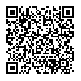
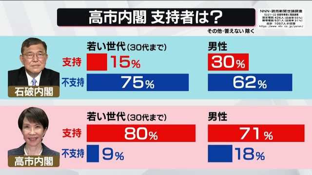
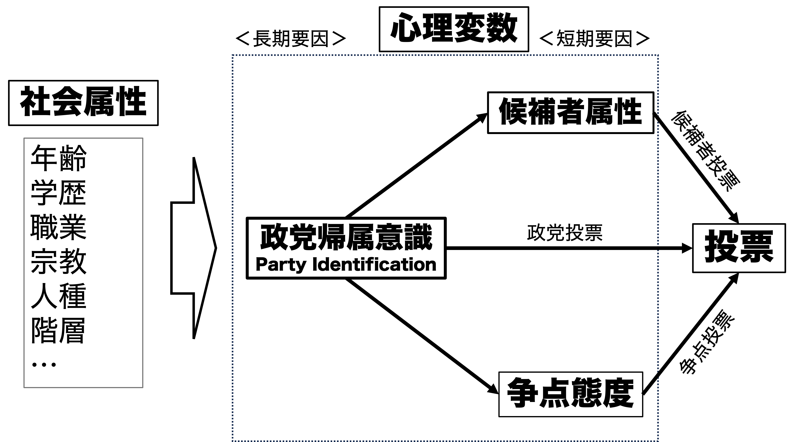
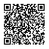

## 出席登録をお願いします

## 今日の目次

1. はじめに
1. 社会学モデル
1. 心理学モデル
1. 経済学モデル
1. モデルの比較
1. まとめ

# はじめに
## 先週のRPより
TBD

## 本日の目的と到達目標
::: {style="font-size: 0.8em;"}
#### 目的
有権者がどの候補者や政党に入れるのか、政治学で提起されてきた社会学モデル、心理学モデル、経済学モデルを学ぶ。三つのモデルを応用して、実際の投票行動を考察する。

::: {.fragment .fade-in}
#### 到達目標
1. 投票行動に関する社会学モデル（＝コロンビアモデル）の主張と問題点を説明できる。
1. 投票行動に関する心理学モデル（＝ミシガンモデル）の主張と問題点を説明できる。
1. 投票行動に関する経済学モデルの一つであるダウンズモデルの主張と問題点を説明できる。
1. 投票行動に関する経済学モデルの一つである業績評価モデルの主張と問題点を説明できる。
1. 自分や他人の投票行動について、社会学・心理学・経済学いずれかのモデルと関連づけて説明できる。
:::

:::

## 本日の授業の位置付け

# 社会学モデル
## 質問
一般的に自民党に投票する人々はどのような属性（年齢・性別・職業・居住地etc）を持った人々が多いと言われているでしょうか。

[WebClassチャット](https://webclass.komazawa-u.ac.jp/webclass/login.php?id=d15c3a25e074bb3910a1bed824c5f6e6)に記入してください。

{.r-stretch}

## 社会学モデル
有権者の**社会的属性**に着目して投票行動を説明するモデル

::: {.incremental}
- オハイオ州の**エリー調査** (1940)
   - **ラザースフェルド**らコロンビア大学のグループ
      - 別名：**コロンビアモデル**
   - 初めての**ランダムサンプリング**、**パネル調査**

:::

::: {.fragment .fade-in}
**社会的属性**が投票行動と関連

::: {.incremental}
- 社会経済地位、宗教、居住地、年齢、性別、人種…

:::
:::

::: {.fragment .fade-in}
#### **社会経済地位**（Socioeconomic status: **SES**）
個人あるいは家庭が社会の上で持つ階層や経済的な地位

::: {.incremental}
- 学歴・所得・職業→いわゆる「上級国民」か否か

:::
:::

::: {.notes}
アメリカにおける社会的属性

- 白人・男性・高齢者・プロテスタント・農村部在住→共和党に投票
- 有色人種・女性・若年層・カトリック・都市部在住→民主党に投票
:::

## 年齢・性別と内閣支持：石破vs.高市

{.r-stretch}

<!-- https://news.yahoo.co.jp/articles/f421dd9b2cd03eee166ae07db7804efd8f7db7a1 -->

::: {.notes}
問いかけ②（社会学モデルの概要の後）

- 目的：社会学モデルが説明できない点に気づく
- 質問「（[読売の年代別内閣支持率［石破vs.高市]](https://www.yomiuri.co.jp/election/yoron-chosa/20251023-OYT1T50020/)を見せながら）石破さんから高市さんに変わったことで特に若年層の間で内閣支持率が上がっています。このことから社会学モデルにはどんな欠点があると言えますか。」
   - 進行：ペアで話し合わせる（1分）→1人か2人に当てる
      - 石破政権は高齢者中心→社会学モデルに整合的
      - しかし9月→10月の間で高市政権に変わり、若者支持が急激上昇→非整合的
      
:::

## 社会学モデルの問題点
::: {.incremental}
1. **短期的変動**が説明できない
   - 若い世代の自民党支持が乱高下するのはなぜ？
1. 「**支持**」と「**投票**」が区別されていない
   - **トートロジー**（同語反復）になっている
1. 「**なぜ**」が説明できていない
   - 農家／若者はなぜ自民党を支持するのか？

:::

::: {.fragment .fade-in}
→**心理学・経済学モデル**へ
:::

# 心理学モデル
## 心理学モデル（ミシガンモデル）
有権者の**心理**に着目したモデル

::: {.fragment .fade-in}

:::

::: {.notes}
- ミシガンモデルは社会属性の影響を否定したわけではない

- ただし、社会属性と投票行動の間に心理的な媒介が挟まると主張する

- 心理変数としては、政党帰属意識＞候補者属性＞争点態度
:::

## 政党帰属意識
#### Party Identification: Party ID (政党ID)

自分が応援する**政党に対して感じる一体感や愛着**

::: {.fragment .fade-in}
心理的要因の中で最も影響力が大きく、かつ長期にわたり安定
:::

::: {.fragment .fade-in}
**政治的社会化**を通じた形成

::: {.incremental}
- 子どもから大人にかけての政治的価値観・態度の形成過程
- 親・遊び仲間・職場などの周囲の環境から学習
- 政党IDは特に**親**から受け継ぐ傾向

:::
:::

::: {.fragment .fade-in}
政党IDは投票行動と区別→**「逸脱投票」**

::: {.incremental}
- レーガン・デモクラット…レーガン大統領（共和党）を支持する民主党員

:::
:::

## アンケート
前回投票したかは別にして、あなたは普段支持する政党はありますか？

支持するというほどではない場合、親近感を持つ政党はありますか？

[WebClass上で回答](https://webclass.komazawa-u.ac.jp/webclass/login.php?id=3dc0bdb77459ecf04ee51e4517d5abc2&page=1)してください

{.r-stretch}

（チャットとはURLが違うので注意）

## 心理学モデルの問題
::: {.fragment .fade-in}
**外的妥当性**…国と時間の文脈を越えられるか？

::: {.incremental}
- 60-70年代のアメリカの分析結果

:::

:::

::: {.fragment .fade-in}
「Republican/Democrat」の意味

::: {.incremental}
- 単に「党員」「支持者」を超える→帰属意識
- 日本との比較
   - 無党派層の多さ（特に90年代以降）
   - 「**政党支持態度**」（三宅一郎）…政党IDよりも弱い

:::

:::

::: {.fragment .fade-in}
現代アメリカの**感情的分極化**（affective polarization）

::: {.incremental}
- 逸脱投票はまれ

:::

:::

::: {.notes}
政党帰属意識は「巨人ファン」「阪神ファン」と言ったものに近い
:::

# 経済学モデル
## 経済学モデル
有権者の合理性に注目したモデル

::: {.fragment .fade-in}
#### 復習：合理的選択論

::: {.incremental}
- 経済学における基本的な考え
- アクターは効用を最大化するべく行動すると仮定

:::

:::

::: {.fragment .fade-in}
主張「自分にとって一番得になる候補者に投票」
:::

## ダウンズモデル (Downsian model)
::: {.columns}

::: {.column width=80%}
有権者は自分の**政策選好に最も近い候補者**に投票

::: {.fragment .fade-in}

:::

::: {.fragment .fade-in}
→有権者は**距離がより近いAに投票**
:::

:::

::: {.column width=20%}

:::

:::

## ダウンズモデルの問題点
この時有権者はどちらに投票しますか？

::: {.fragment .fade-in}

:::

::: {.fragment .fade-in}
→**近接性**だけでなく**方向性**も考える必要？

:::

## 業績評価投票モデル
#### restrospective voting model
::: {.columns}

::: {.column width=80%}
**モーリス・フィオリーナ**の提唱

::: {.fragment .fade-in}
有権者は現職候補者や政権与党の**過去の業績**に基づいて投票

- いい働きをしたら現職・与党に、悪いと思ったら野党に
- 過去の業績を見る→**restrospective**（回顧的）

:::

::: {.fragment .fade-in}
政党IDの再定義

- 過去から現在までの政党の評価の累積
- 親からRepublican→業績が悪ければ政党IDが低下

:::

:::

::: {.column width=20%}

:::

:::

## 質問
あなたはどういう「業績」のある候補者や政党に投票したいと思いますか？

[WebClassチャット](https://webclass.komazawa-u.ac.jp/webclass/login.php?id=d15c3a25e074bb3910a1bed824c5f6e6)に記入してください。

{.r-stretch}

（最初のものと同じです）

## 個人志向vs.社会志向
::: {.fragment .fade-in}
**個人志向**投票 (**pocketbook** voting)

::: {.incremental}
- 自分個人にとって政府がいいことをしてくれたから投票
- 給料が上がった、税金が安くなった、就職できた…

:::
:::

::: {.fragment .fade-in}
**社会志向**投票 (**sociotropic** voting)

::: {.incremental}
- 社会全体にとって政府がいいことをしたから投票
- GDPが成長した、失業率が減った、インフレ率が減った…

:::
:::

# モデルの比較
## 3つのモデルまとめ

::: {.fragment .fade-in}
**社会学モデル**…外的要因に注目

- 強み：非常に直感的
- 限界：「なぜ」が不明確、短期的な変化に着目しない、政党支持と投票行動が曖昧

:::

::: {.fragment .fade-in}
**心理学モデル**…内的態度に注目

- 強み：政党支持と投票行動を区別、短期の変化の説明
- 限界：外的妥当性に難

:::

::: {.fragment .fade-in}
**経済学モデル**…合理性に注目

- 強み：「なぜ」を説明
- 限界：近接性vs.方向性、個人志向vs.社会志向

:::

## Think-pair-share
1. **Think**（1-2分）…前回の自分の投票選択の理由を書き留める
   - 自分が投票していない場合は家族など身近な人の選択で良い
   - 具体的な投票先は伏せる
1. **Pair**（3分）…ペアを組み、投票選択の理由を共有
   - 理由を紹介された側は、相手の理由は社会学・心理学・経済学どれで最も説明できるかを考える
1. **Share**（2-3分）…全体に共有（[WebClassチャット](https://webclass.komazawa-u.ac.jp/webclass/login.php?id=d15c3a25e074bb3910a1bed824c5f6e6)）

# まとめ
## 本日の目的と到達目標
::: {style="font-size: 0.8em;"}
#### 目的
有権者がどの候補者や政党に入れるのか、政治学で提起されてきた社会学モデル、心理学モデル、経済学モデルを学ぶ。三つのモデルを応用して、実際の投票行動を考察する。

::: {.fragment .fade-in}
#### 到達目標
1. 投票行動に関する社会学モデル（＝コロンビアモデル）の主張と問題点を説明できる。
1. 投票行動に関する心理学モデル（＝ミシガンモデル）の主張と問題点を説明できる。
1. 投票行動に関する経済学モデルの一つであるダウンズモデルの主張と問題点を説明できる。
1. 投票行動に関する経済学モデルの一つである業績評価モデルの主張と問題点を説明できる。
1. 自分や他人の投票行動について、社会学・心理学・経済学いずれかのモデルと関連づけて説明できる。
:::

:::

## 次回までに
#### 事後学習

 - 授業資料を見直し、目標到達をセルフチェック
 - WebClass上でのリアクションペーパー入力（日曜日まで）
    - 授業で学んだモデルのうち、最も説得的に思うものについて記入（通常の感想欄とは別）

#### 事前学習

 - 教科書（V-12〜V-15）を読み、WebClass 上でのチェックフォーム記入