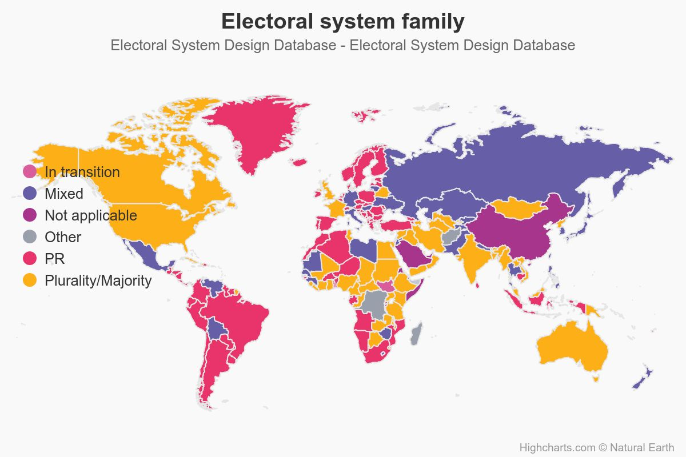

## 出席登録をお願いします

## 今日の目次

1. はじめに
1. 選挙制度の概要
1. 多数代表制／デュヴェルジェの法則
1. 比例代表制
1. 日本の選挙制度
1. まとめ

# はじめに
## 先週のRPより
TBD

## 本日の目的と到達目標
::: {style="font-size: 0.9em;"}
#### 目的
多数代表制や比例代表制といった制度を紹介し、世界の選挙制度について概観する。デュベルジェの法則を通じて、選挙制度が投票行動や政党システムに与える影響を考察する。日本の選挙制度の特徴である選挙制度不均一についても論じる。

::: {.fragment .fade-in}
#### 到達目標
1. 多数代表制と比例代表制とはそれぞれ何かを説明できる。
1. デュヴェルジェの法則を踏まえて選挙制度と政党システムの関係を説明できる。
1. 最大平均法あるいは最大剰余法を用いて比例代表制下の議席獲得率を計算できる。
1. 日本の選挙制度の特徴である選挙制度不均一について、その実態と影響を説明できる。
:::

:::

## 本日の授業の位置付け

# 選挙制度の概要
## 選挙制度
選挙に関するさまざまなルール[^Ogawa2025]

::: {.fragment .fade-in}
**投票**を**議席**に変換するルール（cf. 入力と変換）

::: {.incremental}
- **多数代表制**…得票数の多い順に議席を配分
- **比例代表制**…政党ごとの得票に比例して議席を配分
- **混合制**…両者の組み合わせ

:::
:::

::: {.fragment .fade-in}
その他のルール

::: {.incremental}
- 選挙区定数 (magnitude)…1人か複数か
- 投票方式…単記制、連記制、優先順位制…

:::
:::

[^Ogawa2025]: 小川寛貴（2025）「選挙制度－日本が特異なのか？」浅古泰史・善教将大編『数理とデータで読み解く日本政治』日本評論社，p.22．

## 世界の選挙制度

::: {.notes}
英語圏の国々は多数代表（Plurality/Majority）が多い

ヨーロッパの国々は比例代表が多い（PR）が多い

日本は混合（Mixed）
:::

# 多数代表制／デュヴェルジェの法則
## 多数代表制 (majoritarian representation)
::: {style="font-size: 0.9em;"}
得票数の多い順に議席を配分するシステム

::: {.fragment .fade-in}
**小選挙区制**（定数1人）と**大選挙区制**（定数2人-）
:::

::: {.fragment .fade-in}
多数派や大政党が有利なシステム

::: {.incremental}
- 特に小選挙区制ではトップ以外は落選
- 少数派や小政党への投票は「**死票**」に

:::
:::

::: {.fragment .fade-in}
#### ギャラガー指標 (Gallagher Index)
得票率と議席率の乖離（＝**非比例性**）を測る指標

:::

::: {.fragment .fade-in}
$$
G = \sqrt{\frac{1}{2}\sum_{i=1}^{n}(v_i-s_i)^2}
$$
$n$個の政党；$v_i$：政党$i$の得票率；$s_i$：政党$i$の議席率

:::

::: {.fragment .fade-in}
→多数代表制は比例代表制よりも大きい（教科書p.79の表１）

:::
:::

::: {.notes}
$n$個ある政党のうち、政党$i$の得票率$v_i$から議席率$v_i$を引いて二乗したのを全部の政党を足して2で割ってルートをとる

ギャラガー指標が大きい→得票率よりも多い議席率が割り当てられている
:::

## アンケート
ある選挙区で以下の候補者が立っています。

::: {.fragment .fade-in}

| 候補者     | あなたの態度 | 情勢     | 
| ---------- | ------------ | -------- | 
| 井上勝     | 大好き       | 追い上げ |
| 田中洋平   | 大嫌い       | 優勢     | 
| 佐藤みゆき | まあ好き     | 優勢     | 

::: {.incremental}
1. 2人当選するとしたら、誰に投票しますか
1. 1人当選するとしたら、誰に投票しますか

:::
:::

::: {.fragment .fade-in}
[WebClassアンケート](https://webclass.komazawa-u.ac.jp/webclass/login.php?id=9a97218475d0c6f19ef7fd6893035662&page=1)で回答してください。

{width=20%}
:::

## デュヴェルジェの法則 (Duverger's Law)
::: {.columns}
::: {.column width=70%}
**小選挙区制**では**二大政党制**に、**比例代表制**では**多党制**になる

::: {.incremental}
- **機械的効果**…小政党の議席獲得は難しい
- **心理的効果**…有権者が**戦略投票**を行う
   - 小党は勝てないとわかっている有権者
   - 大政党でましな方に投票
   - cf. **誠実投票**…自分の選好通りに投票

:::

::: {.fragment .fade-in}
Cf. **$M+1$ルール**…政党数は選挙区定数($M$)に1を加えた数になる傾向

:::

:::

::: {.column width=30%}

**Maurice Duverger**

(1917-2014)

:::

:::

# 比例代表制
## 比例代表制 (proportional representation)
政党ごとの得票に比例して議席を配分するシステム

::: {.incremental}
- **政党名簿式**…政党が提出した候補者リストに基づく
   - **拘束名簿式**…政党に対して投票
   - **非拘束名簿式**…政党および候補者に対して投票
- **単記移譲式**…候補者に優先順位をつけて投票

:::

::: {.fragment .fade-in}
得票から議席への変換方式

::: {.incremental}
- **最大剰余法**…ヘアー式、ドループ式…
- **最大平均法**…ドント式、アダムズ式、サン＝ラグ式…

:::
:::

::: {.notes}
比例代表制といえば基本的には政党名簿式

単記移譲式はアイルランド、オーストラリア、マルタだけ
:::

## 最大剰余法（ヘアー式）
**基数**…投票総数を定数で割ったもの

::: {.fragment .fade-in}
投票総数100,000票で5議席を配分する例

::: {.incremental}
- 基数$100,000 \div 5 = 20,000$

:::
:::

::: {.fragment .fade-in}
| 政党        | 得票数  | 得票数÷基数 （1段階目議席） | 余り   | 2段階目議席 | 獲得議席 | 
| ------------ | ------- | -------------------------- | ------ | ----------- | -------- | 
| **自民党**   | 60,000  | 3                          | 0      | 0           | 3        | 
| **中道改革** | 28,000  | 1                          | 8,000  | 0           | 1        | 
| **維新の会** | 12,000  | 0                          | 12,000 | 1           | 1        | 
| **合計**     | 100,000 | 4                          | 20,000  | 1           | 5        | 

:::

## 最大平均法（ドント方式）
各党の得票数を自然数で順次割りその商の大きさの順に議席を配分

::: {.fragment .fade-in}
投票総数100,000票で5議席を配分する例

| **政党**     | 得票数  | ÷1       | ÷2       | ÷3       | ÷4       | 獲得議席 | 
| :------------ | -------: | -------- | -------- | -------- | -------- | :-------- | 
| **自民党**   | 60,000  | 60,000① | 30,000② | 20,000④ | 15,000⑤ | 4        | 
| **中道改革** | 28,000  | 28,000③ | 14,000   |          |          | 1        | 
| **維新の会** | 12,000  | 12,000   |          |          |          | 0        | 
| **合計**     | 100,000 |          |          |          |          | 5        | 

:::

::: {.fragment .fade-in}
最大剰余法よりも大政党が有利＝非比例性指標が高い
:::

## 演習（ワークシート）
4党が**10議席**を争う選挙で次のような得票になりました。

ヘアー式とドント式ではそれぞれどのような議席配分になるでしょうか？

| 政党名           | 得票数  | ヘアー式 | ドント式 | 
| ---------------- | ------- | -------- | -------- | 
| **家系党**       | 250,000 | ?        | ?        | 
| **二郎の会**     | 120,000 | ?        | ?        | 
| **蒙古中本連合** | 80,000  | ?        | ?        | 
| **新党がんこ**   | 50,000  | ?        | ?        | 
| **合計**         | 500,000 | 10       | 10       | 

::: {.notes}
| 政党名           | 得票数  | ヘアー式 | ドント式 | 
| ---------------- | ------- | -------- | -------- | 
| **家系党**       | 250,000 | 5        | 6        | 
| **二郎の会**     | 120,000 | 2        | 2        | 
| **蒙古中本連合** | 80,000  | 2        | 1        | 
| **新党がんこ**   | 50,000  | 1        | 1        | 
| **合計**         | 500,000 | 10       | 10       | 
:::

# 日本の選挙制度
## 日本の選挙制度
多数代表の比重が大きい**混合制**

::: {.incremental}
- 衆議院…**小選挙区比例代表並立制**
   - 定数1人の小選挙区（289）
   - 都道府県単位の拘束名簿式比例区（176）
   - 重複立候補可能
- 参議院
   - 定数1-6人の選挙区（148）
   - 全国単位の非拘束名簿式比例区（100）
   - 重複立候補不可
- 都道府県・市町村議会…複数定数が多い選挙区制

:::

## 質問
小選挙区と比例代表が両方ある日本の衆議院議員選挙においては、完全に小選挙区制のアメリカなどと比べると有権者は戦略投票しやすくなると思いますか？あるいはしにくくなると思いますか？

## 選挙制度不均一
一国内に**異なる選挙制度が混在**していること

::: {.incremental}
- 衆院と参院、制度と制度、選挙区と選挙区、国政と地方、地方と地方…
- 特に参院の選挙区間定数の不均一が世界的に見ても大きい

:::

::: {.fragment .fade-in}
有権者や政党の行動に影響

::: {.incremental}
- 小政党の小選挙区進出
   - 例：参政党と共産党
- **心理的効果**の弱まり
   - 小政党にも勝ち目があると認識
   - 戦略投票ではなく誠実投票
- 並立制の理念の形骸化

:::
:::

::: {.notes}
衆院の並立制は元々政党を中心とした選挙を行なって政権交代可能な政治を目指して導入された

それまでは中選挙区制（定数3〜5人）→候補者本位の選挙で派閥が発達し政党の規律が弱かった（特に自民党）
:::

# まとめ
## 本日の目的と到達目標
::: {style="font-size: 0.9em;"}
#### 目的
多数代表制や比例代表制といった制度を紹介し、世界の選挙制度について概観する。デュベルジェの法則を通じて、選挙制度が投票行動や政党システムに与える影響を考察する。日本の選挙制度の特徴である選挙制度不均一についても論じる。

::: {.fragment .fade-in}
#### 到達目標
1. 多数代表制と比例代表制とはそれぞれ何かを説明できる。
1. デュヴェルジェの法則を踏まえて選挙制度と政党システムの関係を説明できる。
1. 最大平均法あるいは最大剰余法を用いて比例代表制下の議席獲得率を計算できる
1. 日本の選挙制度の特徴である選挙制度不均一について、その実態と影響を説明できる。
:::

:::

## 次回までに
#### 事後学習

 - 授業資料を見直し、目標到達をセルフチェック
 - WebClass上でのリアクションペーパー入力（日曜日まで）

#### 事前学習

 - 教科書（I-1〜2、I-7〜8）を読む。
