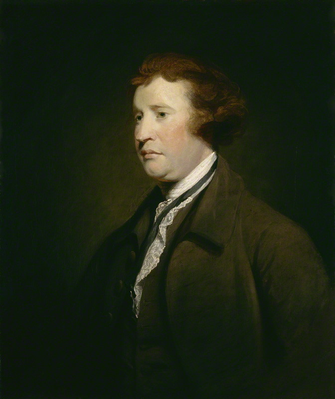
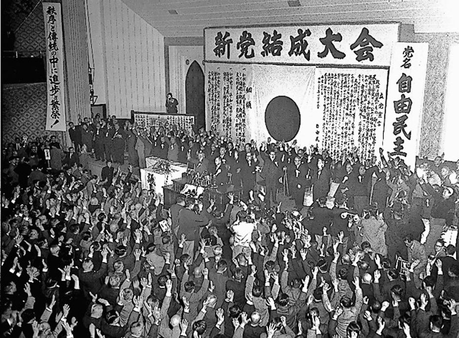

## 出席登録をお願いします

## 今日の目次

1. はじめに
1. 政党の機能
1. 政治家と政党／社会的選択問題
1. 政党組織論
1. 日本の政党組織
1. まとめ

# はじめに
::: {.notes}
目標15分
:::
## 先週のRPより (1/4)
> デュヴェルジェの法則について学んだ。小選挙区制では二大政党制になりやすく、比例代表制では多党制になりやすいことを知り、選挙制度が政党の数や投票行動に大きな影響を与えることが印象に残った

## 先週のRPより (2/4)
::: {.fragment .fade-in}
> 小選挙区制にも比例代表制にもそれぞれいい点があると知り、混合制を使ってより良い選挙にしようとしている日本は良い国だと思いました。

:::

::: {.fragment .fade-in}
> 落選者が比例復活する矛盾や、死票を恐れて本命に投票できない歪みがある中、なぜこの中途半端な制度を続けるが疑問が残った

:::

::: {.fragment .fade-in}
> 比例代表制は多様な意見を正確に反映できる強みがあることがわかり、これらを組み合わせた混合制は、安定性と公平性のバランスを取ろうとする現実的な工夫だと感じた。

:::

::: {.notes}
小選挙区比例代表並立制

- ポジティブな意見とネガティブな意見
- 政治学者（私も含めて）ネガティブ
   - 中途半端な制度→良いところを補完し合うというよりは悪いところが出ている
      - 一強他弱：小選挙区部分で自民党が有利；比例部分で野党が分裂
   - 当初の理念と合っていない
      - 「政権交代可能な二大政党制」を実現したければ完全小選挙区制にすべき
      - それが嫌なら完全比例代表にすべき

:::

## 先週のRPより (3/4)
> プリントのヘアー式の計算で蒙古中本連合の議席が2票になるのはなぜですか、計算したら1.6だったので1議席0.6余りだと思ったのですが四捨五入する必要があるということですか。

::: {.fragment .fade-in}
> ヘアー式、ドント式を学んだ。ヘアー式の第2議席目に配分する場面があまり分からなかった。余りが多い方に配分するようになっていたけど、余りが少ない方に配分する方がいいと思ったがどういう理論なのか知りたい。

:::

::: {.notes}
ヘアー式

- 計算方法…余りをそのままにしておくから小数は出ない（実際に計算を解説）
- 余りが最大の政党に議席を割り振る
   - 余り＝「惜しい」度を測る
      - 中本：80,000→もう20,000取っていたら1段階目で2議席取れていた
      - 余りで測れば最も「惜しい」→二段階目で優遇
      - 小政党は一段階目で惜しい→最大剰余法は小政党に有利
         - 逆に余りが小さい方に配分したら、家系党が有利

:::

## 授業の方法(4/4)
> Web class で行なっているチャットですが、匿名で送れる設定にしていただきたいです。

::: {.notes}
チャットの匿名化

- 慣れておらず恐縮
- 今週以降匿名化しました

:::

## 本日の目的と到達目標
::: {style="font-size: 0.9em;"}
#### 目的
政党とは何か、その目的と政治システムの中で果たす機能を概観する。組織の面から近代政党の成立に至るまでの歴史を辿るとともに、日本の自由民主党の組織上の特徴を考察する。

::: {.fragment .fade-in}
#### 到達目標
1. 政党の主要な機能を4つ列挙できる。
1. 政治家にとっての政党の3つの存在意義を列挙できる。
1. 政党がどのようにして「コンドルセのパラドックス」を解決するのかを説明できる。
1. 「貴族政党」「名望家政党」「大衆政党」「包括政党」という語句を用いて、政党組織の変遷を説明できる。
1. 日本の自由民主党の組織上の特徴を説明できる。
:::

:::

## 本日の授業の位置付け

# 政党の機能
::: {.notes}
ここまで15分

目標15分
:::
## 復習：政治システム

## 質問
日本には自民党や中道改革連合、維新の会、国民民主党といった政党が存在します。

こうした政党は具体的には何をしているでしょうか？

簡単なものでもいいので[WebClassチャット](https://webclass.komazawa-u.ac.jp/webclass/login.php?id=61f237a64bbcd900ecb90775f90b691a)に書き込んでみてください。

{width=30%}

## 政党 (party/political party)
::: {.columns}
::: {.column width=70%}
**エドマンド・バーク**の定義

::: {.fragment .fade-in}
> 自分たちの**共同の努力**により、自分たちが皆同意している何らかの**特定の原理**の上に立ち、**国民的利益**を増進するために**結合した人々の組織団体**

:::

:::

::: {.column width=30%}

**Edmund Burke**

(1729-97)

:::

:::

::: {.notes}
Q「バークを聞いたことがある人？」→イギリスの政治家、『フランス革命の省察』にて革命を批判、保守主義の祖と呼ばれる
:::

## 政党の主要機能
::: {.incremental}
1. **政策形成**…社会の利益を表出・変換し、政策へ
   - **表出**…社会のさまざまな利益を政府に伝達（＝入力）
   - **集約**…多様な利益をまとめ、対立を調停（＝変換）
1. **政治的リクルートメント**…選挙の候補者を探索・擁立・支援
   - 政党主導、予備選挙、公募、後継指名…
1. **指導者の選抜と政府の形成**
   - 大統領・首相・大臣になりうる人材の選抜・養成
   - 与党として行政府を組織したり、議会に役職者を提供
   - 野党として代替案の提示
1. **政治的社会化**…有権者の政治知識を与え、参加を促進

:::

::: {.fragment .fade-in}
Q. 先ほどの政党の仕事は4機能のうちどれ？（[WebClassチャット](https://webclass.komazawa-u.ac.jp/webclass/login.php?id=297ed6b9fc55ca07f1e2f0f893bf0531)）

:::

# 政党と多数決のパラドックス
::: {.notes}
ここまで30分

目標15分
:::
## 政治家と政党
**ジョン・オールドリッチ**「政党は政治家たちによる**内生的制度** (endogenous institution)である」

::: {.incremental}
 - 政治家たちが直面する問題の解決手段

:::

::: {.fragment .fade-in}
政治家にとっての存在意義：

::: {.incremental}
1. **集合行為問題**の解決
   - 政治家は自分の選挙区に利益誘導したい
   - しかし、全員やると財源が逼迫する
1. **政治的野心**の実現
   - 政治家になりたいという野心で立候補
   - しかし、競合すれば共倒れの可能性
1. **コンドルセのパラドックス**の解決

:::
:::

## クイズ
岸田・石破・高市[^note]の3人の駒大生グループが海外旅行に行く計画を立てています。

::: {.fragment .fade-in}
イタリア、韓国、ケニアが目的地の候補で、それぞれ以下のような希望順位です。

:::

::: {.fragment .fade-in}
|      | 第1希望  | 第2希望  | 第3希望  | 
| ---- | -------- | -------- | -------- | 
| 岸田 | イタリア | 韓国     | ケニア   | 
| 石破 | 韓国     | ケニア   | イタリア | 
| 高市 | ケニア   | イタリア | 韓国     | 

:::

::: {.fragment .fade-in}
イタリアと韓国、韓国とケニア、イタリアとケニアのそれぞれ2択で多数決をしたらどちらが勝ちますか？

[WebClassアンケート](https://webclass.komazawa-u.ac.jp/webclass/login.php?id=4bf549362503c24f60d9dda5fadd2704&page=1)で回答してください。

:::

[^note]: 実在の人物とは全く関係がない。

## コンドルセのパラドックス
#### Condorcet's paradox
各人の選好順位が明確に存在しても、多数決では堂々巡りになってしまい決定できないこと

::: {.fragment .fade-in}
政党は**議事方式の管理**を通してこのパラドックスを解決可能

::: {.incremental}
- 多数派が結託して政党結成
- 議事の順番を自分たちに都合よく設定

:::
:::

## 旅行先の例
::: {.fragment .fade-in}

|      | 第1希望  | 第2希望  | 第3希望  | 
| ---- | -------- | -------- | -------- | 
| 岸田 | イタリア | 韓国     | ケニア   | 
| 石破 | 韓国     | ケニア   | イタリア | 
| 高市 | ケニア   | イタリア | 韓国     | 

:::

::: {.fragment .fade-in}
岸田・石破の連合形成

::: {.incremental}
- 2人ともケニアよりも韓国に行きたい
- 結託し、投票ルールを予選・決戦方式に
   - 予選…イタリアとケニア→ケニアの勝利
   - 決戦…ケニアと韓国→韓国の勝利

:::
:::

# 政党組織論
::: {.notes}
ここまで45分

休憩5分

目標15分
:::
## 政党研究
::: {.incremental}
- **政党組織論**…**政党内部の組織・構造**を考察
   - 歴史的にどのように変容してきたか
   - 各国に違いはあるか
- **政党システム論**…**政党同士の関係**を考察
   - 政党の数、力関係、距離…
   - 詳しくは次回

:::

## アンケート
次の日本の政党のうち、一般に「組織力が強い」と言われる政党はどれだと思いますか？

1. 自由民主党
1. 立憲民主党
1. 日本維新の会
1. 日本共産党
1. 公明党

[WebClassアンケート](https://webclass.komazawa-u.ac.jp/webclass/login.php?id=90fa86f56de500421708c681fef67619&page=1)で回答

{width=20%}

## 政党組織の歴史①
::: {.fragment .fade-in}
**貴族政党**…**貴族**と従者たちの集団（派閥）

::: {.incremental}
- 選挙導入以前（17〜18世紀）にかけて発達
- 官職などの**パトロネージ** (patronage)の配分を目的
- 例：イギリスの**ホイッグ党**と**トーリー党**

:::
:::

::: {.fragment .fade-in}
**名望家政党**…資本家や富農、知識人など**名望家**の主導

::: {.incremental}
- 19世紀前半の**制限選挙**導入後に発達
- こちらもパトロネージの配分が主眼
- **地方幹部会**が組織上の単位
   - 名望家たる議員と選挙区民の集団→分権的政党
   - **幹部政党** (cadre party)とも

:::
:::

## 政党組織の歴史②
::: {.fragment .fade-in}
**大衆政党** (mass party)…近代の**大衆**を基礎

::: {.incremental}
- 20世紀前半の**普通選挙**導入後に発達
- 特徴：個人資格による加入、支部単位、集権的党官僚制
- 例：社会主義政党→労働者階級との結合

:::
:::

::: {.fragment .fade-in}
**包括政党** (catch-all party)…特定階級ではなく**市民全体**を取り込む

::: {.incremental}
- 戦後（特に60年代以降）に発達
- 特徴：イデオロギー主張の減少、資金調達・利益団体接触の多様化
- Cf. **カルテル政党** (cartel party)…国家の機構の一つとなった既成政党

:::
:::

::: {.notes}
ドイツのナチスやイタリアのファシスト党も大衆政党
:::

# 日本の政党組織
::: {.notes}
ここまで65分（1:05:00）

目標20分
:::
## Think-pair-share (-10分)
日本の自由民主党は、名望家政党・大衆政党・包括政党のどの特徴を最も強く持っていると思いますか？また、それはなぜでしょうか？

1. **Think** (1分)…1人で考える
1. **Pair** (2-3分)…ペアで話し合う
1. **Share** (2-3分）…全体に共有する（[WebClassチャット](https://webclass.komazawa-u.ac.jp/webclass/login.php?id=297ed6b9fc55ca07f1e2f0f893bf0531)）

{width=30%}

## 自由民主党（自民党）
#### Liberal Democratic Party (LDP)
::: {.columns}
::: {.column width=65%}
::: {.fragment .fade-in}
1955年の**保守合同**により結党

- **自由党**と**日本民主党**
:::

::: {.fragment .fade-in}
結党以来ほぼ一貫して政権の座

::: {.incremental}
- **55年体制**（1955-93）

:::
:::

::: {.fragment .fade-in}
**保守政党**（中道右派〜右派）との位置付け

:::

:::

::: {.column width=35%}

:::
:::

## 自民党の特徴
::: {.fragment .fade-in}
**包括政党**…イデオロギーが不明確

::: {.incremental}
- 第二次安倍政権前後からの右傾化
- 岸田・石破ら穏健派も内包
- 伝統的な**利益誘導志向**

:::
:::

::: {.fragment .fade-in}
**名望家／幹部政党**…組織構造が分権的

::: {.incremental}
- 党本部の弱さ⇄派閥の存在
- 自律性の高い議員
   - 多くは地元の名望家
   - 個人後援会⇄派閥所属
   - 都道府県連…国会・地方議員の所属単位（＝幹部会）
- 選挙制度改革による変化？

:::
:::

::: {.notes}
派閥と議員の自律性のところで中選挙区制

- 定数3-5人：同じ選挙区内で自民党同士が競合
   - 自民党のラベルではなく、自分の特徴を売り出す→個人本位の選挙
   - その中で個人後援会が出てきて、党本部ではなく派閥がバックアップする
   
:::

# まとめ
::: {.notes}
ここまで85分（1:25:00）

目標15分
:::
## 本日の目的と到達目標
::: {style="font-size: 0.9em;"}
#### 目的
政党とは何か、その目的と政治システムの中で果たす機能を概観する。組織の面から近代政党の成立に至るまでの歴史を辿るとともに、日本の自由民主党の組織上の特徴を考察する。

::: {.fragment .fade-in}
#### 到達目標
1. 政党の主要な機能を4つ列挙できる。
1. 政治家にとっての政党の3つの存在意義を列挙できる。
1. 政党がどのようにして「コンドルセのパラドックス」を解決するのかを説明できる。
1. 「貴族政党」「名望家政党」「大衆政党」「包括政党」という語句を用いて、政党組織の変遷を説明できる。
1. 日本の自由民主党の組織上の特徴を説明できる。
:::

:::

## 次回までに
#### 事後学習

 - 授業資料を見直し、目標到達をセルフチェック
 - WebClass上でのリアクションペーパー入力（日曜日まで）

#### 事前学習

 - 教科書（I-3〜6）を読む。