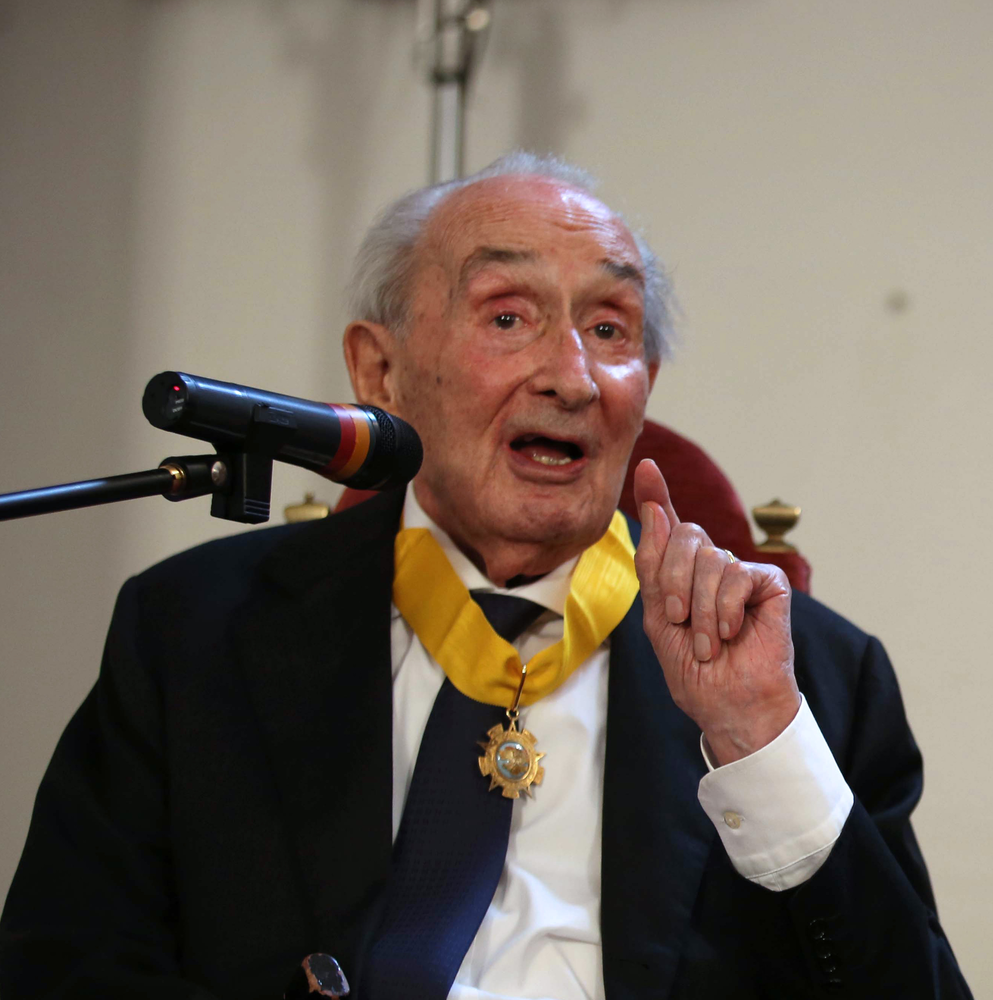
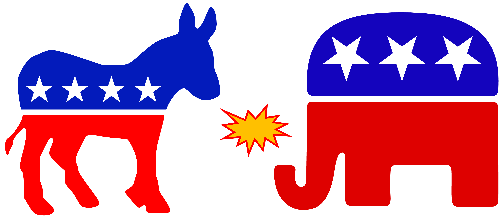

## 出席登録をお願いします

## 今日の目次

1. はじめに
1. イデオロギー
1. 政党システム
1. 政党システムの形成
1. 政党システムの変容
1. まとめ

# はじめに
## 先週のRPより
TBD

## 本日の目的と到達目標
::: {style="font-size: 0.8em;"}
#### 目的
政党間の相互作用の構造である政党システムについて学ぶ。政党を特徴づけるイデオロギーを学んだのち、政党システムについてのサルトーリの類型論や形成に関する凍結仮説を紹介する。さらに近年先進国における右派ポピュリズム政党の対等に見られるような現代の政党システムの変容を考察する。

::: {.fragment .fade-in}
#### 到達目標
1. イデオロギーや政党を右派・左派の一次元で捉えることの意義を説明できる。
1. 政党システムとは何かを説明できる。
1. サルトーリの政党システム類型論のうち、競争的システムと位置付けられる4つを列挙できる。
1. イギリスとイタリアの事例を用いて「凍結仮説」の内容を説明できる。
1. 戦後西側諸国における社会構造の変化が政党システムにどのような変容をもたらしたのかを説明できる。
1. ポピュリズムの概念を説明できる。
:::

:::

## 本日の授業の位置付け

# イデオロギー
## アンケート
異なる政治的立場を表す時、「**右派**」と「**左派**」などといったように、対になった２つの言葉で表現することがあります。

1. 憲法や格差是正などをめぐる主張や立場がありますが、それぞれ「右派」っぽいと思いますか？それとも「左派」っぽいと思いますか？
1. もっとも左派的な立場を1、中道・中立を4、もっとも右派的な立場を7とすると、日本の各政党の立場はどこに当たると思いますか？

[WebClassアンケート](https://webclass.komazawa-u.ac.jp/webclass/login.php?id=5f9a99251bb4ee3b1a5b534d2a9ccfce&page=1)で回答してください。

{.r-stretch}

## イデオロギー (ideology)[^kabashima2012]
比較的守備一貫した**信念や態度のまとまり**

::: {.incremental}
- 例：右派…憲法改正賛成、原発賛成、夫婦別姓反対、同性婚反対
- 本来は相互に関係ないのに共起

:::

::: {.fragment .fade-in}
**わかりやすい言葉・イメージ・シンボル**で表現

::: {.incremental}
- 例：右派／左派、保守主義、自由主義（リベラリズム）、共産主義、社会民主主義、ファシズム、環境主義、排外主義…

:::
:::

::: {.fragment .fade-in}
::: {layout-ncol=3}
{width=40%}

{width=30%}

{width=60%}
:::
:::

[^kabashima2012]: 蒲島郁夫・竹中佳彦（2012）『イデオロギー』東京大学出版会，pp.33-34．

## イデオロギーの左右次元
政党や候補者は「左派」から「右派」の一次元の**イデオロギー空間**上に位置付け

::: {.fragment .fade-in}

:::

::: {.fragment .fade-in}
**情報ショートカット**として機能（ダウンズ）

::: {.incremental}
- 無数にある政策争点vs.人間の処理機能の限界
- 一次元上の位置付けで候補者の争点態度を予測可能
   - 「右派」→憲法改正賛成、原発賛成、夫婦別姓反対、同性婚反対…
- 自分と政党・候補者の距離を測ることも容易に

:::
:::

# 政党システム
## 政党研究と政党システム
::: {.fragment .fade-in}
#### 復習：政党研究
::: {.incremental}
- **政党組織論**…**政党内部の組織・構造**を考察
- **政党システム論**…**政党同士の関係**を考察

:::
:::

::: {.fragment .fade-in}
#### 政党システム／政党制 (party system)
政党間の相互作用（**競争**と**協調**）の構造

:::

::: {.fragment .fade-in}
::: {.columns}
::: {.column width=75%}
**デュヴェルジェ**の類型論…**政党数**による分類

::: {.incremental}
- 一党制、二党制、多党制

:::

::: {.fragment .fade-in}
Q. 日本と中国の政党システムは同じと言えるか？（[WebClassチャット](https://webclass.komazawa-u.ac.jp/webclass/login.php?id=148fc7c1d51076c82287779d88861530)）
:::
:::

::: {.column width=25%}
{width=70%}
:::

:::
:::

## サルトーリの類型論[^sartori1976]
::: {style="font-size: 0.8em;"}
::: {.columns}
::: {.column width=80%}
三つの基準による分類

::: {.incremental}
- **競争性**
- **政党数**
- **イデオロギー距離**

::: {.fragment .fade-in}
| 競争性     | システム         | 政党数 | イデオロギー距離 | 
| ---------- | ---------------- | ---------- | ---------------- | 
| 非競争的   | 一党制           | 1          |                  | 
|            | ヘゲモニー政党制 | 1+α          |                  | 
| 競争的     | 一党優位政党制   | 1+α         |                  | 
|            | 二大政党制       | 2+α          |                  | 
|            | 穏健多党制       | 3〜5       | 小さい           | 
|            | 分極多党制       | 6〜8       | 大きい           | 
| 擬似政党制 | 原子化多党制     | 無数       |                  | 

:::

:::

:::

::: {.column width=20%}

:::

:::

[^sartori1976]: サルトーリ（1976=2009）『現代政党学－政党システム論の分析枠組み』（岡澤憲芙・川野秀之訳）早稲田大学出版部．

:::

## 競争的政党制
::: {.panel-tabset}
##### 一党優位政党制
{fig-align="center"}

##### 二大政党制
{fig-align="center"}

##### 穏健多党制
{fig-align="center"}

##### 分極多党制
{fig-align="center"}

:::

# 政党システムの形成
## 復習クイズ
デュヴェルジェの法則によれば、小選挙区制では【a】に、比例代表制では【b】になるとされています。

aとbに入る単語の適切な組み合わせを以下から選んでください。

1. a: 一党制、b: 多党制
1. a: 一党制、b: 二大政党制
1. a: 二大政党制、b: 多党制
1. a: 多党制、b: 二大政党制

[WebClass上](https://webclass.komazawa-u.ac.jp/webclass/login.php?id=dbf4350ab3386c2bb9eb0fd2077e3e8c&page=1)で回答

{.r-stretch}

## 政党システム形成の理論
::: {.fragment .fade-in}
**デュヴェルジェの法則**…**選挙制度**が政党システムを決める

::: {.incremental}
- **小選挙区制**では**二大政党制**に、**比例代表制**では**多党制**になる
- **機械的効果**と**心理的効果**

:::
:::

::: {.fragment .fade-in}
**凍結仮説**…**社会構造**が政党システムを決める

::: {.incremental}
- **シーモア・リップセット**と**スタイン・ロッカン**の提唱

:::
:::

::: {.fragment .fade-in}
::: {layout-ncol=2}
{width=50%}

{width=50%}
:::
:::

## 凍結仮説 (Freezing Hypothesis)[^lipset1967]
::: {.fragment .fade-in}
戦後の西欧の政党システムは1920年代までの**社会的亀裂** (social cleavage)を反映

::: {.incremental}
- 4つの亀裂：中央vs.地方、政府vs.教会、都市vs.農村、資本vs.労働

:::
:::

::: {.columns}
::: {.column width=50%}
::: {.fragment .fade-in}
イギリス…**世俗的二大政党制**

::: {.incremental}
- 早期の国家建設と政教対立解決→地域・宗教政党の不在
- 都市化→保守党（農村）vs.自由党（都市）
- 階級闘争→ 保守党（資本）vs.労働党

:::
:::
:::

::: {.column width=50%}
::: {.fragment .fade-in}
イタリア…**分極多党制**

::: {.incremental}
- 統一の遅れ→多数の地域政党
- 政教対立→人民党・DC
- 都市化→自由党・共和党
- 階級闘争→社会党・共産党

:::
:::
:::

:::

[^lipset1967]: リプセット、ロッカン「クリヴィジ構造、政党制、有権者の連携関係」加藤秀治郎・岩渕美克編『政治社会学［第4版］』一藝社．

# 政党システムの変容
## 質問
第5回にイングルハートの脱物質主義論を紹介しました。この議論によると戦後の欧米諸国はどのような社会構造の変化を経験したでしょうか。

資料を見直して整理してみましょう（2-3分）。

## 戦後の社会構造変化
::: {style="font-size: 0.9em;"}
『静かなる革命』…経済成長、産業構造変化、高学歴化…

::: {.incremental}
- 「**イデオロギーの終焉**」
   - 代替案としての社会主義体制の正当性低下
   - 主要政党の**カルテル政党化**
- **階級投票**の減少
   - 製造業からサービス業への移行
   - 特に労働組合の弱体化
      - 左派政党のカルテル参入
- **脱物質主義的価値観**の広まり
   - 精神的な満足や生活の質、良好な環境を求める価値観
   - エリート挑戦的政治参加、新たな政治的対立
      - カルテル政党化に対する反発の側面

:::
:::

## 政治対立構造の変化
::: {.fragment .fade-in}
**左右次元**（狭義）…**国家と市場**の関係をめぐる対立

::: {.incremental}
- 経済介入・再分配の左派vs.市場経済・自由放任の右派

:::
:::

::: {.fragment .fade-in}
**GAL/TAN次元**…**社会**や**文化**に関する対立

::: {.incremental}
   - **G**reen-**A**lternative-**L**ibertalian…環境保護や個人の自由・人権擁護、コスモポリタン的価値観
      - いわゆる「リベラル」→**緑の党**
   - **T**raditional-**A**uthoritarian-**N**ationalist…伝統文化・価値観、権威主義、ナショナリズムや排外主義
      - いわゆる「保守」→**右派ポピュリズム政党**

:::
:::

## 右派ポピュリズム政党
#### Populist Radical Right Parties (PRRP)
::: {style="font-size: 0.9em;"}
::: {.fragment .fade-in}
**ポピュリズム** (populism)…社会を善良な**人民**と腐敗した**エリート**の対立として捉える考え方[^mudde1994]

::: {.incremental}
   - **中心のない** (thin-centred) イデオロギー→右派・左派とも両立可能

:::
:::

::: {.fragment .fade-in}
ただし現在は**右派ポピュリズム政党**の台頭が著しい

::: {.incremental}
- **右派権威主義**な主張：反移民、反LGBTQ、保護主義、反環境保護…
- **ポピュリズム**的レトリック…「腐敗したリベラルエリート」に対する「大衆の正義・常識」
   - 欧州では特にEUが念頭
- 例：フランス国民連合、リフォームUK、ドイツのための選択肢、トランプ共和党、参政党…

:::
:::

:::

[^mudde1994]: Mudde, C. (2004). The Populist Zeitgeist. *Government and Opposition, 39*(4), 541-563

# まとめ
## 本日の目的と到達目標
::: {style="font-size: 0.8em;"}
#### 目的
政党間の相互作用の構造である政党システムについて学ぶ。政党を特徴づけるイデオロギーを学んだのち、政党システムについてのサルトーリの類型論や形成に関する凍結仮説を紹介する。さらに近年先進国における右派ポピュリズム政党の対等に見られるような現代の政党システムの変容を考察する。

::: {.fragment .fade-in}
#### 到達目標
1. イデオロギーや政党を右派・左派の一次元で捉えることの意義を説明できる。
1. 政党システムとは何かを説明できる。
1. サルトーリの政党システム類型論のうち、競争的システムと位置付けられる4つを列挙できる。
1. イギリスとイタリアの事例を用いて「凍結仮説」の内容を説明できる。
1. 戦後西側諸国における社会構造の変化が政党システムにどのような変容をもたらしたのかを説明できる。
1. ポピュリズムの概念を説明できる。
:::

:::

## 次回までに
#### 事後学習

 - 授業資料を見直し、目標到達をセルフチェック
 - WebClass上でのリアクションペーパー入力（日曜日まで）

#### 事前学習

 - 参考書（中北2019: 69-112）を読む。
    - 中北浩爾（2019）『自公政権とは何か－「連立」に見る強さの正体』筑摩書房、pp.69-112
    - いつもの教科書ではないので注意