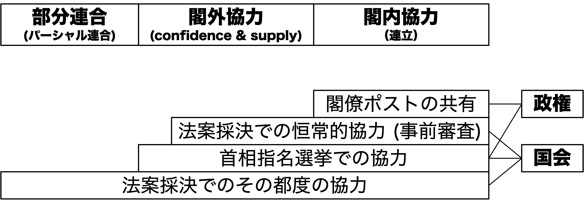
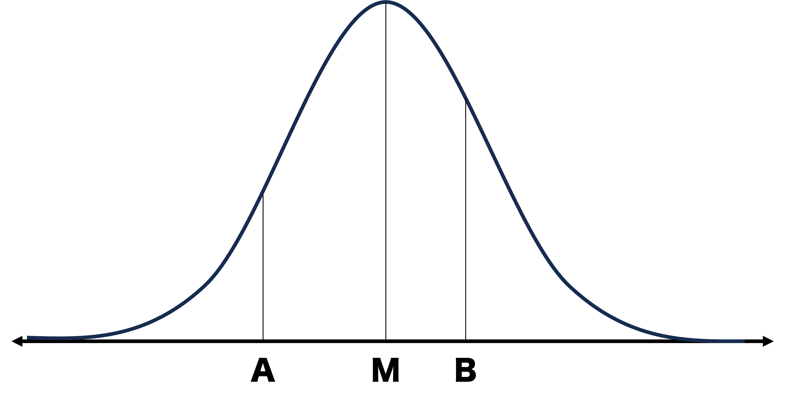
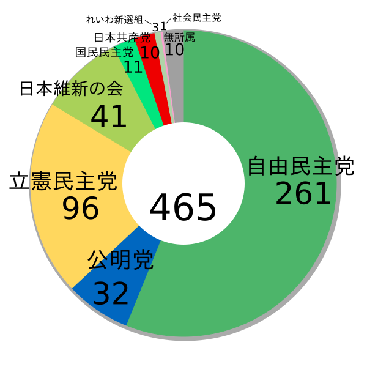

## 出席登録をお願いします

## 今日の目次

1. はじめに
1. 政党間競争と協力
1. 中位投票者定理
1. 連立政権のモデル
1. 日本の連立政権
1. まとめ

# はじめに
::: {.notes}
目標15分
:::

## 先週のRPより (1/3)
> イデオロギーが「情報ショートカット」として機能するという点に興味を持ちました。人間の処理能力に限界があるからこそ、左右の次元で候補者の態度を予測し、距離を測る仕組みは合理的だと深く納得しました。

::: {.fragment .fade-in}
> 木曜日の3限の講義でもイデオロギーを扱っており、『イデオロギーの隠れたガイド』という映画を紹介されました。本講義とその講義でイデオロギーについて改めて学ぶことができました。

:::

::: {.notes}
イデオロギー

- 情報のショートカットとしてのイデオロギー→1つの立場に過ぎない
- 別の授業ではまた違う説明がされるかもしれない→合わせて学んでほしい

:::

## 先週のRPより (2/3)
> イタリアの分極多党制が印象深かった。宗教や歴史的背景などで生じたさまざまな社会的亀裂により、共産党などの両極が対立し、DCを中心とする連立政権が固定化されているが、政情が不安定になりやすいと分かった。（[参考](https://ja.wikipedia.org/wiki/%E3%82%A4%E3%82%BF%E3%83%AA%E3%82%A2%E3%81%AE%E9%A6%96%E7%9B%B8)）

::: {.notes}
イタリアの分極的多党制

- 第一共和政時代も現在もイタリアは基本的には連立政権が多い
   - 今日の話につながる
- イタリアは日本以上に首相の交代が多い
   - 選挙によらない首相交代（例えば連立与党が離脱）

:::

## 先週のRPより (3/3)
> ポピュリズムは善良な市民と腐ったエリートを捉えたものとされていましたが、逆の場合でも成り立つのでしょうか

::: {.fragment .fade-in}
> 右派ポピュリズムが、なぜ近年の世界各国で多く見られるようになったのかのついて興味を持った。また、これについて、近年は多様性やグローバル化が進んでいるが、それに対する反発なのかと考えた。（[参考](https://www.amazon.co.jp/%E6%AC%A7%E5%B7%9E%E3%81%AE%E6%8E%92%E5%A4%96%E4%B8%BB%E7%BE%A9%E3%81%A8%E3%83%8A%E3%82%B7%E3%83%A7%E3%83%8A%E3%83%AA%E3%82%BA%E3%83%A0%E2%80%95%E8%AA%BF%E6%9F%BB%E3%81%8B%E3%82%89%E8%A6%8B%E3%82%8B%E4%B8%96%E8%AB%96%E3%81%AE%E6%9C%AC%E8%B3%AA-%E4%B8%AD%E4%BA%95-%E9%81%BC/dp/478772102X)）

:::

::: {.notes}
ポピュリズムの対義語
- ポピュリズム＝善良な市民と腐ったエリートの二項対立
- エリート主義＝大衆は愚かなのでエリートが導くべき

右派ポピュリズムの台頭の原因→政治学で今熱いネタ

- 通説「経済格差が拡大して取り残された敗者が支持」
- 政治学では否定
   - 所得と右派ポピュリズム政党支持の結びつきはない
   - むしろ重要なのは人種・性別・年齢・居所・価値観
      - 白人・男性・高齢者・田舎・保守的な価値観
      - 経済ではなく文化対立→GAL/TAN

:::

## 本日の目的と到達目標
::: {style="font-size: 0.9em;"}
#### 目的
政党間の競争と協力についてミクロ的な視点から学ぶ。中位投票者理論から政党間競争を考察するのと並行して、選挙や議会などで行われる政党同士の協力のあり方を概観する。特に複数の政党による連立政権について、最小勝利連合理論と隣接最小勝利連合理論といった理論を学習し、日本の事例を通してその妥当性を検証する。

::: {.fragment .fade-in}
#### 到達目標
1. 政党同士の協力が行われる3つの場を列挙できる。
1. 中位投票者定理の内容と問題点をそれぞれ説明できる。
1. 連立政権形成に関する公職追求モデルの内容を説明できる。
1. 連立政権形成に関する政策追求モデルの内容を説明できる。
1. 日本の自公連立がなぜパズルであると言えるのか、3つの理由を列挙できる。
:::

:::

## 本日の授業の位置付け

# 政党間競争と協力
::: {.notes}
ここまで15分

目標15分
:::
## クイズ①
アメリカ、イタリア、ドイツ、日本の政党制はサルトーリの分類（一党優位政党制、二大政党制、穏健多党制、分極多党制）に基づくとそれぞれどれになるでしょうか。

正しいものを選んでください。

[WebClass上で回答](https://webclass.komazawa-u.ac.jp/webclass/login.php?id=a20d89f1b19cadc7d88b9ddf26603477&page=1)

{.r-stretch}

## 政党間競争と協力
::: {.fragment .fade-in}
#### 復習：政党システム (party system)
政党同士の**相互作用**の構造

::: {.incremental}
- 一党優位政党制、二大政党制、穏健多党制、分極多党制

:::
:::

::: {.fragment .fade-in}
政党間**競争**

::: {.incremental}
- 有権者の票、政府権力、政策実現をめぐる対立→**中位投票者理論**

:::
:::

::: {.fragment .fade-in}
政党間**協力**のレベル

::: {.incremental}
1. **選挙**…候補者調整や他党候補者の支援・推薦
1. **国会**…法案や予算可決のための協力
1. **政権**…首相指名のための協力
   - 引き換えの閣僚ポストと政策実現

:::
:::

## 国会・政権レベルでの協力
{.r-stretch}

# 中位投票者定理
::: {.notes}
ここまで30分

目標15分
:::
## 海水浴場でアイスクリーム屋
{.r-stretch}

[WebClassアンケート](https://webclass.komazawa-u.ac.jp/webclass/login.php?id=94d86224cbb5c49ce1dbd0b7bdb684ee&page=1)で回答してください

::: {.notes}
アンケート（冒頭）

- 目的：ホテリングの空間理論を直観的に理解する
- 質問「今あなたは海水浴場で屋台を設置し、アイスクリームを売ろうとしています。横長の海水浴場には10組の客が来ていますが、競合のアイスクリーム屋台もまた来ています。客はより近い方に来てくれますが、競合もそのことを考えて屋台の場所を動かしてきそうです。このような場合、図上のA・B・Cどこに屋台を設置しますか？」
- 進行：WebClassアンケート（2-3分、3択）
  - 正解＝Bに設置する 

:::

## 中位投票者定理 (median voter theorem)
二大政党の政策選好は**中位投票者**の位置にまで収斂する

::: {.incremental}
- 左右一次元上でちょうど真ん中の投票者

:::

::: {.fragment .fade-in}
**ダウンズ**がホテリングの空間理論を政党間競争に応用

:::

::: {.fragment .fade-in}

:::

## 中位投票者定理の前提

::: {.incremental}
- 政策空間は一次元
   - 実際には多次元化
- 有権者は自分に少しでも近い政党に投票
   - cf. 近接性モデル
- 政党は得票の最大化を目指す
   - cf. 公明党と日本共産党
- 2つの政党しか存在しない
   - 第三党の存在は収斂をもたらさない
- 有権者は一次元政策空間上に単峰型に分布
   - 実は必要のない前提

:::

# 連立政権のモデル
::: {.notes}
ここまで45分

休憩5分

目標20分
:::
## 連立政権 (coalition government)
::: {}
**複数の政党**が参加する政権

::: {.incremental}
- 対義語は「**単独政権**」
:::
:::

::: {.fragment .fade-in}
::: {.columns}
::: {.column width=80%}
**多党制**の欧州では通常の形態

::: {.incremental}
- ドイツの「**信号連立**」(Ampelkoalition; 2021-24)
- イタリアの「**五党連立**」 (Pentapartito; 1981-91)

:::

::: {.fragment .fade-in}
連立政権を説明するモデル

::: {.incremental}
- **公職追求**モデル
- **政策追求**モデル

:::
:::
:::

::: {.column width=20%}

:::

:::

:::

## 公職追求モデル (office-seeking model)
::: {}
各政党は**公職（＝閣僚ポスト）**の獲得を追求

:::

::: {.fragment .fade-in}
::: {.columns}
::: {.column width=70%}
#### 最小勝利連合 (minimal winning coalition)
過半数を超えるのに**必要最小限の議席を持つ政党**で連立が成立

::: {.incremental}
- **ウィリアム・ライカー**の提唱
- **過大連合**→各党の閣僚数が減少
- 過半数を取れるギリギリの政党同士で連立
   - A+B (65)
   - A+C (60)
   - A+D+E (55)
   - B+C+D (55)

:::
:::

::: {.column width=30%}
| 政党 | 議席数 | 
| ---- | ------ | 
| A    | 40     | 
| B    | 25     | 
| C    | 20     | 
| D    | 10     | 
| E    | 5      | 
| 計   | 100    | 
:::
:::
:::

## クイズ②
::: {.columns}
::: {.column width=30%}
| 政党 | 議席数 | 
| ---- | ------ | 
| 自民 | 40     | 
| 維新 | 25     | 
| 立憲 | 20     | 
| 公明 | 10     | 
| 共産 | 5      | 
| 計   | 100    | 
:::

::: {.column width=70%}
::: {.fragment .fade-in}
次の最小勝利連合のうち、最も「**ありえない**」のはどれ？

1. 自民＋維新 (65)
1. 自民＋立憲 (60)
1. 自民＋公明＋共産 (55)
1. 維新＋立憲＋公明 (55)

:::

::: {.fragment .fade-in}
[WebClassで回答](https://webclass.komazawa-u.ac.jp/webclass/login.php?id=5498ad55333c4f6458fe7fd634d4b460&page=1)してください

{width=30%}

:::

:::
:::

## 政策追求モデル (policy-seeking model)
各政党は公職の獲得だけでなく**政策**も追求

::: {.fragment .fade-in}
#### 隣接最小勝利連合 (minimal connected winning coalition)
余計な政党を含まず、かつ**政策的に隣**の政党同士で連合

::: {.incremental}
- **ロバート・アクセルロッド**の提唱

:::
:::

::: {.fragment .fade-in}
{fig-align="center"}

:::

::: {.notes}
イタリア第一共和政…隣接最小勝利連合の典型例

- キリスト教民主主義（DC）は常に真ん中→隣接する穏健政党（PRI・PLI・PSDI・PSI）が連立パートナー
- 共産党と社会運動は極端すぎるので排除
- 共産・社会運動の極左・極右連立も当然ありえない

:::

# 日本の連立政権
::: {.notes}
ここまで70分（01:10:00）

目標15分
:::
## 日本の連立政権史
::: {style="font-size: 0.9em;"}

| 時期      | 政権構成                 | 備考                                                         | 
| --------- | ------------------------ | ------------------------------------------------------------ | 
| 1955-93   | **自民党単独**               | いわゆる55年体制；中曽根内閣の例外（新自由クラブ）           | 
| 1993-94   | **非自民・非共産**連立       | 細川→羽田内閣；初の自民党下野                               | 
| 1994-98   | **自社さ**連立               | 村山（社会党）→橋本（自民党）内閣                                     | 
| 1998-2009 | **自自公→自公保→自公**連立 | 小渕内閣で公明参加；小沢自由党→保守党→自民党に合流（03年） | 
| 2009-12   | **民国社→民国**連立         | いわゆる民主党政権；社民党は10年に離脱                       | 
| 2012-26   | **自公**連立                 | 第二次安倍→石破内閣；自公協力は野党時代も継続               | 
| 2026-     | **自維**連立                 | 厳密には閣外協力（維新は補佐官のみ）                         | 

:::

## 自公連立
::: {}
**自民党**と**公明党**の連立政権

::: {.incremental}
- 長期間にわたり安定して存続（合計26年）
- 緊密な**選挙協力**と**政策調整**

:::
:::

::: {.fragment .fade-in}
::: {.columns}
::: {.column width=70%}
連立モデルで説明できない謎

::: {.incremental}
- 過大連合…自民は単独政権可能
- 公明ポストの少なさ
   - 基本的には国交大臣のみ
- 政策距離が小さくない
   - 改憲の自民と護憲の公明
   - 2015年安保法制の動揺

:::
:::

::: {.column width=30%}
{width=100%}
:::

:::
:::

## Think-pair-share (-10分)
このように従来の連立政権モデルからは説明できない自公政権ですが、なぜ長きにわたり存在し続けたのでしょうか。

今回の事前学習課題（中北2019）にはどのようなことが書かれていたか、隣と相談してもいいので見つけてみてください。

::: {.fragment .fade-in}
[WebClassチャット](https://webclass.komazawa-u.ac.jp/webclass/login.php?id=d28a815900a964b101aac5277a11de4c)で共有

{width=30%}

:::

::: {.notes}
p.103以降に書かれている

安定多数…全ての常任委員会で半数を確保し、委員長職も独占

絶対安定多数…全ての常任委員会で過半数を確保し、委員長職も独占
:::

## 制度論的説明
**制度構造**が自公に連立を組む誘因（インセンティブ）

::: {.incremental}
- **委員会中心主義**…実質的審議は委員会
   - 単なる過半数では円滑審議に不十分
   - 委員長ポストと各委員会での過半数
      - 安定多数、絶対安定多数
- **二院制**…権限の強い参議院が存在
   - 参院は比例性の高い選挙制度→多党化
   - 単独では過半数が取りにくい
- **選挙制度**…衆参とも混合制
   - 多数代表部分での共倒れ抑止→選挙協力
   - 引き換えに比例代表部分での融通

:::

# まとめ
::: {.notes}
ここまで85分（01:25:00）

目標15分
:::
## 本日の目的と到達目標
::: {style="font-size: 0.9em;"}
#### 目的
政党間の競争と協力についてミクロ的な視点から学ぶ。中位投票者理論から政党間競争を考察するのと並行して、選挙や議会などで行われる政党同士の協力のあり方を概観する。特に複数の政党による連立政権について、最小勝利連合理論と隣接最小勝利連合理論といった理論を学習し、日本の事例を通してその妥当性を検証する。

::: {.fragment .fade-in}
#### 到達目標
1. 政党同士の協力が行われる3つの場を列挙できる。
1. 中位投票者定理の内容と問題点をそれぞれ説明できる。
1. 連立政権形成に関する公職追求モデルの内容を説明できる。
1. 連立政権形成に関する政策追求モデルの内容を説明できる。
1. 日本の自公連立がなぜパズルであると言えるのか、3つの理由を列挙できる。
:::

:::

## 次回までに
#### 事後学習

 - 授業資料を見直し、目標到達をセルフチェック
 - WebClass上でのリアクションペーパー入力（日曜日まで）
 - 【任意】[中北の自公政権崩壊に関する論考](https://www.webchikuma.com/n/n42f7f5f5af6a)を読む。
 
#### 事前学習

 - 教科書（II-1〜2）を読む。