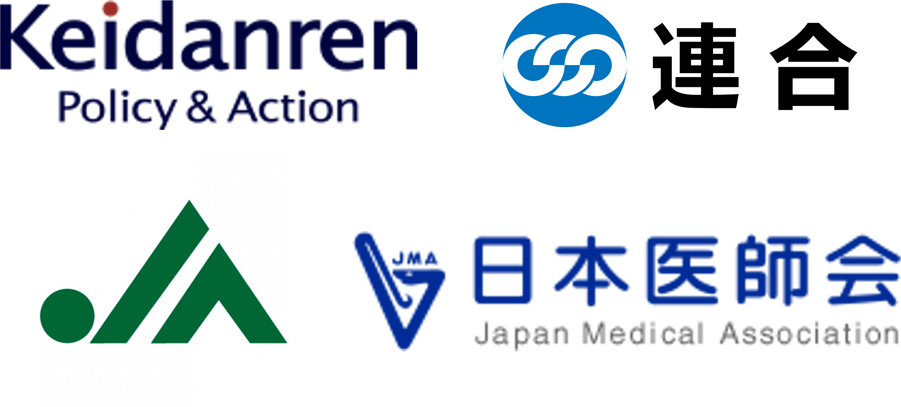

## 出席登録をお願いします

## 今日の目次

1. はじめに
1. 利益団体とは何か
1. 利益団体の分類
1. 利益団体の機能
1. 利益団体の活動
1. まとめ

# はじめに
::: {.notes}
目標15分
:::

## 先週のRPより (1/2)
> スライドにある中位投票者理論は、政党が票を得るために中道に寄っていく事を示唆しているように思えたがSNSの普及によって世論が極端に分断されているような状況でもこの理論はそのまま機能するのか気になった。

> 中位投票者定理をもとに考えると、二大政党制であるアメリカの選挙戦略に何か影響は与えているのか気になった。しかし、他の講義でアメリカでは有権者が分極化していると学んだため、少し矛盾しているとも感じた。

::: {.notes}
中位投票者定理

- 1950年代の安定期が想定
   - 民主党と共和党間で安定
- 現代のアメリカに当てはまらない→感情的分極化
- 前提が違う？
   - 有権者は必ず投票→本当か？
      - あまりにも遠いと棄権するかも

:::

## 先週のRPより (2/2)
> 一党優位政党制の代表例として日本がよく挙げられると思いますが、例えば自民党単独では過半数に満たない連立政権の場合でも「一党優位」と言えるのでしょうか？

::: {.fragment .fade-in}
> 政策追求モデルにおいて、自民党(保守寄り)と共産党(革新寄り)の連合は政策の方向的にあり得ない。しかし、特定の目標や政策に対して意見が合致する場合、あり得ないとされる連合が起こるのでは？と考えた。

:::

::: {.fragment .fade-in}
> なぜ、自民党は維新の会に閣僚ポストを配分してないのですか。（[参考](https://news.web.nhk/newsweb/na/na-k10015052601000)）

:::

::: {.notes}
一党優位制

- ある程度の期間を想定した呼び方
- 戦後を見てみれば自民党がほぼ一貫して政権
   - 断続的に政権を失ったり、少数与党になったとしても

特定の政策における「ありえない」連合

- 大阪における自民党と共産党の協力（連合や連立ではないが）
   - 「都構想」を掲げる維新
   - 断固反対の自民党大阪府連と共産党

維新の閣僚ポスト

- 最初は様子見として閣外協力
- 次の内閣改造で閣僚が出るはず

:::

## 本日の目的と到達目標
::: {style="font-size: 0.9em;"}
#### 目的
選挙外の政治過程でとりわけ重要となる利益団体について学ぶ。利益集団や利益団体、圧力団体といった類似の概念を明確化するとともに、政治システムで果たす機能を考察する。実際の利益団体の例・分類・活動を知る。

::: {.fragment .fade-in}
#### 到達目標
1. 利益集団・利益団体・圧力団体の3つの概念を区別できる。
1. 目的に基づいて実際の利益団体をセクター団体、政策受益団体、価値推進団体のいずれかに分類できる。
1. 政治過程における利益団体の機能を2つ以上列挙できる。
1. 利益団体の活動を2つ以上列挙できる。
:::

:::

## 本日の授業の位置付け

# 利益団体とは何か
::: {.notes}
ここまで15分

目標15分
:::
## Think-pair-share (-10分)
一般に「**利益団体**」あるいは「**圧力団体**」としてニュースなどで言及される組織にはどのようなものがあるでしょうか。

日本または海外の実例を考えてみてください。

※政党や公的な機関は除外してください。

- **Think** (1分)…1人で考える
- **Pair** (2-3分)…ペアで話し合う
- **Share** (2-3分）…全体に共有する（[WebClassチャット](https://webclass.komazawa-u.ac.jp/webclass/login.php?id=7e64c206525a97fced1f59631783a3e8)）

{.r-stretch}

## 利益集団・利益団体・圧力団体

## 日本の主な利益団体
::: {.fragment .fade-in}

:::

::: {.fragment .fade-in}
質問：こうした利益団体が政治的な影響力を持つことはいいこと／悪いことだと思いますか？→[WebClassチャット](https://webclass.komazawa-u.ac.jp/webclass/login.php?id=7e64c206525a97fced1f59631783a3e8)

:::

::: {.notes}
図（時計回り）

- 日本経済団体連合会（経団連）
- 日本労働組合総連合会（連合）
- 全国農業協同組合中央会（JA全中）
- 日本医師会

問いかけ

- 目的：利益団体が民主主義で果たす役割について考察し、展開③への導入とする。
- 質問「こうした利益団体が政治的な影響力を持つことはいいことだと思いますか、それとも悪いことだと思いますか。理由を含めて考えてみてください。」
- 進行：WebClassチャット（2-3分）
:::

# 利益団体の分類
::: {.notes}
ここまで30分

目標15分
:::
## 利益団体の分類
団体の**目的**に基づく分類

::: {.incremental}
- **セクター団体**…**市場**における**経済的・物質的な利益**の促進のための団体
   - 経済・業界団体、労働団体…
- **政策受益団体**…特定の**政策**から利益を受ける集団による団体
   - 福祉団体、行政関係団体…
- **価値推進団体**…特定の**価値**や**主義**に基づき、**公共の利益**の促進を目指す団体
   - 環境団体、平和団体…

:::

## Think-pair-share (-10分)
::: {}
以下は日本における代表的な利益団体です。

それぞれセクター団体・政策受益団体・価値推進団体のうちどれに該当すると思いますか？

:::

::: {.columns}
::: {.column width=60%}
- 日本経済団体連合会（経団連）
- 全国農業協同組合中央会（JA全中）
- 創価学会
- 日本医師会
- 日本労働組合総連合会（連合）
- 在日本大韓民国民団（民団）
- 全国町村会
- 日本会議

:::

::: {.column width=40%}
::: {.fragment .fade-in}
進行：

- **Think** (1-2分)
   - [WebClassアンケート](https://webclass.komazawa-u.ac.jp/webclass/login.php?id=b21f6028a5a5de9e6eb601bbff992f66&page=1)
- **Pair** (2-3分)
- **Share** (2-3分）

{width=40%}

:::
:::

:::

::: {.notes}
進行：アンケートを取り入れる

- Think (1-2分)…WebClassアンケートに入力
   - 選択式で分類
   - 記述式で迷ったものについて回答（あれば
- Pair (2-3分)…ペアで話し合う
- Share (2-3分）…全体に共有する（集計結果と記述回答）

:::

# 利益団体の機能
::: {.notes}
ここまで45分

休憩5分

目標15分
:::
## 復習：政治システム

## 質問
あなたはゼミ合宿の幹事になりました。

行き先のアンケートを取ったところ、20人中19人が葉山に行くことを希望しました。

しかし、反対する1人に詳しく話を聞いてみると「昔海水浴で溺死しそうになったトラウマがあるので、葉山には絶対に行きたくない。軽井沢とかだったら大丈夫。」と言われました。

あなたはどうしますか？

::: {.fragment .fade-in}
[WebClassチャット](https://webclass.komazawa-u.ac.jp/webclass/login.php?id=7e64c206525a97fced1f59631783a3e8)で回答して下さい

{width=20%}

:::

## 利益団体の機能
::: {.fragment .fade-in}
**選挙外の入力経路**の提供

::: {.incremental}
- **業種・職種**に基づく利益の代表
  - 選挙は主に地域利益
- **選挙期間以外**における利益の代表
  - 選挙は数年に一度

:::
:::

::: {.fragment .fade-in}
**政治コミュニケーション**の円滑化

::: {.incremental}
- 政策決定者・一般市民に**情報の提供**→**知識の改善**

:::
:::

---

::: {.fragment .fade-in}
民主主義原理の**抑制・補完**

::: {.incremental}
- 民主主義＝多数派の意見に基づき決定
   - 「**多数派の専制**」…多数派の名の下に、少数派の権利が侵害
   - **多元主義**の理念（[第3回](https://junpei-suzuki.github.io/PP-2026-Komazawa/03_power_slide.html#/%E5%A4%9A%E5%85%83%E4%B8%BB%E7%BE%A9%E8%AB%96)と次週）
      - 多様な利益団体の存在→競争と相互抑止
      - 重複メンバーシップ→分極化の抑止

:::
:::

# 利益団体の活動
::: {.notes}
ここまで65分（01:05:00）

目標20分
:::
## Think-pair-share (-10分)
利益団体のうち、経団連・連合・環境NGOはそれぞれどのような方法で政治に影響を与えようとしているでしょうか。

- **Think** (1分)…1人で考える
- **Pair** (2-3分)…ペアで話し合う
- **Share** (2-3分）…全体に共有する（[WebClassチャット](https://webclass.komazawa-u.ac.jp/webclass/login.php?id=7e64c206525a97fced1f59631783a3e8)）

{.r-stretch}

## 利益団体の活動
::: {.fragment .fade-in}
**ロビイング**…特定の政策を実施するよう直接働きかける

::: {.incremental}
- **政治家**や**政党**へ陳情
  - 引き換えに選挙で特定候補の支援
     - 直接「組織内候補」を擁立することも
- **行政機関**へも陳情
  - 政策実施にあたって利益団体の協力が不可欠

:::
:::

::: {.fragment .fade-in}
**世論**への働きかけ

::: {.incremental}
  - 一般市民からの支持を獲得し、間接的に政策実施を働きかける
     - テレビCMや新聞広告、署名活動、デモ…

:::
:::

---

::: {.fragment .fade-in}
**訴訟**の提起と支援

::: {.incremental}
  - 裁判は平等なアクセス→弱小団体にも活用可能

:::
:::

::: {.fragment .fade-in}
**政治的消費者主義** (political consumerism)

::: {.incremental}
  - 特定企業の**支援／ボイコット**

:::
:::

::: {.fragment .fade-in}
各団体の行動パターン：

|              | ロビイング | 世論喚起 | 訴訟 | 消費者主義 | 
| ------------ | ---------- | -------- | ---- | ---------- | 
| セクター団体 | ◎         | ◯       | △   | △         | 
| 政策受益団体 | ◎         | ◯       | ◯   | △         | 
| 価値推進団体 | △         | ◎       | ◎   | ◎         | 

:::

## 利益団体の活動例
::: {.r-stack}
](figs/Shusaku_Indo.png){.fragment}

](figs/Mayday_2026.png){.fragment}

](figs/same_sex_marriage_litigation.jpg){.fragment}

](figs/Israel_Boycott.png){.fragment}

:::

# まとめ
::: {.notes}
ここまで85分（01:25:00）

目標5分
:::
## 本日の目的と到達目標
::: {style="font-size: 0.9em;"}
#### 目的
選挙外の政治過程でとりわけ重要となる利益団体について学ぶ。利益集団や利益団体、圧力団体といった類似の概念を明確化するとともに、政治システムで果たす機能を考察する。実際の利益団体の例・分類・活動を知る。

::: {.fragment .fade-in}
#### 到達目標
1. 利益集団・利益団体・圧力団体の3つの概念を区別できる。
1. 目的に基づいて実際の利益団体をセクター団体、政策受益団体、価値推進団体のいずれかに分類できる。
1. 政治過程における利益団体の機能を2つ以上列挙できる。
1. 利益団体の活動を2つ以上列挙できる。
:::

:::

## 次回までに
#### 事後学習

 - 授業資料を見直し、目標到達をセルフチェック
 - WebClass上でのリアクションペーパー入力（日曜日まで）
 
#### 事前学習

 - 教科書（II-4、XII-1）を読む。