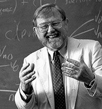
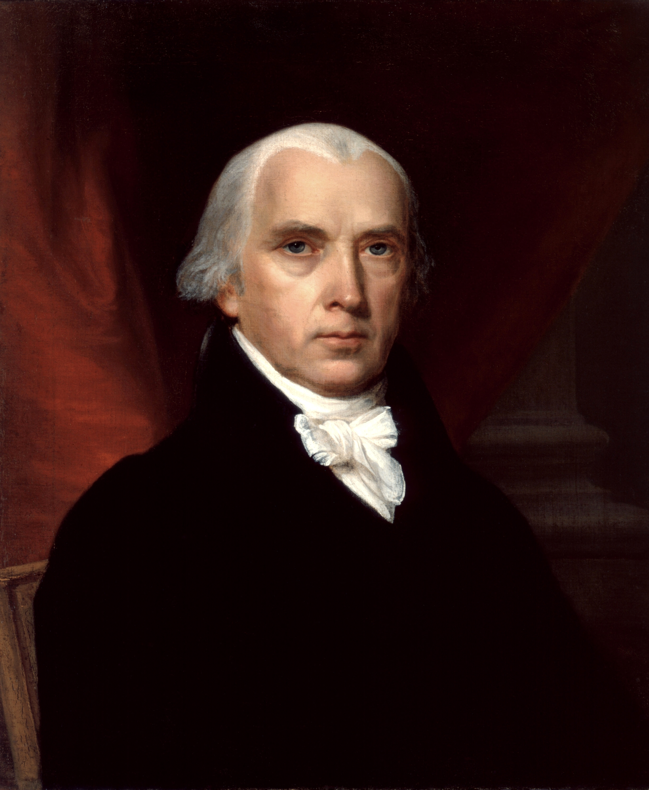

## 出席登録をお願いします

## 今日の目次

1. はじめに
1. 組織化の理論
1. 集合行為論
1. 多元主義
1. 団体政治批判
1. まとめ

# はじめに
::: {.notes}
目標15分
:::

## 先週のRPより (1/3)
> 日本医師会は政府に何の利益を求めるのでしょうか

::: {.fragment .fade-in}
> 利益団体は、政治に対して何かを訴えかけたり、世論を動員したりして政治を動かすと学んだ。政治を意見を政治に反映させようとする点で政党に似ていると感じたが、利益団体が政党になることはあるのか気になった。

:::

::: {.notes}
日本医師会の求めること

- 診療報酬を医師に有利な水準にする
   - 日本の健康保険制度→医療行為に対する報酬は全て公定（1点＝10円）
      - 初診料・再診、入院、レントゲン検査、手術、薬…
   - 厚労大臣の決定事項：財源を気にする財務省と医師会

利益団体と政党

- イギリス労働党…労働組合の連合体である労働代表委員会として1900年に発足

:::

## 先週のRPより (2/3)
> 利益団体の活動として挙げられているロビイング活動やデモや広告などの世論の働きかけ，また訴訟提起やメーデーなどは実際政策としてどのくらい成立・実現されているか少し疑問に感じた。

> ロビイングは直接訴えるから影響は分かるが、世論喚起が実際にどのように政治に影響するか/したか、事例があれば知りたいです。　

::: {.notes}
利益団体による世論喚起の成功例

- NPO法の成立（1995年）…阪神淡路大震災の時のボランティア団体が連携して世論を喚起
- 禁煙・タバコ規制運動…医療系のNGOが数十年かけて公共の場での禁煙・広告規制を達成

:::

## 先週のRPより (3/3)
> 多元主義の理念に注目しました。多様な利益団体が互いに競争・抑制し合う仕組みや、重複メンバーシップによる分極化の抑止という論理は、政治の安定性を理解する上で非常に重要だと学びました。

::: {.fragment .fade-in}
> 民主主義の抑制や補完機能について多元主義では複数団体の競争が権力を分散させるとされていますが、日本で経団連などの大規模団体が強い影響力を持つのなら利益団体間の相互抑止が機能しているのか疑問を感じました

:::

::: {.notes}
多元主義とその是非

- 多元主義によれば、利益団体の競争が公益につながる
- しかし結局「既得権益」が守られるだけではないのかという懸念
:::

## 本日の目的と到達目標
::: {style="font-size: 0.9em;"}
#### 目的
利益団体について理論的に考察する。利益団体の組織化に関して、社会的要因論・集合行為論・政治的企業家論の3つを学ぶ。多元主義・鉄の三角形・利益団体自由主義といった議論から、利益団体の政治的影響力を実証的かつ規範的に検討する。

::: {.fragment .fade-in}
#### 到達目標
1. 利益集団の組織化に関する3つの理論を列挙できる。
1. 集合行為論に基づいて利益集団の組織化を説明できる。
1. 多元主義の見地から利益団体政治を正当化できる。
1. ローウィの「利益団体自由主義」論の見地から利益団体政治を批判できる。
1. 「鉄の三角形」という概念を説明できる。
:::

:::

## 本日の授業の位置付け

# 組織化の理論
::: {.notes}
ここまで30分

目標15分
:::

## 復習：利益集団・利益団体・圧力団体

## 組織化の理論
なぜ利益団体は組織化されるのか？

::: {.incremental}
- **社会要因論**…マクロな社会的変動に着目
   - 社会的変化→新たな利益→集団と組織化
   - 例：工業化・都市化→労働者の登場と組織化
- **集合行為論**…ミクロな合理的選択に着目
   - 共通の利益≠組織化（←**フリーライダー問題**）
- **政治的交換論**…政治的企業家に着目
   - **政治的企業家** (political entrepreneur)…自らの政治的目的のために組織化のコストを引き受ける人
   - 例：[東大学費値上げ反対アクション](https://mainichi.jp/univ/articles/20241004/ddm/012/100/080000c)

:::

::: {.notes}
社会要因論「利益→集団の組織化」

- 集合行為論「組織化は自動的には起こらない」
   - ただし「実際にはなぜ組織化されるのか」には答えていない
- 政治的交換論「政治的企業家がコストを引き受ける」

:::

## アンケート
来週この政治過程論の履修者約140人で来週パーティを開催することになりました。[^potluck]

形式はポットラックパーティ、つまり各自食べ物や飲み物を持ち寄る形です。

あなたは食べ物や飲み物を持ってきますか？

[WebClassアンケート](https://webclass.komazawa-u.ac.jp/webclass/login.php?id=2c38a3a5f41697a46eb4cc3011abd8a5&page=1)で回答

{.r-stretch}

[^potluck]: 実際にやるわけではありません。

# 集合行為論
::: {.notes}
ここまで20分

目標15分
:::
## オルソン『集合行為論』[^olson1965]
::: {.columns}

::: {.column width=65%}
#### 集合行為 (collective action)
ある集団の共通の利益を達成するための行動

::: {.fragment .fade-in}
#### フリーライダー問題 (free-rider problem)
合理的な個人は集合行為から逃れる誘因をもつ
:::

::: {.incremental}
- 集合行為の達成は**公共財**→集団メンバー全員に恩恵
- 対して集合行為に貢献するコストは大きい
- 利益集団は自動的に団体にはならない

:::
:::

::: {.column width=30%}
{width=70%}

:::

:::

[^olson1965]: Olson, Mancur. 1965. *The Logic of Collective Action: Public Goods and the Theory of Groups*

## Think-pair-share (-10分)
あなたはの先ほどポットラックパーティの幹事に任命されました。

幹事として参加者になるべく食べ物や飲み物持って来させるためにどのようなことをしますか？

[WebClassで共有](https://webclass.komazawa-u.ac.jp/webclass/login.php?id=2b7e9c819a6301b54b310b102e0f14c8)

{.r-stretch}

## 原因と対処法
#### 規模の原理
大規模な集団ほどフリーライダー問題に直面

::: {.incremental}
- 大規模な集団→相互監視のしにくさ
- 解決：規模を小さくする
- 例：保護主義のパラドックス

:::

::: {.fragment .fade-in}
#### 選択的誘因
集合行為の貢献者だけに与えられる便益

::: {.incremental}
- 入会特典、非協力者への懲罰など

:::
:::

::: {.notes}
保護主義のパラドックス…農業従事者が少ないにも関わらず農産品における保護主義が強い

- 集合行為論「農業従事者が少ないからこそ保護主義が強い」
:::

# 多元主義
::: {.notes}
ここまで50分

休憩5分

目標15分
:::
## 復習クイズ ([WebClass](https://webclass.komazawa-u.ac.jp/webclass/login.php?id=446d7bb1d4e85a90917ce0d588664744&page=1))
コミュニティ権力論争に関する以下の説明のうち、正しいものを全て選んでください。

1. ダールはアメリカにおいて政治全般に影響力を持つエリート層は存在しないと主張した。
1. ハンターはエリート層の存在を検証するにあたり、さまざまな政治的争点の中で影響力を持つ人々を特定する方法を用いた。
1. ダールはエリート論の権力概念が測定可能性に問題を抱えていると主張した。
1. ダールの権力の定義に基づくと、影響力があると周りから考えられている人が権力者として考えられる。

{.r-stretch}

## 復習：コミュニティ権力論争
地域社会を牛耳るエリートが…

::: {.incremental}
- **エリート論**「存在する」
   - ハンターの評判法研究→アトランタの経済エリート支配
- **多元主義論**「存在しない」
   - ダールの争点法研究→すべてを支配するエリートの不在

:::

## 多元主義と利益団体
多元主義は「**多数派の専制**」の抑止の観点から利益団体を規範的に擁護

::: {.incremental}
- 多様な利益団体の存在→**競争**と**相互抑止**
- 実現された政策は「**均衡**」→公共の利益を反映
- **重複メンバーシップ**→分極化の抑止

:::

## 『ザ・フェデラリスト』第10篇
::: {.columns}
::: {.column width=75%}
ジェームズ・マディソン（4代大統領）の執筆

- 合衆国憲法批准推進のキャンペーン

::: {.fragment .fade-in}
「**派閥**」の害をいかに防ぐか

::: {.incremental}
- 結社の自由を奪う→やりすぎ
- 人間の価値観を同じにする→無理
- 派閥の存在を許し、相互に競争させる→現実的
   - そのために批准し「**大きな合衆国**」を

:::
:::
:::

::: {.column width=25%}

:::

:::

::: {.notes}
「大きな合衆国」論

- 小さい国では一つの派閥が専制
- 大きい国では多数の派閥が競争
:::

# 団体政治批判
::: {.notes}
ここまで70分（01:10:00）

目標15分
:::
## Think-pair-share (-10分)
日本には経団連・建設業協会・医師会・農協などといった利益団体が存在し、特に自民党と結びついて影響力を行使してきました。

そのことによりどのような問題が生じていると思いますか？

[WebClassで共有](https://webclass.komazawa-u.ac.jp/webclass/login.php?id=2b7e9c819a6301b54b310b102e0f14c8)

{.r-stretch}

## 利益団体自由主義
#### Interest group liberalism
::: {.columns}
::: {.column width=75%}
多元主義の理念

- 利益団体同士の競争→均衡としての政策

::: {.fragment .fade-in}
実際には**有力少数者**による政治の乗っ取り

::: {.incremental}
- 規模の原理→多数派の利益代表に不利
- 少数派の中でも権力資源に違い
   - 例：経営者vs.障害者
- 結果、既得権益層が政治を停滞→**鉄の三角形**

:::
:::
:::

::: {.column width=25%}

:::

:::

## 鉄の三角形 (iron triangle)
{.r-stretch}

# まとめ
::: {.notes}
ここまで85分（01:25:00）

目標5分
:::
## 本日の目的と到達目標
::: {style="font-size: 0.9em;"}
#### 目的
利益団体について理論的に考察する。利益団体の組織化に関して、社会的要因論・集合行為論・政治的企業家論の3つを学ぶ。多元主義・鉄の三角形・利益団体自由主義といった議論から、利益団体の政治的影響力を実証的かつ規範的に検討する。

::: {.fragment .fade-in}
#### 到達目標
1. 利益集団の組織化に関する3つの理論を列挙できる。
1. 集合行為論に基づいて利益集団の組織化を説明できる。
1. 多元主義の見地から利益団体政治を正当化できる。
1. ローウィの「利益団体自由主義」論の見地から利益団体政治を批判できる。
1. 「鉄の三角形」という概念を説明できる。
:::

:::

## 次回までに
#### 事後学習

 - 授業資料を見直し、目標到達をセルフチェック
 - WebClass上でのリアクションペーパー入力（日曜日まで）
    - 可能ならば「利益集団は必要かどうか？」について書き込む
      - 上限文字数100→200字
 
#### 事前学習

- 【事前】参考書（田中ほか3章）を読む。
   - 田中拓道・近藤正基・矢内勇生・上川龍之進（2020）『政治経済学－グローバル時代の国家と市場－』有斐閣，pp.49-65．
   - いつもの教科書ではないので注意
 
## 第14回以降の進行
第14回（7/16）はグループワークが中心のためリアルタイムの**オンライン**（Google Meet）で開催

- 来週（第12回7/9）は通常通りなので注意

::: {.fragment .fade-in}
第15回（7/30）は前期の理解度の確認（期末試験）

- 統一の「定期試験」の形ではないので注意

:::

::: {.fragment .fade-in}
**詳細は後にアナウンスします！**

:::