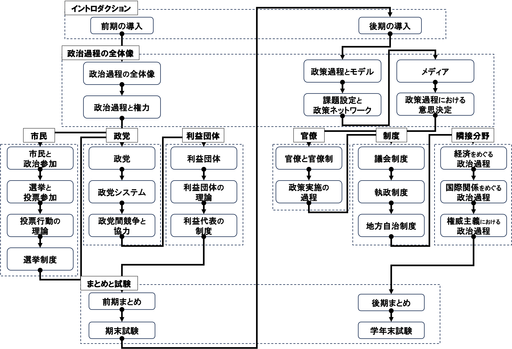
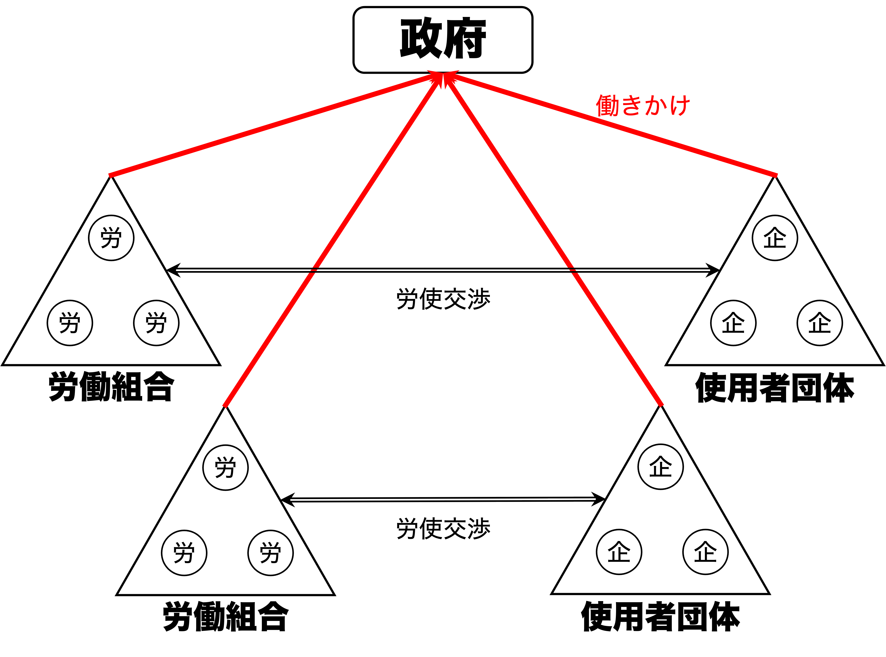

## 出席登録をお願いします

## 今日の目次

1. はじめに
1. 多元主義とコーポラティズム
1. コーポラティズムと経済実績
1. 資本主義の多様性
1. 日本の政治経済制度
1. まとめ

# はじめに
::: {.notes}
目標15分
:::
## 先週のRPより (1/3)
> オルソンの「集合行為論」において、集合行為の利益は公共財となり、貢献への報酬が少ないことから利益集団が自動的に団体にならない問題と、それに対して選択的誘因を使えば解決できると理解した。しかし、選択的誘因があったとしても参加コストが高いなら利益集団は団体化されず、必ずしも組織化に成功するといえないと考えた。

::: {.notes}
選択的誘因の設計

- 選択的誘因があったとしても必ずしも組織化できないのはその通り
   - プロライフ派vs.プロチョイス派→フリーコーヒー→参加するか？

:::

## 先週のRPより (2/3)
> 利益集団は、多元主義の考え方から見ても必要な存在だと考える。社会にはさまざまな価値観や立場を持つ人々がいるため、それぞれの利益や要望を政治に伝える役割を担っているからである。多様な利益集団が活動することで、特定の意見だけでなく幅広い声が政策に反映されやすくなる。一方で、一部の利益集団に影響力が集中すると公平性が損なわれる恐れもあるため、政治の透明性を保ちながら活動することが重要だと思う。（[参考](https://political-finance-database.com/)）

::: {.notes}
利益団体は必要である論

- まさに多元主義→多様な利益の反映
- 透明性を保つ工夫→政治資金規正法
   - 政治資金収支報告書…誰から寄付を受けているかが明らかに

:::

## 先週のRPより (3/3)
> 私は利益集団は必要でないと思う。鉄の三角形から判断して、結局国民の意見というよりも団体の利益だけを追求しているように感じるからである。偏った団体の意見だけではなく、少数者など社会的不利な立場におかれめいるひとも声を上げやすい制度をつくるべきだ。例えば極端にいうと国民全員から要望アンケートをとるなど、実践できるかどうかは別としてもっと積極的に、国民の意見を聞く姿勢が必要であると判断した。（[参考](https://www.yomiuri.co.jp/editorial/20250518-OYT1T50151/)）

::: {.notes}
利益団体は必要でない論

- 利益団体自由主義、鉄の三角形論
- 国民全員からの要望アンケート→パブリックコメント制度が近い
    - 優位な少数派による動員の可能性
- 不利な少数派（障害者、性的マイノリティ、女性、少数民族）などのクォータ制が現実的？→政治的対立の懸念

:::

## 本日の目的と到達目標
::: {style="font-size: 0.9em;"}
#### 目的
利益団体を労使関係を中心とした政治経済制度として位置付けた上で検討する。利益代表の制度としての多元主義・コーポラティズムという2つの理念型を学ぶとともに、資本主義の多様性論に基づき先進国の経済システムを2つに分類し、それぞれの経済的な影響についての実証研究の知見を紹介する。さらに、日本の政治経済制度の位置付けについて考察する。

::: {.fragment .fade-in}
#### 到達目標
1. 政治経済体制の理念型としての多元主義およびコーポラティズムを比較できる。
1. コーポラティズムが各国の経済実績について与える影響について、関連する研究成果を踏まえて議論できる。
1. 資本主義の多様性論に基づき、先進諸国の資本主義のあり方を2つに分類できる。
1. コーポラティズム論および資本主義の多様性論における日本の位置付けを議論できる
:::

:::

## 本日の授業の位置付け

# 多元主義とコーポラティズム
::: {.notes}
ここまで15分

目標15分
:::
## クイズ
利益団体についての以下の説明のうち、正しいものを全て選んでください。

1. 共通の利益を持つ集団を利益集団、そのうち組織化されたものを利益団体という。
1. 多元主義と呼ばれる考え方は、政治において多数派の意思を最優先にすべきだとするものである。
1. 多元主義の下で人々は基本的には1つの利益団体にしか所属が許されない。
1. 多元主義の下では、複数の利益団体が存在し競争を行っていると考えられる。

[WebClassで回答](https://webclass.komazawa-u.ac.jp/webclass/login.php?id=0db36abba97ae7294d15a3fc401d4241&page=1)

## 労使関係 (industrial relations)
**労働者**と**使用者**（企業など）の関係

::: {.incremental}
- **利益集団**としての労働者と使用者
   - 賃金など労働条件をめぐる利害対立
   - 現代社会で最も重要
- **利益団体**としての労働組合と使用者団体
   - 例：連合と経団連
- 労使関係の2つのモデル
   - 多元主義
   - コーポラティズム

:::

## 多元主義 (pluralism)
{.r-stretch}

::: {.notes}
多元主義…英語圏で見られる労使関係のあり方

- 労働組合や使用者団体への加入は自由
- 労働者と使用者、組合と団体は個々に交渉
- 労働者と使用者は個々に政府に働きかけ
:::

## コーポラティズム (corporatism)
{.r-stretch}

::: {.notes}
**コーポラティズム** (corporatism)…大陸ヨーロッパ諸国で見られる労使関係のあり方

- フィリップ・シュミッターの提唱
  - ファシスト・イタリアのCorporativismo
  - 砂糖業界の新聞記事から着想
- **強制的メンバーシップ**…労働組合・業界団体への加入が強制
- **頂上団体** (peak association/national centre)…全国の労組あるいは使用者団体を統括する組織
   - 労組や企業は産業別の団体に加盟
   - 産業別団体は頂上団体に加盟
   - 頂上団体から下部組織は明確な指揮命令系統
- **公的な性格**をもつ団体交渉…頂上団体同士の交渉を政府が仲立ち

:::

# コーポラティズムと経済実績
::: {.notes}
ここまで15分

目標15分
:::
## コーポラティズム論の時代背景
フィリップ・シュミッターのコーポラティズム論[^schmitter1974]

::: {.incremental}
- 現在の酪農業界と[ファシスト・イタリアのCorporativismo](https://www.quaritch.com/books/fascism/ordinamento-corporativo-dello-stato-fascista/PO13/)の類似から着想

:::

::: {.fragment .fade-in}
1970年代の**スタグフレーション**

::: {.incremental}
- stagnation (停滞) + inflation (インフレ)
- 先進国間の明暗
   - 多元主義諸国→インフレ率も失業率も**高い**
   - コーポラティズム諸国→インフレ率も失業率も**低い**

:::
:::

[^schmitter1974]: Schmitter, P. C. (1974). Still the century of corporatism?. *The Review of politics, 36*(1), 85-131.

## 質問
来年から日本在住者全員の賃金が10%上がることになりました。

::: {.incremental}
1. あなた自身にとってはどのような影響があると思いますか。
1. 社会全体にとってはどのような影響があると思いますか。

:::

[WebClassチャット](https://webclass.komazawa-u.ac.jp/webclass/login.php?id=b40fc19b80a08fa20f599900f82d3630)に入力（相談しながらでも可能）

{.r-stretch}

## 囚人のジレンマと賃金上昇
#### 囚人のジレンマ (prisoner’s dilemma)
::: {.fragment .fade-in}
各個人が自分にとって最適な行動を行なった結果、全体としては最適な結果にならない状況
:::

::: {.fragment .fade-in}
賃金上昇は…

::: {.incremental}
- 個人的には嬉しい
- 社会的には嬉しくない
   - **物価高騰**と**雇用阻害**

:::
:::

::: {.fragment .fade-in}
コーポラティズムは囚人のジレンマを解決

::: {.incremental}
- 頂上団体が各労組の賃上げ要求を抑制
- 引き換えに使用者は雇用を維持

:::
:::

## ハンプ仮説
{.r-stretch}

::: {.notes}
**ハンプ仮説**…コーポラティズムと経済実績は逆U字型（＝ハンプ型）の関係

- コーポラティズム度が高まればインフレ率が低いという直線的関係を批判
  - 低い国…市場メカニズムによる賃金抑制と企業活動の活発化→雇用の促進
  - 高い国…フリーライダー問題解決による賃金抑制と雇用の促進
  - 中位の国…**デュアリズム**（二分化）の発生
    - 一部の組織化された労働者→自らの雇用維持と賃上げ要求
    - 組織化されない労働者→失業と賃下げ
:::

# 資本主義の多様性
::: {.notes}
ここまで45分

休憩5分

目標15分
:::
## 資本主義の多様性
#### Varieties of Capitalism (VoC)
ピーター・ホールとデイヴィッド・ソスキスの提唱[^hall2001]

::: {.incremental}
- **企業**に焦点を当てた**アクター中心論**
   - コーポラティズム論は労働者に焦点
- 企業が直面する**情報の非対称性**
   - 取引における情報量の格差
   - 労働者、投資先、取引先…
- 対処の仕方に応じて2つの市場経済
   - **自由型市場経済**…アメリカやイギリスなどの英語圏
   - **調整型市場経済**…ドイツなど大陸欧州

:::

[^hall2001]: Hall, Peter A., Soskice, David (eds.): *Varieties of Capitalism. The Institutional Foundations of Comparative Advantage.* Oxford: Oxford University Press, 2001.

## 2つの市場経済 {.smaller}
|          | 自由型市場経済 (Liberal Market Economies: LMEs) | 調整型市場経済 (Coordinated Market Economies: CMEs) | 
| -------- | -------------------------------------------------- | ------------------------------------------------------ | 
| **原則**     | 市場原理の徹底                                     | 非市場メカニズムによる補完                             | 
| **労使関係** | 流動的                                             | 固定的                                                 | 
| **資金調達** | 直接金融（株式市場中心）                           | 間接金融（銀行融資中心）                               | 
| **企業統治** | トップダウン                                       | ボトムアップ                                           | 
| **教育制度** | 統合的                                             | [分離的](https://www.mext.go.jp/b_menu/shingi/chousa/shougai/015/siryo/08102203/001/016/004.htm)                                                 | 

## アンケート
次のような企業は、LMEsとCMEsどちらの方で成功しやすいと思いますか？

1. 全く新しいAIサービスを開発するスタートアップ企業
1. 自動車の燃費を毎年少しずつ改善するメーカー

[WebClassアンケート](https://webclass.komazawa-u.ac.jp/webclass/login.php?id=b45d6b105e83bd3cc7b12874b2dc5ea2&page=1)で回答

{.r-stretch}

## 制度的比較優位
LMEsとCMEsで得意な産業に差

::: {.incremental}
- LMEs…**抜本的イノベーション**に強み
   - 機動的な資源配分が可能
   - 例：バイオテクノロジー、IT、半導体
- CMEs…**漸進的な改善**に強み
   - 長期的な視点に立った資源配分が可能
   - 例：自動車や機械など製造業

:::

# 日本の政治経済制度
::: {.notes}
ここまで70分（01:10:00）

目標15分
:::
## Think-pair-share (-10分)
以下について考えてみてください。

1. 日本の労使関係は多元主義とコーポラティズムどちらに近いでしょうか。
1. 日本の資本主義は自由型市場経済それとも調整型市場経済どちらに近いでしょうか。

[WebClassで共有](https://webclass.komazawa-u.ac.jp/webclass/login.php?id=b40fc19b80a08fa20f599900f82d3630)

{.r-stretch}

## 労働なきコーポラティズム
政府・官僚と経済団体との密接な関わりの一方、労働組合は政策決定から排除←分権的で弱体な労働組合

::: {.incremental}
- 企業別の労働組合が主流
   - 例：[全トヨタ労連](https://www.fine.or.jp/)、[パナソニックグループ労働組合連合会](https://www.pgu.or.jp/)、駒澤大学教職員組合
   - 産業単位ではなく企業単位の労使交渉
- 分裂した頂上団体
   - **全日本労働総同盟**（同盟）…民間大企業、労使協調路線
   - **日本労働組合総評議会**（総評）…国鉄等官公庁、労使対立路線
   - 89年に同盟として統合

:::

## CMEとしての日本
ホールとソスキス「日本はCME」

::: {.incremental}
- 終身雇用と年功序列
- 協調的労使関係
- メインバンク制度と系列

:::

::: {.fragment .fade-in}
批判

::: {.incremental}
- 大企業ではなく中小企業は？
- 教育制度は統合的→LMEsに近い
- アジア型資本主義の存在？
   - 強い国家、大企業中心、弱い福祉

:::
:::

# まとめ
::: {.notes}
ここまで85分（01:25:00）

目標5分
:::
## 本日の目的と到達目標
::: {style="font-size: 0.9em;"}
#### 目的
利益団体を労使関係を中心とした政治経済制度として位置付けた上で検討する。利益代表の制度としての多元主義・コーポラティズムという2つの理念型を学ぶとともに、資本主義の多様性論に基づき先進国の経済システムを2つに分類し、それぞれの経済的な影響についての実証研究の知見を紹介する。さらに、日本の政治経済制度の位置付けについて考察する。

::: {.fragment .fade-in}
#### 到達目標
1. 政治経済体制の理念型としての多元主義およびコーポラティズムを比較できる。
1. コーポラティズムが各国の経済実績について与える影響について、関連する研究成果を踏まえて議論できる。
1. 資本主義の多様性論に基づき、先進諸国の資本主義のあり方を2つに分類できる。
1. コーポラティズム論および資本主義の多様性論における日本の位置付けを議論できる
:::

:::

## 次回までに
#### 事後学習

 - 授業資料を見直し、目標到達をセルフチェック
 - WebClass上でのリアクションペーパー入力（日曜日まで）
 
#### 事前学習

 - 今までの授業全体を見直す。
    - 改めて目標到達をセルフチェック
    - まだ理解できていないところを書き出しておく

## 来週（7/16）の授業
::: {.incremental}
- 対面ではなく**オンライン（Google Meet）**で実施
- 授業の内容について適宜ワークをしつつ振り返る
- 期末試験（授業内試験）の案内も行う
<!-- - 形式：グループワーク＋ギャラリーウォーク -->
<!--    - テーマ別グループで授業内容復習→スライド作成 -->
<!--       - Googleの共有ドライブ上で作業 -->
<!--    - ギャラリーウォークで復習＋相互評価 -->
<!-- - Google Meetおよび共有ドライブの招待は前日にKOMAnet Gmail上に送信 -->

:::
