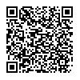
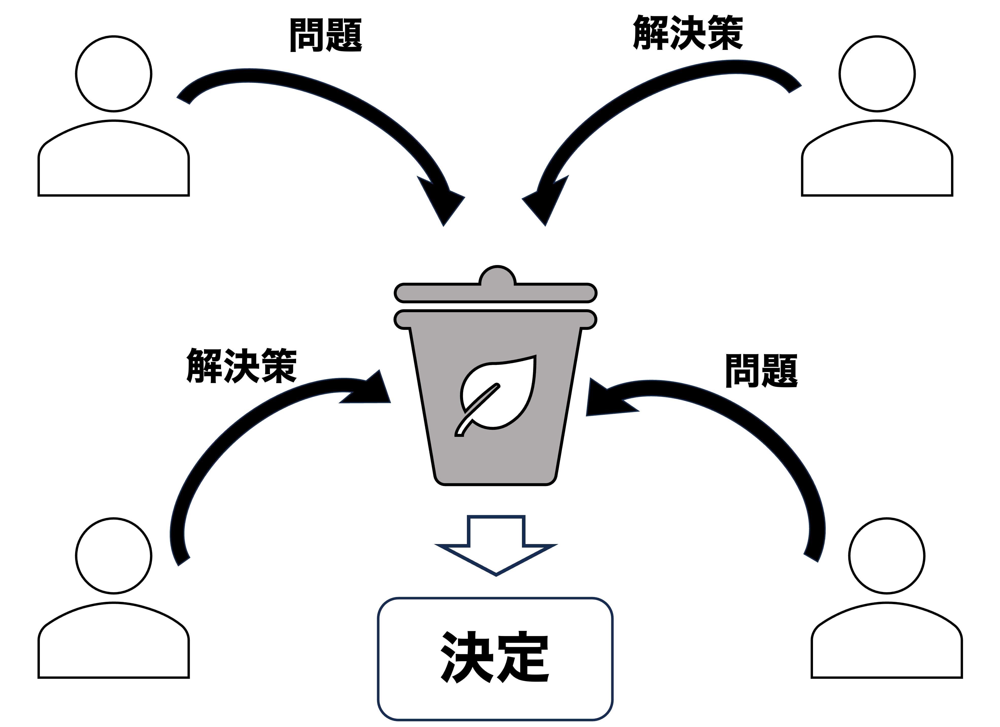
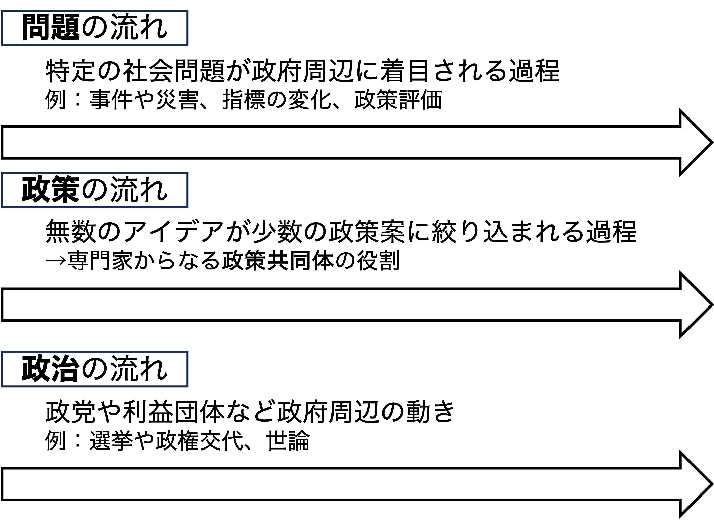
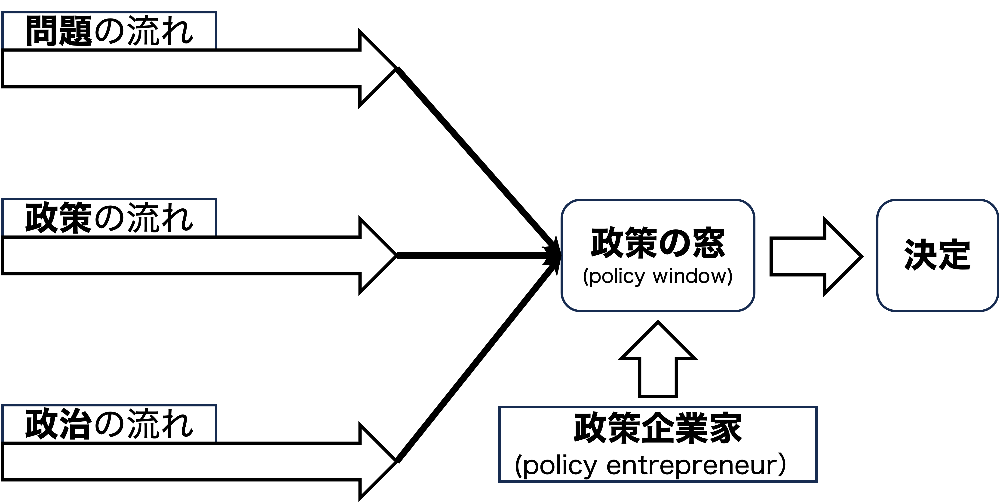

## 出席登録をお願いします

## 今日の目次

1. はじめに
1. 政策過程論
1. 段階モデル
1. ゴミ缶モデル
1. 政策の窓モデル
1. まとめ

# はじめに
## 先週のRPより
TBD

## 本日の目的と到達目標
#### 目的
政策が決定され実施されるまでの過程である政策過程論を学ぶ。理念型としての段階モデルののち、段階モデルを批判するものとしてのゴミ缶モデルと政策の窓モデルを紹介する。

::: {.fragment .fade-in}
#### 到達目標
1. 政策過程論の論点を3つ以上列挙できる。
1. 政策過程の段階モデルを説明できる。
1. 政策過程の「ゴミ缶モデル」を説明できる。
1. 「政策の窓」モデルを説明できる。

:::

## 本日の授業の位置付け

# 政策過程論
## 政策 (policy)
公共的問題に対する解決の方向性と具体的手段

::: {.fragment .fade-in}
例：

::: {.incremental}
- 貧困問題←福祉政策
- 外国の脅威←国防政策
- 物価高騰←金融政策

:::
:::

## 質問
福祉・国防・金融の各政策の他に、どのような政策があり、それらの政策はどのような問題に対応しているのでしょうか。

考えられることを[WebClassチャット](https://webclass.komazawa-u.ac.jp/webclass/login.php?id=6a28646d61a8ac6788e0c28b51da063a)に書き込んでください。

{.r-stretch}

## 政策過程 (policy process)
政策が**立案・決定・実施・評価**される一連の過程

::: {.fragment .fade-in}
政策過程論の論点：

::: {.incremental}
- 政策過程（特に形成・決定）の全体像
- 課題設定＝政策的対応が必要だと認識される問題
- 政策実施
- 政策評価

:::
:::

# 段階モデル
## 復習：政治システム

## 段階モデル

## 例：復興庁の設置
::: {.columns}
::: {.column width=70%}
::: {.incremental}
- **課題設定**…2011年東日本大震災→省庁を超えた問題の発生
- **政策形成・決定**…政府有識者会議での議論→12年復興庁設置法案成立（21年までの10年間限定）
- **政策実施**…被災者支援、住まいとまちの復興、産業・生業の再生など様々な政策
- **政策評価**…21年に設置年限を10年延長（31年まで）、26年に宮城・岩手復興局廃止

:::
:::

::: {.column width=30%}

:::

:::

## 段階モデルの問題
「課題→政策」という理想的な流れでは説明できない場面

::: {.incremental}
- 政策が課題に先立つ→「手段の目的化」

:::

::: {.fragment .fade-in}
例：パソコン購入

::: {.incremental}
- 理想：文章を作成したいからパソコンを買う
- 現実：パソコンを買ってからやることを考える
:::
:::

::: {.fragment .fade-in}
質問「パソコン購入の例のように、手段が目的化していると言えるような自信の体験談、あるいは政策の実例はあるでしょうか。」→[WebClassチャット](https://webclass.komazawa-u.ac.jp/webclass/login.php?id=6a28646d61a8ac6788e0c28b51da063a)
:::

# ゴミ缶モデル
## クイズ
教科書（XII-3）で書かれている、ゴミ缶モデルの説明として正しいものを以下から全て選びなさい。

1. ゴミ缶モデルでは、問題に対して解決策が策定されるという流れが想定されている。
1. ゴミ缶モデルでは、自分がやりたいことがよく分かっていない人間が政策決定に参加していると想定されている。
1.  ゴミ缶モデルでは、参加者は政策決定のプロセスについて十分な知識を持っていると想定されている。
1. ゴミ缶モデルでは、誰が政策決定に参加するかによって、政策決定の結果が変わることがある。

[WebClass](https://webclass.komazawa-u.ac.jp/webclass/login.php?id=c5467ae3db2b9ba8228568ca1f33cce7&page=1)で回答

## ゴミ缶モデル (garbage can model)
マーチ、オルセン、コーエンの提唱

::: {.fragment .fade-in}
{width=80%}
:::

::: {.notes}
ゴミ缶モデル

- 政策決定過程をゴミ缶に例えるモデル
   - 参加者は好き勝手に問題や解決策を投げ込む
   - ゴミ缶の中で問題と解決策が偶然結合し、政策として決定
- 政策→課題をうまく説明

:::

## 組織化された無秩序 (organized anarchy)
問題・解決策・参加者・選択の機会の4つの流れがそれぞれ別々に形作る状況

::: {.fragment .fade-in}
前提：

::: {.incremental}
- 参加者は自分の選好をよく知らない
- 参加者の知識や情報は完全でない
- 決定過程への参加は流動的

:::
:::

::: {.fragment .fade-in}
例：国鉄分割民営化、GoToトラベル

:::

::: {.notes}
実例

- 国鉄分割民営化→うまくいっていた電電公社も民営化
- GoToトラベル→旅行業に対する支援がコロナ経済対策として位置付け

:::

# 政策の窓モデル
## 政策の窓モデル
**ジョン・キングダン**がゴミ缶モデルの発展版として提唱

::: {.fragment .fade-in}

{width=70%}

<!-- ::: {.incremental} -->
<!-- - **問題の流れ**…特定の社会問題が政府周辺に着目される過程 -->
<!--    - 事件や災害、指標の変化、政策評価の結果 -->
<!-- - **政策の流れ**…無数のアイデアが少数の政策案に絞り込まれる流れ -->
<!--    - 専門家からなる政策共同体の役割 -->
<!-- - **政治の流れ**…政党や利益団体など政府周辺の動き -->
<!--    - 選挙や政権交代、世論など -->

<!-- ::: -->
:::

::: {.notes}
政策の窓モデル (multiple stream framework: MSF)

- 「組織化された無秩序」のうち、組織性を強調

政策決定における3つの流れ

- 問題、政策、政治
- 通常は独立しており交わらない

:::

## 政策の窓 (policy window)

::: {.notes}
政策の窓 (policy window)
- 通常は独立した3つの流れが結合して開かれる
- 開く際に政策企業家の役割が重要
   - **政策企業家**（policy entrepreneur）…自ら望む政策の実現のために時間・労力・資源などを投入する人

:::

## Think-pair-share (10分)
2020年のコロナ禍により急速に普及した「**テレワーク**（在宅勤務）」ですが、この概念自体は昔からあり、総務省も長年普及の取り組みを進めてきました（[参考](https://www.soumu.go.jp/main_content/000616369.pdf)）。

このテレワークの事例について、①問題の流れ、②政策の流れ、③政治の流れにあたるものを、それぞれ1つずつ挙げてください。

::: {.fragment .fade-in}
[WebClassチャット](https://webclass.komazawa-u.ac.jp/webclass/login.php?id=c5467ae3db2b9ba8228568ca1f33cce7&page=1)で共有してください。

{width=30%}
:::

::: {.notes}
例：テレワーク推進

- 問題の流れ…コロナ感染拡大
- 政策の流れ…働き方改革の一環として「テレワーク」が提唱
- 政治の流れ…コロナ対策が政治的課題に

→政策の窓が開かれた！

:::

# まとめ
## 本日の目的と到達目標
#### 目的
政策が決定され実施されるまでの過程である政策過程論を学ぶ。理念型としての段階モデルののち、段階モデルを批判するものとしてのゴミ缶モデルと政策の窓モデルを紹介する。

::: {.fragment .fade-in}
#### 到達目標
1. 政策過程論の論点を3つ以上列挙できる。
1. 政策過程の段階モデルを説明できる。
1. 政策過程の「ゴミ缶モデル」を説明できる。
1. 「政策の窓」モデルを説明できる。

:::

## 次回までに
#### 事後学習

 - 授業資料を見直し、目標到達をセルフチェック
 - WebClass上でのリアクションペーパー入力（日曜日まで）
 
#### 事前学習

 - 教科書（VII-2、XII-2）を読む。