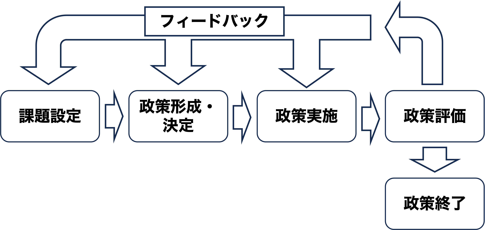

## 出席登録をお願いします

## 今日の目次

1. はじめに
1. 課題設定論
1. 課題設定の過程
1. 課題設定の戦略
1. 政策ネットワーク
1. まとめ

# はじめに
## 先週のRPより
TBD

## 本日の目的と到達目標
#### 目的
社会の要求が課題として設定される過程を概観する。課題設定の重要性を権力論の視点から考察した後、アクターが課題設定において有する動機や採る戦略を議論する。また、政策ネットワーク論を学び、課題が政策に変換される条件を考察する。

::: {.fragment .fade-in}
#### 到達目標
1. 政策過程における課題設定の重要性を非決定権力の視点から説明できる。
1. 課題設定過程における発案者をその動機に基づいて4つに分類できる。
1. 課題設定過程における争点の再定義という戦略は何かを説明できる。
1. 政策ネットワークのあり方を2つに分類できる。

:::

## 本日の授業の位置付け

# 課題設定論
## 復習：段階モデル

## 質問
[第3回の講義用スライド](https://junpei-suzuki.github.io/PP-2026-Komazawa/03_power.html)を確認し、非決定権力論とはどのような議論であったかを思い出してください。

その内容を[WebClassチャット](https://webclass.komazawa-u.ac.jp/webclass/login.php?id=52f54d434a66e43f8f27bd82afd117c2)に簡単にまとめてください。

{.r-stretch}

## 課題設定と権力
#### 課題 (agenda)
政府による解決を要すると認識される問題

::: {.fragment .fade-in}
#### 課題設定 (agenda setting)
ある問題を政府による解決を要する重大な問題であると認識させる過程

:::

::: {.fragment .fade-in}
#### 非決定権力論
何かを**させない**形で行使される権力

::: {.incremental}
- 例：大気汚染問題…企業が大気汚染を課題として設定させない

:::
:::

## 課題設定論
::: {.columns}
::: {.column width=70%}
政策決定者から遠い集団が非決定権力をいかに乗り越えて新しい課題を認識させるかを探究

::: {.fragment .fade-in}
**ロジャー・コブ**と**チャールズ・エルダー**の研究[^cobb1983]

::: {.incremental}
1. 課題設定過程の段階
1. 発案者の役割と戦略

:::
:::

:::

::: {.column width=30%}

:::

:::

[^cobb1983]: Cobb, Roger W. and Charles D. Elder. *Participation in American Politics: The Dynamics of Agenda-building,* 2nd ed., Johns Hopkins University Press, 1983.

# 課題設定の過程
## 課題設定の二段階
課題設定は以下の二段階を経る。

::: {.incremental}
1. **システム課題**（systemic agenda）…国民の注目に値すると認識されると同時に、既存政府の正当な管轄権内で重要であると認識される争点
1. **公式課題**（formal agenda）…権威的意思決定者による積極的かつ真剣に考慮すべき対象として明確になった一連の項目
   - システム課題より特定的、具体的、数的にも制限
   - この段階で対応策が具体的に検討

:::

::: {.fragment .fade-in}
システム課題が公式課題に変化するには、**対応を望む集団**が**政策決定者／政策コミュニティへのアクセスの機会**を持つことが重要

:::

## Think-pair-share
いわゆる「外国人問題」は2024年からより強い政治的争点として浮上しました。

1. 「外国人問題」への対応を求めているのは、どのような人々や団体だと思いますか。
1. その人々・団体は、どのようにして政治家や政府に自分たちの要求を届けることができるようになったと思いますか。

::: {.fragment .fade-in}
[WebClassチャット](https://webclass.komazawa-u.ac.jp/webclass/login.php?id=52f54d434a66e43f8f27bd82afd117c2)で共有

{width=30%}

:::

::: {.notes}
例：いわゆる「外国人問題」

- 2023年以前はシステム課題→排外主義者が内々に議論するだけ
- 2024年以降は公式課題：自民党や政府が明確に考慮
  - SNSで排外主義者と政府中枢（特に高市）の接続
  - 排外主義者の参政党・保守党の議席獲得
  
:::

# 課題設定の戦略
## 発案者 (initiator)
新しい争点を政治的な課題として提起する人・集団

::: {.incremental}
- **再調整者**…資源配分の不均衡を是正しようとする
- **私的利益者**…自分たちの利益を求める
- **環境反応者**…予期せぬ出来事に反応する
- **社会改革者**…公益・正しいことの実現を目指す

:::

::: {.fragment .fade-in}
契機となる出来事…災害や技術革新、社会構造や政治状況の変化など

:::

## 発案者の戦略
特に政策決定者に遠い集団にとって重要

::: {.fragment .fade-in}
#### 争点の再定義

多くの人の注目を集めるために、具体的かつ重要なものとして争点を定義しなおすこと

::: {.incremental}
- 例：「米の輸入自由化」への反対
  - 食糧安全保障
  - 伝統文化としての米
  - 環境保全

:::
:::

<!-- 1. **争点の再定義**…多くの人の注目を集めるために、具体的かつ重要なものとして争点を定義しなおす -->
<!-- 1. **シンボルの操作**…喚起・挑発・諫止・示威行為・断言の戦略 -->

<!-- ::: {.notes} -->
<!-- シンボルの操作 -->

<!-- - 喚起…人々が元々持っている感情や価値観（愛国心、正義感、家族愛など）を呼び起こす行為 -->
<!-- - 挑発…相手（主に政府や対立陣営）の怒りや過剰反応を、意図的に引き出す行為 -->
<!-- - 諫止…対立する陣営や政府に対して「それ以上進むと破滅的な結果になる」と警告し、行動を思いとどまらせる行為 -->
<!-- - 示威行為…自陣営の「数の多さ」や「団結力」を、視覚的・物理的なシンボルを使ってアピールする行為 -->
<!-- - 断言…複雑な背景や議論をすべて無視し、自分たちの主張の正当性を「絶対的な真実」として言い切る行為 -->

<!-- ::: -->

## 質問
いわゆる「外国人問題」を治安問題・雇用の問題として捉えたとき、それぞれどのような人々が注目すると思いますか。

[WebClassチャット](https://webclass.komazawa-u.ac.jp/webclass/login.php?id=52f54d434a66e43f8f27bd82afd117c2)で書き込み

{width=30%}

# 政策ネットワーク
## 政策ネットワーク
政策の形成・決定・実施をめぐる国家と社会、官と民、あるいは公的セクターと私的セクターにまたがる、**ネットワーク的な相互依存関係**

::: {.fragment .fade-in}
政策ネットワークの二類型：

|                        | 政策共同体   | イシューネットワーク | 
| ---------------------- | ------------ | -------------------- | 
| **メンバー**           | 固定的       | 流動的               | 
| **価値観や選好**       | 均質         | 多様                 | 
| **相互信頼・協力関係** | 強い         | 弱い                 | 
| **例**                 | 医療報酬制度 | 外国人政策           | 

:::

## 質問
政策共同体とイシューネットワークでは、どちらの方が新しい政策課題を政治的な争点として設定しやすいと思いますか。またなぜだと思いますか。

[WebClassチャット](https://webclass.komazawa-u.ac.jp/webclass/login.php?id=52f54d434a66e43f8f27bd82afd117c2)で書き込み

{width=30%}

# まとめ
## 本日の目的と到達目標
#### 目的
社会の要求が課題として設定される過程を概観する。課題設定の重要性を権力論の視点から考察した後、アクターが課題設定において有する動機や採る戦略を議論する。また、政策ネットワーク論を学び、課題が政策に変換される条件を考察する。

::: {.fragment .fade-in}
#### 到達目標
1. 政策過程における課題設定の重要性を非決定権力の視点から説明できる。
1. 課題設定過程における発案者をその動機に基づいて4つに分類できる。
1. 課題設定過程における争点の再定義という戦略は何かを説明できる。
1. 政策ネットワークのあり方を2つに分類できる。

:::

## 次回までに
#### 事後学習

 - 授業資料を見直し、目標到達をセルフチェック
 - WebClass上でのリアクションペーパー入力（日曜日まで）
 
#### 事前学習

 - 教科書（VI-2〜5）を読む。
