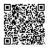
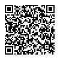

## 出席登録をお願いします

## 今日の目次

1. はじめに
1. メディアと強力効果論
1. 限定効果論
1. 課題設定とメディア
1. ソーシャルメディア
1. まとめ

# はじめに
## 先週のRPより
TBD

## 本日の目的と到達目標
#### 目的
課題設定過程におけるメディア、特にマスメディアの役割を考察する。政治学や関連する研究動向から、強力効果論と限定効果論という2つの対立する見方を紹介する。さらに最近の展開として、ソーシャルメディアが及ぼす影響として「エコーチェンバー」と「フィルターバブル」を学ぶ。

::: {.fragment .fade-in}
#### 到達目標
1. 強力効果論とはどのような議論かを説明できる。
1. ラザースフェルトの研究に依拠しながら、限定効果論を説明できる。
1. 課題設定過程においてメディアが果たす役割を説明できる。
1. 「エコーチェンバー」「フィルターバブル」という言葉を用いてソーシャルメディアが与える影響を議論できる。

:::

## 本日の授業の位置付け

# メディアと強力効果論
## 質問
新聞やテレビなど「マスコミ」についてどう思いますか。自由に意見を[チャット](https://webclass.komazawa-u.ac.jp/webclass/login.php?id=d78f14cd9ea6036992f59fba0640ab87)に書き込んでください。

{.r-stretch}

## メディア／マスメディア
::: {.fragment .fade-in}
#### メディア（media）
情報を記録・伝達・記録する媒体

:::

::: {.fragment .fade-in}
#### マスメディア（mass media）
不特定多数の人々に向かって大量の情報を伝える媒体

::: {.incremental}
- 例：新聞、雑誌、ラジオ、テレビ

:::
:::

::: {.fragment .fade-in}
（マス）メディアの効果をめぐる論争

::: {.incremental}
- **強力効果論**
- **限定効果論**

:::
:::

## 強力効果論
マスメディアは人々に対して強い影響を及ぼすとする説

::: {.incremental}
- 別名：「**魔法の弾丸**」論、「**皮下注射**」論
- 1920-30年代にかけての通説

:::

::: {.r-stack}
{.fragment width=70%}

{.fragment width=70%}

:::

# 限定効果論
## 限定効果論
マスメディアの影響力は限定されているとする説

::: {.incremental}
- 1940-60年代に強力効果論に代わって有力
- ラザースフェルトによる**エリー調査**が端緒

:::

::: {.fragment .fade-in}
#### ワーク

ラザースフェルトのエリー調査については、実は[前期第6回](06_voting.qmd)の授業で紹介しています。授業資料を見返して、どのような議論であったかを思い出してください。

:::

## エリー調査（1940年）
::: {.columns}
::: {.column width=70%}
**ポール・ラザースフェルド**らコロンビア大学のグループがオハイオ州エリーで実施[^lazarsfeld1948]

::: {.incremental}
- 1940年アメリカ合衆国大統領選挙
   - 民主党現職のF・ルーズヴェルトと共和党のウィルキーの対決
- **ランダムサンプリング**による大規模**パネル調査**の嚆矢
- 目的：メディアが投票行動に与える影響の検証

:::

:::

::: {.column width=30%}

:::

:::

[^lazarsfeld1948]: Lazarsfeld, P. F. (1948) *The People's Choice: How the Voter Makes up His Mind in a Presidential Campaign.* New York: Columbia University Press.

## エリー調査の発見
メディアは有権者に対して直接強力な影響を与えるわけではない。

::: {.incremental}
1. **政治的先有傾向**の重要性
   - **有権者の社会的属性**が主に投票行動を説明（社会学モデル）
1. **選択的接触**…有権者は自分の先有傾向に沿うメディアに接触
   - 民主党支持者は民主党寄りのメディア、共和党支持者は共和党寄りのメディアに接触
1. **コミュニケーションの二段階の流れ**…メディアの情報は所属集団内部にいる**オピニオンリーダー**を経由して受容される
   - 例：友人、家族、ご近所さん

:::

# 課題設定とメディア
## アンケート
ここまで強力効果論と限定効果論について学んできました。改めてどちらに説得力があると思いますか。

[WebClass](https://webclass.komazawa-u.ac.jp/webclass/login.php?id=c3a42fcda0b05c4819b7fa07e86ab309&page=1)で回答

{.r-stretch}

## 新しい強力効果論
マスメディアは**課題設定**などを通じて影響力を及ぼしている

::: {.incremental}
- 1970年代以降、限定効果論を批判する形で登場

:::

::: {.fragment .fade-in}
バーナード・コーエン[^cohen1963]曰く、

> ニュースは人々の考えに影響を与えることには失敗しているかもしれないが、人々が何について考えるかに影響を与えることには驚くほど成功している。

::: {.incremental}
- 例：皇室典範改正

:::

:::

[^cohen1963]: Cohen, B. C. (1963) *The Press and Foreign Policy.* Princeton, NJ: Princeton University Press.

## マコームズの研究
1968年大統領選挙でのノースカロライナ州の投票先未定有権者のとニュースの内容分析[^mccombs2014]

::: {.incremental}
- 有権者→自由回答式で重要だと思う争点を尋ねる
- ニュース→テレビ・新聞・雑誌の誌面から内容を分類

:::

::: {.fragment .fade-in}
**ニュースで扱われている争点**と**有権者が重要だと思う争点**が一致

::: {.incremental}
- 支持政党に関わらず同様の傾向

:::
:::

[^mccombs2014]: McCombs, M. E. (2024) *Setting the Agenda: The Mass Media and Public Opinion.* Cambridge, UK: Polity Press.

## 政策過程とメディア
#### 課題設定 (agenda setting)
ある問題を政府による解決を要する重大な問題であると認識させる過程

::: {.fragment .fade-in}
{width=80%}

:::

# ソーシャルメディア
## 質問
XやTikTokなどのSNSを政治で活用することについて、ポジティブな面とネガティブな点について考えられること／見聞きしたことを[チャット](https://webclass.komazawa-u.ac.jp/webclass/login.php?id=d78f14cd9ea6036992f59fba0640ab87)に書き込んでください。

{.r-stretch}

## インターネットの登場
90年代にインターネットが登場・普及

:::: {.fragment .fade-in}
当初は**サイバー・ユートピア論**が主流

::: {.incremental}
- 脱中央集権、国境の開放、異文化間の対話…
- 例：アラブの春（2010-21年）

:::
:::

::: {.fragment .fade-in}
現在は「**選好に基づく強化**」による**分極化**の懸念

::: {.incremental}
- **エコーチェンバー**
- **フィルターバブル**
:::

:::

## メディアの性質の比較
::: {.fragment .fade-in}
#### マスメディア
少数の発信主体から多数の受け手へ大量に情報を届けることが得意

::: {.incremental}
- 「万人受け」する情報が発信される傾向

:::
:::

::: {.fragment .fade-in}
#### ソーシャルメディア
利用者自身も情報を発信・共有でき、情報の選択も行いやすい

::: {.incremental}
- 極端な発信主体（ニッチメディア）も存続しやすい

:::
:::

## エコーチェンバー（echo chamber）
自分と同じ意見に囲まれて、先鋭化していく現象

::: {.incremental}
- **選択的接触**…自分の先有傾向に沿うメディアに接触
- 極端な人々がニッチメディアや同類と積極的に交流

:::

::: {.fragment .fade-in}
](figs/twitter_polarization.png){width=40%}

:::

::: {.notes}
Conover et al. (2011)

- ツイッターのリツイートによるアカウント同士の繋がりを視覚化
- 共和党支持者同士、民主党支持者同士のリツイートばかり

:::

## フィルターバブル（filter bubble）
個人が選好に沿った泡に包まれ、異なった価値観を持つ人と交わらなくなる現象

{width=60%}

::: {.notes}
**パーソナライゼーション**…個人に合わせた情報を表示するアルゴリズム→自分に都合のいい情報だけが表示

:::

# まとめ
## 本日の目的と到達目標
#### 目的
課題設定過程におけるメディア、特にマスメディアの役割を考察する。政治学や関連する研究動向から、強力効果論と限定効果論という2つの対立する見方を紹介する。さらに最近の展開として、ソーシャルメディアが及ぼす影響として「エコーチェンバー」と「フィルターバブル」を学ぶ。

::: {.fragment .fade-in}
#### 到達目標
1. 強力効果論とはどのような議論かを説明できる。
1. ラザースフェルトの研究に依拠しながら、限定効果論を説明できる。
1. 課題設定過程においてメディアが果たす役割を説明できる。
1. 「エコーチェンバー」「フィルターバブル」という言葉を用いてソーシャルメディアが与える影響を議論できる。

:::

## 次回までに
#### 事後学習

 - 授業資料を見直し、目標到達をセルフチェック
 - WebClass上でのリアクションペーパー入力（日曜日まで）
 
#### 事前学習

 - 教科書（IX-1〜3）を読む。
