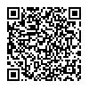
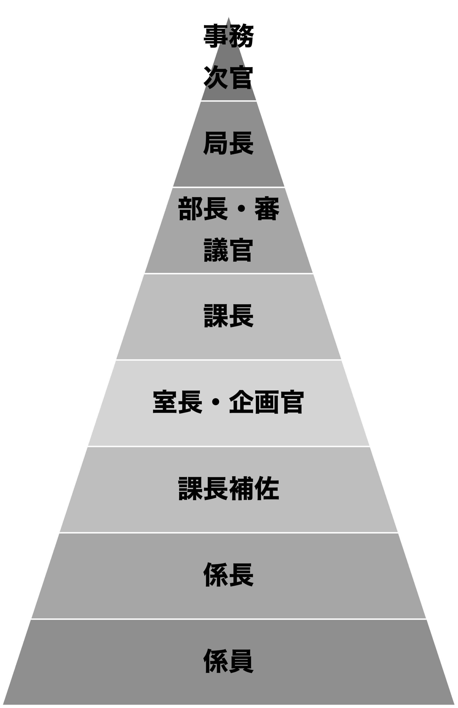
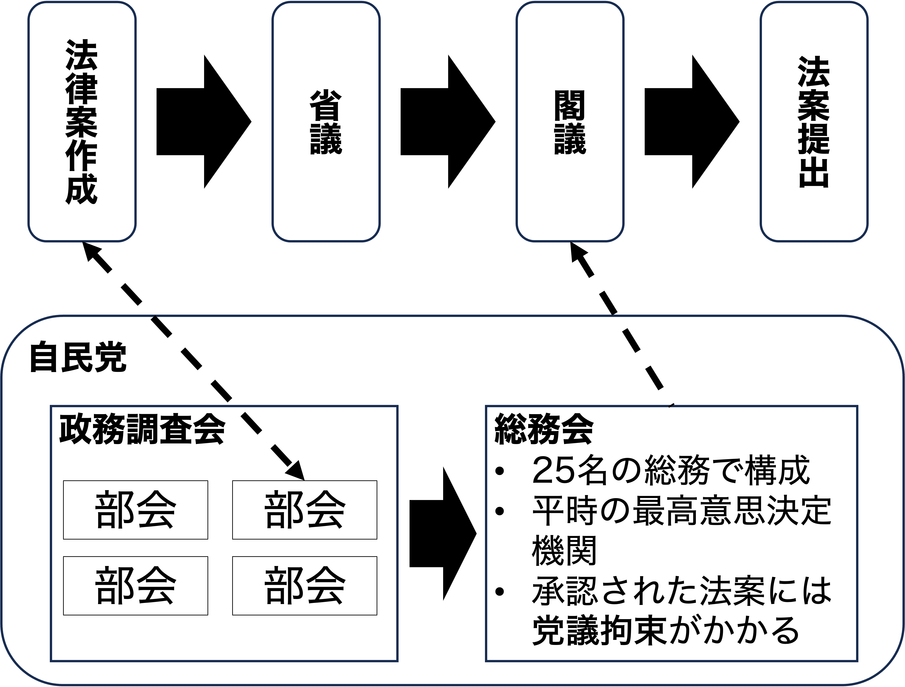
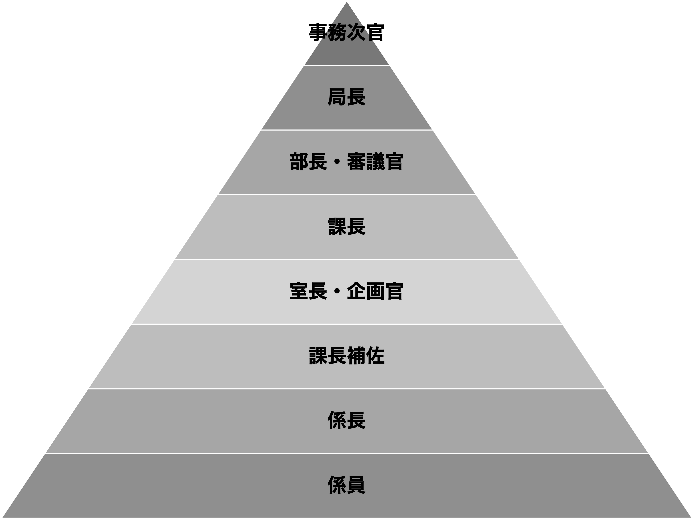
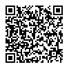

## 出席登録をお願いします

## 今日の目次

1. はじめに
1. 日本の官僚制論争
1. プリンシパル＝エージェント理論
1. 官僚の監視と統制
1. 第一線の公務員
1. まとめ

# はじめに
## 先週のRPより
TBD

## 本日の目的と到達目標
#### 目的
官僚と政治家の関係を考察する。日本における官僚の政治的影響力をめぐる論争を概観したのち、合理的選択論に基づくプリンシパル＝エージェント理論（PA理論）を紹介し、官僚と政治家の関係を捉え直す。政治家が官僚を監視・統制する方法や、政策実施の最前線に立つ官僚のあり方も考察する。

::: {.fragment .fade-in}
#### 到達目標
1. 日本における官僚の影響力をめぐる論争を説明できる。
1. プリンシパル＝エージェント理論を用いて官僚と政治家の関係を議論できる。
1. 官僚監視の2つの様式（パトロール型と火災報知器型）を列挙・説明できる。
1. 第一線の公務員が持つ3つの裁量を説明できる。

:::

## 本日の授業の位置付け

# 日本の官僚制論争
## アンケート
日本政治において政治家と官僚どちらが影響力を持っていると思いますか。

[WebClass](https://webclass.komazawa-u.ac.jp/webclass/login.php?id=e713a2ebd39e48ad43a734077a676686&page=1)で回答

{.r-stretch}

## 官僚優位論
政治家よりも官僚の方が影響力があると主張

::: {.incremental}
- **辻清明**「戦前の官僚制が**温存・強化**」
- [**ジョンソン**](https://www.keisoshobo.co.jp/book/b341352.html)「通産省主導による戦後復興」

:::

::: {.fragment .fade-in}
着眼点：

- **閣法**の多さ→原案は官僚が作成
- **政府委員制度**…大臣に代わって官僚が国会答弁
   - 大臣職は派閥間調整の道具→短期間で交代するので専門性なし
- **資格任用制**…人事面での自律性
   - 第1種国家公務員試験（現総合職試験）による**キャリア**組選抜

:::

---

::: {.columns}
::: {.column width=70%}
学問的のみならず通俗的に受け入れられ、90年代以降の改革に結実

::: {.incremental}
- **中央省庁再編**（2001年）
   - 1府22省庁から1府12省庁への統廃合
   - **政治任用**による副大臣・大臣政務官職の設置と政府委員制度の廃止
- **内閣人事局**の設立（2014年）
   - 審議官級以上の各省幹部人事への関与

:::
:::

::: {.column width=30%}

:::
   
:::

## 多元主義論
必ずしも官僚に権力が集中しているわけではなく、政治家や利益団体も影響力を行使していると主張

::: {.incremental}
- 村松岐夫（1981）『戦後日本の官僚制』
- 現在では日本政治研究の通説

:::

::: {.fragment .fade-in}
着眼点：

::: {.incremental}
- **事前審査制**…自民党**政務調査会・総務会**を通じて法案作成に関与
- **族議員**…専門知識と利益団体とのつながりを持った議員
- 官僚の自己評価は必ずしも高くない

:::
:::

## 法案提出と事前審査
{.r-stretch}

# プリンシパル＝エージェント理論
## プリンシパル＝エージェント理論
#### Principal-Agent Theory (PA理論)
**プリンシパル（本人）**が**エージェント（代理人）**に委任する関係

::: {.fragment .fade-in}
#### エージェンシー・スラック
代理人が本人の利益に反して自己の利益を追求すること

::: {.incremental}
- **情報の非対称性**…代理人の方が本人よりも情報が多い
- 例：患者（本人）と医師（代理人）

:::
:::

## ワーク
患者と医師の他に、身近な例でプリンシパル＝エージェント関係は何かないでしょうか。その際に生じるエージェンシースラックはどのようなものでしょうか。

周りと相談しながらでも良いので、[チャット](https://webclass.komazawa-u.ac.jp/webclass/login.php?id=202fa1eb23e3d0f79d642e610d8c04c4)に書き込んでください。

{.r-stretch}

## 政官関係
**本人である政治家**が**代理人である官僚**に政策立案や政策執行を委任する関係

::: {.incremental}
- 官僚優位論と多元主義論を統合する枠組み
   - 官僚優位論はエージェンシー・スラックが生じていることを強調
   - 多元主義論は政治家側の対処能力を強調
   
:::

# 官僚の監視と統制
## 政官関係における監視・統制
マカビンズとシュウォーツは以下の2つの方式があると主張

::: {.incremental}
1. **パトロール型**…絶えず官僚の行動を監視
1. **火災報知器型**…問題が起きた時に事後的に是正

:::

::: {.fragment .fade-in}
Q. パトロール型と火災報知器型それぞれの監視方法のメリットとデメリットは？（[チャット](https://webclass.komazawa-u.ac.jp/webclass/login.php?id=202fa1eb23e3d0f79d642e610d8c04c4)）

:::

## ラムザイヤー＝ローゼンブルース『日本政治の経済学』
自民党政治家は以下の方法で監視・統制コストを節約

::: {.incremental}
- 利益団体や有権者の利用…不満の声を利用し行動を是正
- 省庁間の競争関係の利用…競争関係にある省庁同士の相互監視
- 昇進機会と天下り先の提供…人事・金銭面での利益提供

:::

::: {.fragment .fade-in}
#### 予測的対応
官僚は政治家の意向を予測（忖度）し、それに沿った政策を立案

:::

## 日本の省庁の人事慣行
{.r-stretch}

::: {.notes}
キャリア官僚は基本横並び昇進→しかし上に行くほどポストは減り、トップの次官は一人だけ→ポストから漏れたら天下り

:::

# 第一線の公務員
## 第一線の公務員
#### street-level bureaucrats
政策実施の最前線に立つ公務員

::: {.incremental}
- 例：外勤警察官、学校教師、生活保護のケースワーカー
- 対象者と直に接する関係上**監視・統制がしにくい**
- 結果として広い裁量→**実施のギャップ**が生じる恐れも
   - ある政策の当初の目的と実施状況のギャップ
   
:::

## 第一線の公務員の裁量
::: {.incremental}
1. **対象方針の裁量**…対象者それぞれに応じた対応が必要かつ可能
1. **法適用の裁量**…多くの関係法規から適用すべきものを選べる
   - 関係法規が多くなるほど裁量も拡大
1. **エネルギー振り分けの裁量**…各種業務にどれだけの時間を割くか選べる

:::

## クイズ
次の3つのケースは、それぞれ『対象方針』『法適用』『エネルギー振り分け』のどの裁量に当てはまるでしょうか。

1. 高速道路でノロノロ運転している車を発見した覆面パトカーの警官が車両通行帯違反で止められないか考え始める
1. 新しいクラスの担任になった先生が昨年のクラスよりも出来が悪いことに気づき、授業のやり方について考え始める
1. 家庭訪問に疲弊した児童相談所の職員が書類仕事に精を出した方が楽なのではないかと思い始める

[WebClass](https://webclass.komazawa-u.ac.jp/webclass/login.php?id=bab1618d58059a452221c7b1cc9e49e0&page=1)で回答

{.r-stretch}

# まとめ
## 本日の目的と到達目標
#### 目的
官僚と政治家の関係を考察する。日本における官僚の政治的影響力をめぐる論争を概観したのち、合理的選択論に基づくプリンシパル＝エージェント理論（PA理論）を紹介し、官僚と政治家の関係を捉え直す。政治家が官僚を監視・統制する方法や、政策実施の最前線に立つ官僚のあり方も考察する。

::: {.fragment .fade-in}
#### 到達目標
1. 日本における官僚の影響力をめぐる論争を説明できる。
1. プリンシパル＝エージェント理論を用いて官僚と政治家の関係を議論できる。
1. 官僚監視の2つの様式（パトロール型と火災報知器型）を列挙・説明できる。
1. 第一線の公務員が持つ3つの裁量を説明できる。

:::

## 次回までに
#### 事後学習

 - 授業資料を見直し、目標到達をセルフチェック
 - WebClass上でのリアクションペーパー入力（日曜日まで）
 
#### 事前学習

 - 【事前】教科書（VIII-1、3〜6）を読む。
