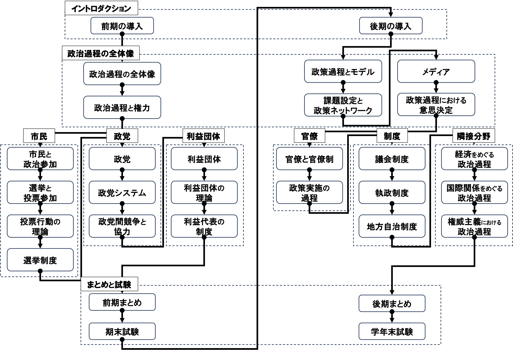
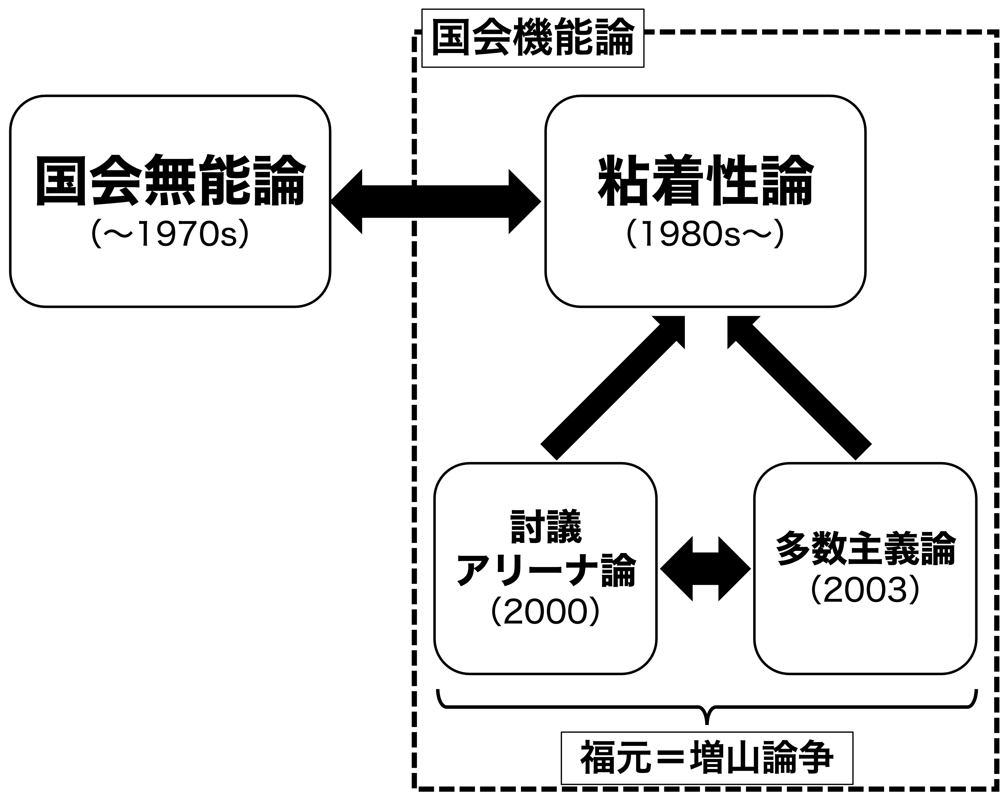

## 出席登録をお願いします

## 今日の目次

1. はじめに
1. 議会の機能と能力
1. 議会類型論
1. 国会無能論と粘着性論
1. 福元＝増山論争
1. まとめ

# はじめに
## 先週のRPより
TBD

## 本日の目的と到達目標
#### 目的
民主主義政治の中核である議会を考察する。議会が持つ2つの能力（政策決定力と政策修正力）を紹介し、行政国家化する中での議会の役割を検討する。また、日本の国会をめぐる国会無能論と国会機能論との論争、および福元＝増山論争を学び、国会の役割を理論的実証的に考える。

::: {.fragment .fade-in}
#### 到達目標
1. 議会が持つ2つの能力（政策決定力と政策修正力）を説明できる。
1. ポルスビーの議論に基づいて、変換型議会とアリーナ型議会の違いを説明できる。
1. 日本における国会無能論と国会機能論（粘着性論）の論争を説明できる。
1. 日本の国会をめぐる福元＝増山論争を説明できる。

:::

## 本日の授業の位置付け

# 議会の機能と能力
## 議会
民主主義政治の中核をなす制度であり、第一義的には**立法**を司る

{.r-stretch}

## 質問
現在の高市総理は国会出席が少ないことが指摘されています。これに対して、[限られた時間を政策決断に使えるという見地から擁護する意見](https://research.nxji.jp/report/no01_pm-time_jp/)もあれば、[国会軽視であるとして批判する意見](https://www.asahi.com/articles/ASV9Y2GJHV9YUTFK00ZM.html)もあります。あなたはどう思いますか。

[WebClassチャット](https://webclass.komazawa-u.ac.jp/webclass/login.php?id=0bcca731c84db16427039dda06c6f805)で記入

{width=30%}

## 行政国家 (administrative state)
行政府が議会に対して優位に立つような国家

::: {.incremental}
- **世界大戦**による国民総動員
- **ニューディール政策**以降の「大きな政府」化

:::

::: {.fragment .fade-in}
専門知識の重要性の増大、官僚制の発達、利益団体の活発化→**議会の衰退？**

:::

## 議会の2つの能力
**ノートン**は議会が持つ能力を2つに分類

::: {.incremental}
- **政策形成力**…政策を修正したり拒否するだけでなく、自己の政策を提示する能力
- **政策修正力**…政策を修正したり拒否する能力であり、己の政策を提示する能力は含まれない）

:::

::: {.fragment .fade-in}
→行政国家化する中で形成力は失われつつあるが修正力は未だ顕在

:::

# 議会類型論
## 議会類型論
**ポルスビー**は議会をその果たす役割に応じて**変換型議会**と**アリーナ型議会**の2つに分類

<iframe width="1020" height="730" src="https://www.youtube.com/embed/4a7kvqrHpto?si=TKC-m-oQtQPrbHNj" title="YouTube video player" frameborder="0" allow="accelerometer; autoplay; clipboard-write; encrypted-media; gyroscope; picture-in-picture; web-share" referrerpolicy="strict-origin-when-cross-origin" allowfullscreen></iframe>

## 変換型議会
社会における多様な要望を吸い上げ、それを政策とした上で法律に変換

::: {.incremental}
- **アメリカ議会**が典型
- 法案は全て**議員提出**
- **委員会中心主義**
- 議員の自律性が高く、**交叉投票**が普通
- 審議の過程で利益団体が**ロビイング**

:::

## アリーナ型議会
与野党による政策論争の舞台となって、有権者に政策的な争点を明らかにする

::: {.incremental}
- **イギリス議会**が典型
- 法案は基本的に**内閣提出**
- **本会議中心主義**
- 議員の自律性が低く、**政党が強く規律**
   - **フロントベンチャー**と**バックベンチャー**
- 利益団体より**有権者の支持獲得**が中心

:::

## クイズ
日本では1990年代に国会改革が行われ、以下の4つが実施されました。それぞれ変換型とアリーナ型どちらを狙ったものだと評価できるでしょうか。

- 政党交付金の導入
- 党首討論の導入
- 政策担当秘書の導入
- 政府委員制度の廃止

[WebClassで回答](https://webclass.komazawa-u.ac.jp/webclass/login.php?id=5289c781f476bc4bbe35b78caf75fbdb&page=1)

{.r-stretch}

# 国会無能論と粘着性論
## 日本の国会論争
{.r-stretch}

## 国会無能論
国会は官僚が作成した政策をただ追認している（**ラバースタンプ**を押している）に過ぎない

::: {.incremental}
- 内閣提出法案は官僚が作成
- 成立率は内閣提出法案が議員提出法案よりも高い（85%vs.27%）
- 内閣提出法案の多くは原案通り成立

:::

::: {.fragment .fade-in}
1970年代まで**官僚優位論**と表裏一体をなして主流
:::

## 粘着性論
**マイク・モチヅキ**は**粘着性**に着目して国会無能論に反論

::: {.fragment .fade-in}
#### 粘着性（viscosity）
内閣提出法案の成立を妨害し廃案に追い込む能力

::: {.incremental}
- **二院制**…比較的強い参議院の存在
- **会期不継続の原則**…会期中に成立しなかった案件は次期に持ち越さない
- 議事運営の**全会一致慣例**…議院運営委員会や常任委員会理事会
- **委員会中心主義**…野党が拒否できる機会の多さ

:::
:::

## 質問
ここまで国会無能論と粘着性論を紹介しましたが、どちらに説得力があると感じますか。理由を含めて書き込んでください。

[WebClassチャット](https://webclass.komazawa-u.ac.jp/webclass/login.php?id=0bcca731c84db16427039dda06c6f805)で記入

{width=30%}

# 福元＝増山論争
## 質問
2015年の安保法案は、最終的には与党の賛成多数で成立しました。

ただしその過程で野党が法案に激しく反発し、政府を厳しく問いただすなど活発な議論が行われました。

この場合国会は「機能した」と言えるでしょうか。理由も含めて書き込んでください。

[WebClassで回答](https://webclass.komazawa-u.ac.jp/webclass/login.php?id=5289c781f476bc4bbe35b78caf75fbdb&page=1)

{.r-stretch}

## 福元＝増山論争
::: {.fragment .fade-in}
::: {.columns}
::: {.column width=45%}
#### 討議アリーナ論

**野党・少数派**の強さを強調

{width=70%}
:::

::: {.column width=5%}

:::

::: {.column width=45%}
#### 多数主義論

**与党・多数派**の強さを強調

{width=70%}
:::

:::
:::

## 討議アリーナ論[^fukumoto2000]
日本の国会は**少数派（野党）**が討議を通じた対抗機会を持つアリーナ型

::: {.fragment .fade-in}
国会で成立した全政府立法を計量分析し、審議様式を3つに分類

::: {.incremental}
- **討議型審議様式**…委員会審議が多く、反対者が多い重要法案
- **粘着型審議様式**…審議が引き延ばされれ成立まで時間がかかった法案
- **標準型審議様式**…審議が少なく対立が弱い法案

:::
:::

::: {.fragment .fade-in}
→粘着性論が想定する「**議論しない抵抗**」に対し「**議論する抵抗**」の存在を明らかに
:::

[^fukumoto2000]: 福元健太郎（2000）『日本の国会政治－全政府立法の分析』東京大学出版会．

## 多数主義論[^masuyama2003]
日本の国会は**多数派（与党）**に有利な制度構造をもつ

::: {.fragment .fade-in}
制度と不成立法案も含めた立法時間の分析

::: {.incremental}
- 議事運営の全会一致は**慣例にすぎず明文の制度ではない**→多数派に「**強行採決**」の余地
- 会期不継続の原則も**国会法上の規定**→多数派はいつでも改正可能
- 会期の長さを決めるのも多数派→**臨時会**の招集
- 不成立法案は野党が抵抗した法案よりは**与党にとって重要でない法案**に集中

:::
:::

::: {.fragment .fade-in}
→ 多数派・与党は制度や有限の時間資源を自分の有利なように活用
:::

[^masuyama2003]: 増山幹高（2003）『議会制度と日本政治－議事運営の計量政治学』木鐸社．

# まとめ
## 本日の目的と到達目標
#### 目的
民主主義政治の中核である議会を考察する。議会が持つ2つの能力（政策決定力と政策修正力）を紹介し、行政国家化する中での議会の役割を検討する。また、日本の国会をめぐる国会無能論と国会機能論との論争、および福元＝増山論争を学び、国会の役割を理論的実証的に考える。

::: {.fragment .fade-in}
#### 到達目標
1. 議会が持つ2つの能力（政策決定力と政策修正力）を説明できる。
1. ポルスビーの議論に基づいて、変換型議会とアリーナ型議会の違いを説明できる。
1. 日本における国会無能論と国会機能論（粘着性論）の論争を説明できる。
1. 日本の国会をめぐる福元＝増山論争を説明できる。

:::

## 次回までに
#### 事後学習

 - 授業資料を見直し、目標到達をセルフチェック
 - WebClass上でのリアクションペーパー入力（日曜日まで）
 
#### 事前学習

 - 【事前】教科書（VII-2）を読む。
