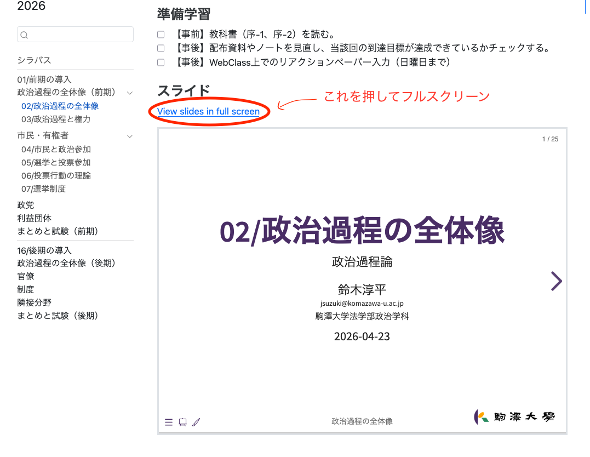
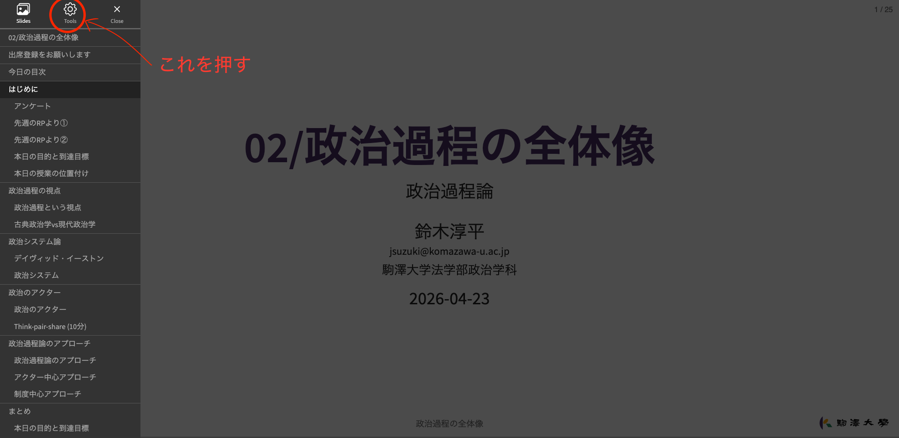
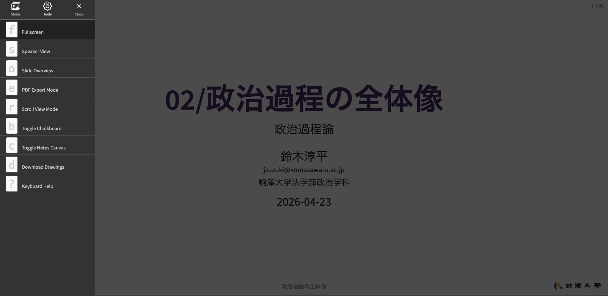
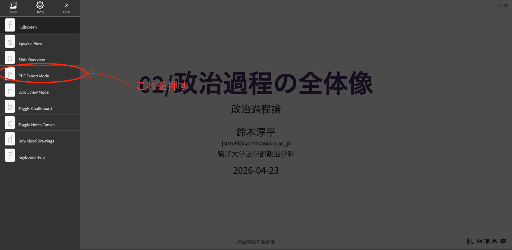
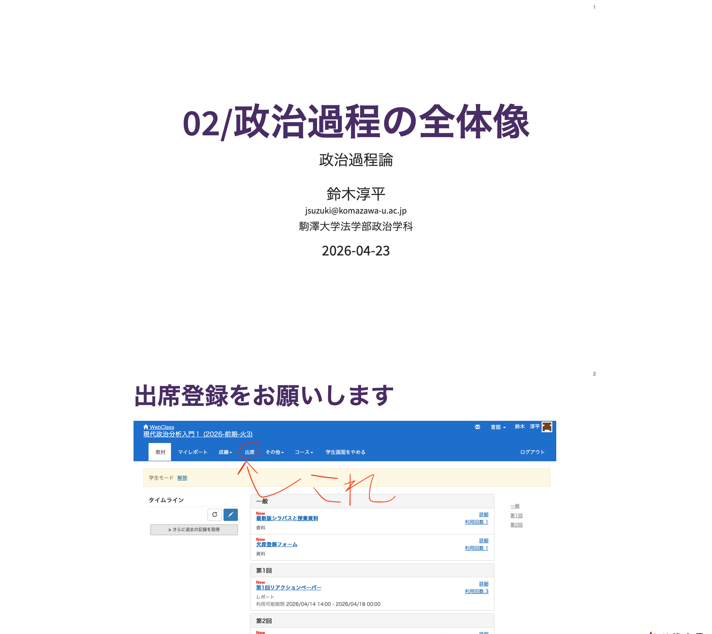
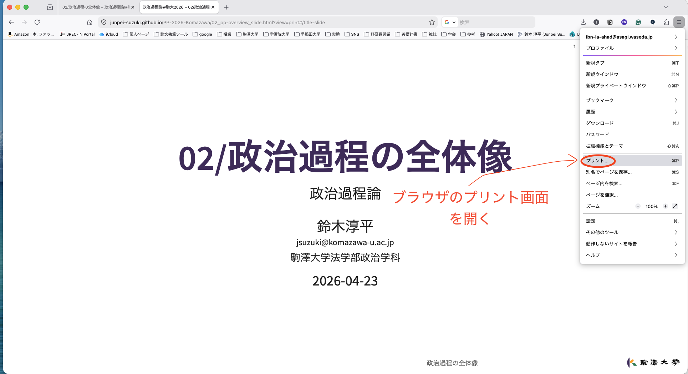
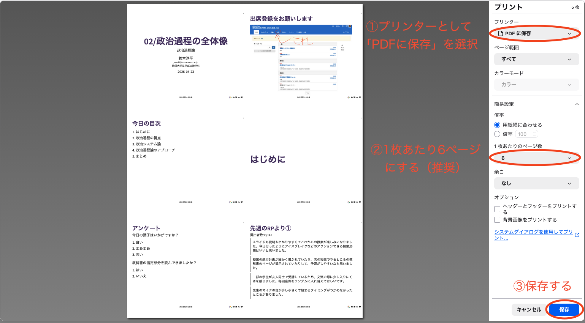

## はじめに
この授業では[Reveal.js](https://revealjs.com/)というツールを用いてスライドを作成しています。詳細は割愛しますが、HTMLやCSS、Javascriptなどのプログラミング言語を用いてスライドを作成するツールです。[^revealjs] 現在のIT業界やアカデミアでは最先端のプレゼンテーションツールではありますが、ファイルとして保存する際には少しクセがあります。以下、Reveal.jsで作成したスライドをPDFファイルとして保存する方法を解説します。

[^revealjs]: [https://easegis.jp/blog/reveal/](https://easegis.jp/blog/reveal/)

## PDFファイル保存の手順

1. 各授業回ページで「View sleides in full screen」を押し、スライドをフルスクリーン表示にする

   

   

2. 左下の「三」のようなマークでメニューバーを開き、さらに「Tools」（歯車マーク）タブをクリックする。

   

   

   

3. Toolメニューから「PDF Export Mode」をクリックする。
   - ちなみにフルスクリーン表示にしたあと、キーボードで「e」を入力しても2-3の手順と同じことができる。

   
    
   
    
4. ブラウザの印刷機能でPDFに保存する。
    - 使用するブラウザによる（担当教員はFireFoxを使っています）。
    - 1枚あたり6ページがおすすめ（他だとうまくいかない）
    
    
    
   